# Changelog

All notable changes to Irrlicht are documented here. The format is based on
[Keep a Changelog](https://keepachangelog.com/en/1.1.0/) and this project
adheres to [Semantic Versioning](https://semver.org/spec/v2.0.0.html).

Release artifacts (DMG, PKG, universal `irrlichd` binary, checksums) are
attached to each [GitHub release](https://github.com/ingo-eichhorst/Irrlicht/releases).

For what's *coming next* (v0.5 / v0.6 / v0.7 and the platform rollout
beyond), see the [Roadmap](https://irrlicht.io/docs/roadmap.html).

## [Unreleased]

## [0.5.7] — 2026-07-13

### History gains three new lenses — agent activity over time, DORA metrics, and CO2 equivalents — alongside a major flaky-test cleanup, non-English waiting-cue detection, and a wave of accessibility and mechanical-quality fixes

### Added
- Activity Matrix chart in History (`chart=state`) — a projects × time-bucket grid of working/waiting/ready agent counts, zoomable across nine granularities from 1 minute to 1 year. (#981, #986)
- DORA metrics in History — Deployment Frequency, Lead Time for Changes, Change Failure Rate, and MTTR as a new Metrics section on both macOS and web, computed on request from the selected project's git repo. (#951, #959)
- CO2 equivalent reference lines on the History CO2 chart (a web search, a phone charge, a flight, a tree-year, …), plus a "CO2 Methodology" docs page citing the source for every figure. (#952, #955)
- Non-English question and waiting-cue detection — sessions ending a turn in German, Spanish, French, or Portuguese now correctly register as waiting on you instead of only ASCII/English cues. (#939)
- Cache-bloat badge now shows the percentage above the project's baseline, not just an arrow. (#949)
- macOS: a single "Enable notifications" master toggle gates all three per-event notification rows instead of always showing them. (#947)
- onboarding-factory: interrupt and reset_session driver actions implemented for antigravity and kiro-cli. (#970, #935, #972)

### Fixed
- WCAG-AA contrast failures in summary/question pills on macOS and web, in both light and dark mode — some combinations measured as low as 2.03:1 against the 4.5:1 minimum. (#984, #987)
- CO2 chart reference-line labels overlapping each other on a dense axis; the near-invisible methodology icon is now a clearly visible "How is this calculated?" link. (#980, #982)
- DORA project picker could overflow the History panel with a long project name. (#969, #962)
- History tab's Range/Group controls closed a `<fieldset>` with a mismatched `
`, which HTML5 silently ignores rather than closing — later controls could end up nested inside the still-open fieldset. (#968, #958)
- Custom backchannel actions (e.g. `/compact`) never actually submitted — they typed the command but never appended a submit sequence. (#966, #963)
- Contrast fix for the comparison-badges documentation page, third attempt at satisfying an automated checker that appears to ignore alpha-compositing. (#961, #960)
- The ready→working "force-bounce" now logs a reason instead of silently flipping state with no visible cause in the events log. (#953, #957)
- A session starting a fresh background process right after settling to ready could immediately bounce back to ready, missing the new process's liveness hold. (#941, #937)
- A recurring family of `-race` test flakes, root-caused to a session-repository aliasing bug (a shared `*SessionState` pointer handed out by `Load()`), closed out for good across the services and e2e packages. (#973, #976, #965, #967, #975, #964, #956, #944)
- Swallowed exceptions in the web dashboard are now logged instead of silently discarded, so private-mode storage failures and dropped websocket frames are at least visible in the console. (#938)

### Changed / Docs / Distribution
- macOS Settings and History panels now share one header/toggle/spacing/width chrome; the History Filters dropdown is removed in favor of the existing drilldown, and the Menu Bar Icon segmented control now fills its row edge-to-edge. (#947)
- Internal: 13 functions taking 8+ positional parameters now take a doc-commented options struct instead. (#945)
- ~50 mechanical SonarQube maintainability findings resolved across Go, Swift, JavaScript, CSS, and Dockerfiles, plus 79 already-fixed findings closed via the SonarQube API after being suppressed in code but never marked resolved upstream. (#901 backlog: #932, #950, #960, #961)

### Technical appendix
- **Activity Matrix (#981, #986):** `ConcurrencyReader.StateSeries` reconstructs per-project, per-state bucketed counts from lifecycle recordings — working/waiting are peak-concurrency-per-bucket (same semantics as the existing agents chart, just split by state); ready is a per-bucket transition histogram, since ready has no duration to be concurrent in. `sessionTimeline.activeIntervals` is refactored onto a shared `stateReconstruction` so the merged (agents) and per-state (state) views can never drift apart, verified behavior-identical against the existing `AgentsSeries` test suite. `chart=state` replaces its old 501 stub and resolves its window from a named `?granularity=` step instead of `?range=`/`?bucket=`; month/6-month/year use an averaged bucket width rather than true calendar boundaries — a deliberate, documented approximation, since the shared series pipeline assumes a uniform bucket stride and calendar-exact bucketing is a cross-cutting change belonging to its own PR. Frontend adds a new "Activity" chart button, a granularity segmented control, and a scrollable DOM grid (stacked working/waiting/ready mini bars per cell) replacing the shared canvas for this chart only, with hover/focus tooltips and CSV export. Found via live smoke-testing (not caught by unit tests): a session still active at the query window's end was spuriously counted as having gone "ready" — the synthetic "last known alive" bound used to close its interval was leaking into the ready-transition histogram; fixed with a regression test. A second, unrelated pre-existing edge case (a session with exactly one recorded transition and no later event vanishes from both `AgentsSeries` and `StateSeries`) was found in the same session and filed separately as #983.
- **DORA metrics (#951, #959):** supersedes #919/#936's wrong-shaped standalone-script attempt. `core/domain/dora` holds pure, unit-tested metric functions ported from a validated shell prototype (tag/commit-range walking, hotfix-window and revert-commit failure signals, median-preferred aggregation). `core/adapters/outbound/git` gains three read-only methods (`ListReleaseTags`, `CommitsInRange`, `TagContaining`). `ComputeDoraMetrics` resolves a project name to its git root via a representative session's CWD, mirroring `YieldSweeper`'s resolution. New `chart=dora` on `GET /api/v1/history` follows the existing `chart=yield`/`chart=agents` special-case pattern. macOS's Yield tab becomes Metrics with an inner Yield/DORA section picker; web adds a Metrics button group and a DORA project selector.
- **CO2 equivalents (#952, #955):** overlays up to 3 red dotted reference lines on the CO2 chart at the height of a relatable everyday CO2e equivalent (17 entries spanning 0.2g to ~100 tonnes), picked to spread across the visible range; ported natively to the macOS SwiftUI Charts implementation; adds a "CO2 Methodology" docs page. Follow-up (#980, #982) densifies the table with 8 new metric-only entries to close label-overlap gaps, converts remaining imperial units to metric, adds a pixel-level minimum-gap backstop in the canvas draw code, and replaces the near-invisible info icon with a visible link.
- **Non-English waiting-cue detection (#939):** `ExtractQuestionSnippet`/`splitSentences` were ASCII-only ('?' only), missing full-width '？' (CJK), '؟' (Arabic), and the Greek ';'. `ExtractWaitingCue`'s imperative patterns were English-only. Five follow-up review rounds tightened the initial patch: dropped German "ihr/ihre", Spanish "su", and Portuguese "sua/seu" (ambiguous between "her/their" and formal "your", unlike English) to avoid misclassifying a background job's completion as waiting on the user; dropped German "da"/French "car" rhetorical-veto prefixes (collide with common English words/names); tightened regex alternation boundaries and added `foldCombiningDiacritics` for NFD-decomposed accented input; dropped two more English-word collisions (Spanish "dime", Portuguese "revise"). Refactored per CodeScene/SonarCloud feedback into named helpers (`isSentenceTerminatorRune`, `sentenceBoundaryAfter`, `composeDiacritic`) and deduplicated the waiting-cue test table into `boolCueCase`/`runBoolCueCases`; full 123-subtest session package suite passes unchanged throughout.
- **Cache-bloat percentage badge (#949, #946):** computes how far the session's current median cache-creation per turn sits above the project's p25 baseline and appends the percentage to the badge on both macOS and web.
- **Notifications master toggle (#947):** a single "Enable notifications" toggle gates the three per-event rows and the context-pressure threshold row, which previously always rendered; a one-time `reconcileNotificationsMasterDefault` migration defaults the new toggle on for anyone upgrading with an event already enabled.
- **Settings/History chrome unification (#947):** extracts a shared `PanelHeader`, migrates Settings onto `IrrSpacing` tokens, fixes `IrrlichtSwitchToggleStyle`'s near-invisible off-state track, widens Settings to `SessionListView.panelWidth`, and tints both panels' segmented controls with the app accent instead of system blue. Removes History's Filters dropdown entirely (state, `filtersDict`/`queryKey` wiring, the menu view, `mergeKnown` vocabulary tracking) since drilldown already covers narrowing to one project/branch/model; Range/Chart/Group now split the row evenly. Adds `EqualWidthSegmentedControl`, an `NSViewRepresentable` bridge setting `segmentDistribution = .fillEqually`, so the Menu Bar Icon segmented control actually fills its row edge-to-edge instead of centering within it.
- **onboarding-factory driver actions (#970, #935, #972):** ports the `interrupt` step (Escape) into both the antigravity and kiro-cli drivers, live-verified against real authenticated sessions — both CLIs bind Escape to cancel the in-flight turn, and neither driver needs `EXPECTED_TURNS` bookkeeping changes since each cancellation lands in the shape the existing turn_count filter already recognizes. `reset_session` for kiro-cli is live-verified (2.6.0) that `/chat new` rotates the session id in-process (unlike `/clear`, which only wipes context); ports the driver's reset arm for real, with a retired-slot guard so a recipe can't tear down the live post-reset session through its old slot number. antigravity's `agy` has no reset command at all — the stub's TODO is replaced with an accurate `not_implemented(reason)` rather than inventing a feature that doesn't exist.
- **WCAG-AA contrast (#984, #987):** summary/question pill text was a fixed hex drawn on a 12%-alpha wash of itself, so contrast against the composited wash was as low as 2.03:1 (macOS light-mode question pill) and 3.37–4.15:1 (web working-purple text, both modes) against the 4.5:1 minimum. macOS adds `Color.adaptive(light:dark:)` and per-appearance pill-text tokens tuned against the actual measured wash colors, plus a light-mode snapshot test; web adds light-mode overrides for the `--waiting`/`--working`/`--ready` tokens and their `-dim` companions.
- **DORA project picker overflow (#969, #962):** the picker used `.fixedSize()` with no upper bound; a long project name pushed the whole metrics row out of the fixed 380pt panel frame.
- **History fieldset close tags (#968, #958):** the Range and Group rows closed `<fieldset class="history-seg">` with a stray `
`; per HTML5 tree construction a mismatched end tag against a "special" element like `<fieldset>` is ignored, so later siblings (e.g. the Forecast toggle) ended up nested inside the still-open fieldset.
- **Backchannel Custom actions (#966, #963):** Custom input actions went through `SendInput`, which types the string verbatim with no submit sequence — a rule like `/compact` never fired since there's no way to type a literal CR into the Settings text field. Routed through `SendCommand`, which already owns the per-backend submit logic (tmux/kitty CR, AppleScript auto-submit) and which presets already used.
- **Ready→working force-bounce logging (#953, #957):** `forceReadyToWorkingIfActive` recorded a `lifecycle.Event` (visible in the `--record` JSONL trace) but never called `d.log.LogInfo` like every sibling transition function, making the bounce invisible in the human-readable events log.
- **Background-liveness probe ordering (#941, #937):** a session settled to ready that then launches a fresh `run_in_background` command on its very next activity event never got the liveness hold — `applyBackgroundLiveness` ran while `state.State` was still stale `ready`, so its `state==working` gate skipped it and cleared tracking before the force-bounce flipped the session to working. Hoisted the force-bounce to run before the liveness probe, kept gated in lockstep with `classifyAndTransition`'s `NoSubstantiveActivity` skip (#329) so an away-summary recap still can't trigger it.
- **mockRepo/memRepo aliasing race (#973, #976, #965, #967, #975):** root cause of a recurring whack-a-mole of "-race flakes" (#606, #942/#944, #956/#964) — `mockRepo.Load()`/`ListAll()` handed back the same `*SessionState` pointer stored internally, and `Save()` stored the caller's exact pointer, so any `Load()` read outside `PIDManager.WithSessionStateLock` (a background PID-discovery goroutine, or a test reading a loaded state directly) raced production code's in-place mutation. Routed through a new `deepCopySessionState` helper (a one-level-deep copy, not a JSON round-trip, since several `SessionMetrics` fields are deliberately `json:"-"`) closing the aliasing class for every `repo.Load()` call site at once. `core/e2e`'s `memRepo` had the identical bug, fixed the same way, plus new `TestMockRepo_*`/`TestMemRepo_*` regression-guard tests asserting Load/Save/ListAll never alias. Two remaining flaky tests fixed with poll-based waits replacing fixed sleeps; a third's addr-file wait ceiling widened from 5s to 15s for loaded CI machines.
- **Swallowed exceptions logged (#938):** 21 empty/near-empty catch blocks across `irrlicht.js`, `quotaChips.js`, `collapsedGroups.js`, `collapsedSummaries.js`, and the onboarding-factory viewer now `console.debug` the error before falling back gracefully. The shared load/persist/toggle logic between the near-twin `collapsedGroups.js`/`collapsedSummaries.js` modules was extracted into `collapsedSet.js`'s `makeCollapsedSet()` factory to resolve a SonarCloud duplication-gate regression the identical fix triggered.
- **Options-struct refactor (#945):** 13 functions exceeding SonarQube's 7-parameter limit (5 exported service constructors, 6 startup.go wiring helpers, an opencode test helper, and Swift's `LauncherHarnessTests.swift` `makeSession`) now take a doc-commented Deps/Options struct, following the existing convention in `replayengine/engine.go`; 61+ call sites updated to named struct literals, pure signature refactor with no behavior change.
- **SonarQube backlog (#901, #932, #950, #960, #961):** resolved across several passes — mechanical fixes (empty-interface-marker comments, nested-ternary extraction, `<output>`/`<fieldset>` semantic HTML swaps, unused vars, deprecated APIs, merged Dockerfile RUN instructions), a cognitive-complexity extraction (`resolveHistoryQuery` out of `handleGetHistory`, dropping complexity from 20 to under 15), a `<dialog>`-element conversion for Settings/Permissions modals (kept the existing classList show/hide since jsdom doesn't implement `showModal()`/`close()`), and 79 already-fixed findings closed via the SonarQube API after being suppressed in code (`// NOSONAR`) without ever being marked resolved upstream. Several findings were deliberately left as judgment calls or dismissed as false positives rather than mechanically "fixed" — see the PRs for the specific list.

## [0.5.6] — 2026-07-09

### Subscription quota lands in the menu bar icon; a full security & code-health sweep closes every open CodeQL/SonarQube finding

### Highlights

#### Subscription quota in the menu bar status icon

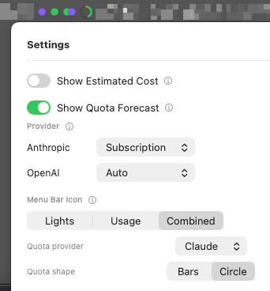

The menu bar status icon can now render your 5-hour/weekly subscription-quota windows directly — as stacked bars or a compact ring — instead of only inside the popover. Pick Lights (today's dots, unchanged default), Usage (quota only), or Combined (both side by side), and choose which provider's quota to show if you have more than one subscription.

**Why it matters:** a glance at the menu bar now tells you how close you are to a quota reset, without opening the popover first.

(#917, #909)

### Added
- `/ir:release` gained an automated security-scan gate — Dependabot, CodeQL, `govulncheck`, `gosec`, and `npm audit` all run before every release build, closing a gap where CodeQL's default setup had silently lapsed with zero local scanning to catch it. (#890)
- Model alias map synced with codeburn — added Xiaomi MiMo and Kwaipilot KAT-Coder aliases (currently price at $0 pending a LiteLLM entry for either model).

### Fixed
- Sessions with a still-active background child no longer flip to ready mid-turn — covers both a parent whose turn ends on a waiting cue and a parent that already looked idle when a new Workflow-tool subagent appears. (#889, #893, #897, #899)
- A session's transcript moving into or out of a git worktree is no longer mistaken for the session ending. (#877, #878)
- Long-running background-research subagents no longer falsely time out and get reaped — the inter-write quiet window is raised to 90s to cover slow Web Search/Fetch-heavy gaps. (#881, #882)
- The CO2 estimate next to cost no longer wraps to a second line for kilogram-scale sessions. (#920, #922)
- `install.sh` no longer kills unrelated `irrlichd` daemons on the machine when restarting its own, and the release smoke test's daemon-liveness check no longer flakes. (#871, #876)
- The README's CodeScene badge was reading the hotspots-only score instead of the overall project score. (#918)

### Security
- Closed every open CodeQL code-scanning alert and the remaining SonarQube security/reliability findings from the project-wide #901 sweep: path-injection guards across the daemon's HTTP-facing file handlers, an SSRF check on the relay's outbound WebSocket URL, prototype-pollution hardening in the dashboard, and path-traversal / `innerHTML`-injection hardening in the onboarding-factory viewer. (#894, #896, #907, #908, #910, #912, #913)

### Changed / Docs / Distribution
- README star-history chart is now self-hosted instead of depending on star-history.com's shared, rate-limited API token; the SonarCloud quality-gate badge was replaced with the steadier security/reliability/maintainability rating badges. (#902, #903, #904)
- `/ir:codescene-report` replaced by `/ir:sonarqube-report` for concrete file:line findings with fix guidance instead of an aggregate hotspot score. (#884)
- `/ir:doc-review` now fixes findings directly instead of filing a GitHub issue for most of them — filing is the fallback only when a fix is genuinely ambiguous. (#875)

### Technical appendix
- **Quota menu bar icon (#917, closes #909).** New `@AppStorage`-backed `MenuBarStyle`/`QuotaVisualStyle`/`MenuBarQuotaProvider` settings (default `.lights` preserves today's icon for existing users); `QuotaMenuBarRenderer` renders stacked 5h/7d bars or a compact ring pinned to the 5h window, sharing `SessionListView`'s pace-percent and color-ramp logic so the icon can't disagree with the popover; `MenuBarImageBuilder.composeSideBySide()` generalizes the two-image layout helper previously hand-rolled for the Gas Town badge. A same-PR follow-up fixed real defects an independent second review caught: settings changes not triggering a repaint, a stale-snapshot mismatch with the popover's "keep, don't drop" behavior, an absolute-only color ramp that could diverge from the popover's pace-aware one, and hardcoded colors unreadable in light menu-bar appearance. 21 new/updated XCTest cases.
- **CO2 unit line-wrap fix (#922, fixes #920).** `formattedCO2` used two decimal digits for the kg branch while g/mg branches use 0-1, producing strings like "16.15kg" that overflow the fixed-width cost/CO2 column; matched the g branch's precision and added `lineLimit(1)` as defense-in-depth.
- **CodeScene badge score source (#918).** The refresh workflow read `current_score` (hotspots-only) instead of `code_health_weighted_average_current` (the actual project score) from CodeScene's API.
- **Cognitive-complexity sweep, part of #901 (#916).** Refactored all 119 open `go:S3776`/`javascript:S3776` findings (109 Go + 10 JS) down to Sonar's threshold across 74 files — every agent adapter, the session-detector state machine, the daemon's HTTP handlers, the relay binary, the tailer, and onboarding-factory tooling — via pure structural extraction (named helpers, early-return guards, switch dispatch), zero intended behavior change. Follow-up commits addressed CodeScene's own stricter argument-count/complexity thresholds on the extracted helpers and a Large-Method test-table split.
- **Flaky relay control test fixed (#915).** `TestRelayRoutesControlToDaemon` dialed the daemon immediately after writing the client's hello, but a successful dial only means the TCP/HTTP handshake finished, not that the server had registered the client — under scheduler contention the daemon's broadcast could beat the registration. Now reads the client's initial snapshot frame (which can only arrive post-registration) before dialing, establishing a real happens-before instead of relying on timing.
- **`swift:S1075` false-positive suppression (#914, part of #901).** All 70 flagged lines in `platforms/macos/` are local filesystem/binary paths, fixed loopback-API routes, SwiftUI preview literals, or opaque test fixtures — suppressed per the established convention rather than churning correct code.
- **Remaining CodeQL alerts closed (#913).** A post-#910 scan found 4 more alerts: 3 were new dataflow paths to the same sinks through a different taint source (a `repository.go` sessionID path reached via `forwarder.go` rather than `input.go`, a `playback.go` recording-derived path through an intervening `filepath.Join`, and an `irrlicht.js` null-prototype dict CodeQL didn't credit) — each closed with a direct taint-visible guard at the exact sink. The 4th (relay-URL request forgery) is left as documented, accepted risk — CodeQL's own sanitizer guidance ("a fixed list of known values") is incompatible with a user-configurable relay endpoint that already gets real structural validation.
- **All open CodeQL alerts resolved, part of #901 (#910, closes #907).** 37 alerts: 1 critical SSRF (relay WebSocket URL validation before `DialContext`), 35 high path-injection (guards at every HTTP-facing path build in the onboarding-factory viewer/store, plus daemon `repository.go` sessionID sanitization reachable from the loopback control API), 1 medium prototype pollution (`irrlicht.js` agent registry now `Object.create(null)`).
- **Remaining SonarQube security/reliability findings, part of #901 (#912).** An empty `go.sum` for a zero-dependency module (satisfies `text:S8566`), `NOSONAR` annotations on two already-documented intentional trade-offs (`ws://` default, no-biometric-gate Keychain item), and a Dockerfile `CMD` rewritten to exec form with its shell script extracted to a standalone file.
- **`swift:S100` naming-convention sweep (#911, part of #901).** Mechanical rename of 98 underscore-named XCTest functions to camelCase across 12 test files, with matching snapshot reference images renamed alongside (swift-snapshot-testing keys images off `#function`).
- **SonarQube findings phase 1, part of #901 (#908).** Real fixes: sanitize `dashboard_url` before logging, tighten a Keychain item to `ThisDeviceOnly`, `charCodeAt`→`codePointAt` on `atob()` output, safer float parsing in `compare/index.html`. 17 additional findings were confirmed false-positive/wontfix by direct code inspection and dismissed in SonarQube with per-issue justification rather than churning correct code.
- **README badge swaps (#902, #904, fixes #903).** Self-hosted star-history SVG (`tools/starhistory`, regenerated on push + daily) decouples the README from star-history.com's shared, rate-limited token pool; SonarCloud's quality-gate badge (which tracks only the new-code leak period) replaced with the security/reliability/maintainability rating badges, which reflect main-branch measures with no CI secret needed.
- **Turn-done waiting hold, part of #901 sweep (#899, fixes #897).** A parent whose turn ends on a waiting cue collapsed straight to `waiting` even with a genuinely-running background Agent-tool child, because that branch never checked `hasActiveChildren` the way the ready-transition branch already did. Also tightens the "I'll wait" cue to exclude waits targeting a non-human object ("its"/"their" completion notification) via an exclusion list rather than narrowing the inclusion regex.
- **`javascript:S6819` accessibility fix, part of #901 (#900, closes #898).** Replaced a nested `role="button"` div/span pair in the design-system's `GroupHeader.jsx` reference copy with two real sibling `<button>` elements — a real button can't validly nest another interactive control, but siblings can.
- **SonarQube VULNERABILITY/BUG/CODE_SMELL cleanup, part of #901 (#896, fixes #895).** ~700 findings addressed across shell/JS/Go/Swift/CSS: absolute-path resolution for 16 shelled-out binaries (`core/pkg/pathutil`), non-root Docker users, `.dockerignore` hardening against secret leakage, URL-encoding and JSON-safe logging in `viewer.js`, locale-safe sort comparators, ARIA labels and `<title>`/`lang` attributes across design-system preview pages, and alpha-composited contrast fixes on 21 of 22 flagged chip backgrounds. One real bug fixed as a byproduct: `state_machine.go`'s `TotalDurationMs()` was missing its lock entirely.
- **Ready-parent hold for new Workflow-tool children (#893, fixes #889).** A background Workflow-tool run can legitimately show zero active children for a stretch (before its first subagent's transcript appears, or between pipeline stages); `holdParentWorkingForNewChild` now forces the parent back to `working` the instant a new child is discovered, surviving the periodic stale-session refresh instead of being silently undone.
- **Onboarding-factory archive-name and innerHTML hardening (#894, fixes #892).** A `SafeArchiveName` type is now the only path to `archiveFilePath`, structurally preventing an unvalidated archive name from reaching the filesystem; `manifestBox`/`driftNote` innerHTML templates replaced with DOM construction so field values can never be interpreted as markup.
- **`ir:release` security-scan gate (#890, fixes #885).** `tools/security-scan.sh` checks open Dependabot/CodeQL alerts (Critical/High blocks), `govulncheck`, `gosec`, and `npm audit --audit-level=high` across every `go.work` module and both web trees; wired into `/ir:release` Step 5.5 and `tools/preflight.sh --only security`. Re-enabled CodeQL default setup for Go and JavaScript/TypeScript, which had silently lapsed.
- **`dashboard_url` iframe validation (#888, closes #886).** `resolveDashboardIframeUrl` rejects anything but a same-origin http(s) URL (e.g. a `javascript:` scheme) instead of assigning server-provided input directly to `iframe.src`.
- **`/ir:sonarqube-report` replaces `/ir:codescene-report` (#884).** CodeScene's public API only exposes aggregate hotspot scores with no way to see the underlying code smells; SonarQube Cloud's issues API returns concrete file:line findings with rule keys and fix guidance instead. `tools/codescene-report.sh` and the automatic badge-refresh workflow are unaffected.
- **`SubagentQuietWindow` raised to 90s (#882, fixes #881).** 30s falsely tripped on a genuine 61-second inter-write gap from a WebSearch/WebFetch-heavy background subagent, causing `finishOrphanedChildren` to promote-and-delete the still-running child and the parent to surface `ready` for 67 seconds while real work continued — same failure class as an earlier 2s→30s fix, recurring at a longer timescale.
- **Worktree-relocation transcript tracking (#877, #878).** Claude Code's transcript path is derived from cwd, so `cd`-ing into a git worktree relocates the `.jsonl` file to a new project-dir slug; the fswatcher collapses the resulting rename into a delete event, which previously forced the session to `ready`. `onRemoved` now detects the relocation (a transcript for the same session still exists under a sibling project-dir slug) and re-points tracking at the surviving file instead of demoting the session. Direction-agnostic — covers both entering and closing a worktree.
- **`viewer.js` decomposition (#873, #880).** Extracted `renderPlayback`'s (660 lines, CodeScene's worst score in the repo, 2.10/10) timeline geometry, DOM painting, and replay-transport concerns into `playbackTimeline.js`, `playbackView.js`, and `replayClient.js`; `renderPlayback` itself drops to ~335 lines. DOM output byte-identical, locked by 41 new characterization tests.
- **`irrlicht.js` row-rendering decomposition (#872, #879).** Split the ~270-line, ~37-branch `updateSessionRow` (CodeScene's 2nd-worst file) into per-column `renderRow*` helpers; the function is now a ~20-line orchestrator. Pure mechanical extraction — DOM output and the HTML snapshot golden suite are unchanged.
- **Release-tooling fixes found while shipping v0.5.5 (#876, fixes #871).** `install.sh`'s `pkill -x irrlichd` matched by process name only, capable of killing an unrelated dev daemon on a different port — now scoped to whatever is bound to port 7837. The release smoke test's daemon-liveness check was a one-shot `pgrep` (unlike the retried dashboard check next to it) and flaked during the v0.5.5 release; now wrapped in the same retry loop. `seed-demo-sessions`' bundled scenarios now auto-create their referenced cwd paths so the daemon doesn't silently reap them as orphans at startup.
- **Agent landscape refresh (#874).** Refreshed GitHub stars/metadata for tracked agents and orchestrators; marked Gemini CLI, Antigravity, and Kiro as irrlicht-supported; archived Void and Roo Code (archived upstream); corrected a stale GitHub Copilot user-count figure conflated with Microsoft 365 Copilot.
- **`ir:doc-review` fixes-by-default (#875).** Previously only narrow claim-vs-code-fact corrections were auto-fixed; every determinable finding is now fixed in place, with filing/closing a GitHub issue as the fallback only for genuinely ambiguous findings or ones that fail their own post-fix verification.
- **Model alias sync.** Added `mimo-v2-flash` → `xiaomi/mimo-v2-flash` and `kat-coder-pro-v1` → `kwaipilot/kat-coder-pro` from codeburn's `BUILTIN_ALIASES`; neither canonical is in LiteLLM's pricing table yet, so both currently resolve to a zero-value capacity and log on miss.
- **`tools/security-scan.sh`'s Dependabot/CodeQL gate was silently non-functional.** `gh_alert_gate`'s `gh api --paginate "$endpoint" -f state=open` had no explicit `--method`, and `gh api` defaults to POST (not GET) whenever `-f`/`-F` parameters are present — so every invocation 404'd against a nonexistent POST route and was misreported as an auth/scope failure. Fixed by adding `--method GET`. Running it for real for the first time surfaced one already-decided item: CodeQL alert #54 (`go/request-forgery`, the relay URL in `forwarder.go`) had been documented as an accepted, by-design risk in #913 but never actually dismissed in the Security UI — dismissed now with that justification.

## [0.5.5] — 2026-07-04

### CO2 estimates next to cost, a self-explaining cache-regression badge, and reconnect reliability fixes

### Highlights

#### Estimated CO2 footprint alongside cost

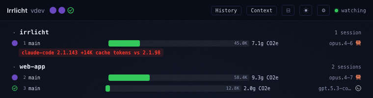

Click a session's cost figure and it now cycles to an estimated CO2e footprint, with a hover tooltip disclosing how confident the number is — provider-disclosed coefficients where a provider publishes them (Gemini, Mistral), a cross-model average otherwise.

**Why it matters:** cost isn't the only budget that matters. Now you can see a session's environmental footprint with the same glance you'd check its price — no separate tool, no export.

(#829, #831)

#### Cache-regression badge explains itself

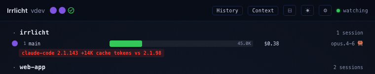

The badge that flags a session whose prompt-cache reuse has regressed now always shows which agent version caused it (or a compact "cache ↑" fallback), with the full plain-language explanation on hover — instead of a bare icon you had to guess at.

**Why it matters:** when caching quietly breaks and a session starts costing more per turn, you immediately know why and which update triggered it, not just that something changed.

(#813, #826, #827, #842)

### Fixed
- History → Usage tab: grouping by Model no longer buckets everything under "unknown" — a wrong source field meant every session landed in one aggregate bucket regardless of which model was actually used. (#792, #793)
- History's tab switcher moved into the header, controls collapsed to one row — the Usage/Yield/Quota picker now lives in the header instead of a static label, and Range/Chart/Group/Forecast controls sit on one scrollable row instead of three stacked ones. (#785, #788)
- Menu bar app recovers when the daemon it's connected to restarts — local-daemon traffic now rides its own recyclable connection with a visible "daemon unreachable — retrying" state, instead of retrying forever against a wedged one. (#843, #845)
- Relay connections recover from the same wedged-restart failure mode — mirrors the local-daemon fix for a restarted standalone `irrlichtrelay`. (#846, #848)
- Menu bar session count no longer double-counts relay-echoed sessions — a local daemon that also publishes to a relay it subscribes to could overcount a project's sessions in the menu bar dots/badge. (#828, #830)
- "Expand All Task Summaries" toggle now persists across restarts. (#799, #800)
- Antigravity sessions bound to a non-interactive background poller no longer show as phantom menu-bar circles — a known third-party helper process is now recognized and excluded at admission time. (#784, #791)
- FocusMonitor's remaining crash path on the macOS 26 SDK closed. (#782, #790)
- Subagents whose worktree/transcript disappeared mid-run are reaped instead of lingering as phantom sessions. (#850)
- Daemon route-registration startup race fixed. (#794, #795, #798)

### Changed / Docs / Distribution
- Dropped a fragile SwiftPM resource-bundle dependency — removes a crash mode where a dev build's `.app` could outlive the worktree it was built from. (#844, #847)
- Doc-review sweep gained a `--fix` mode, wired into the release process itself, and the README's CodeScene score badge now auto-refreshes on every push to main. (#834, #835, #837)

### Technical appendix
- **Estimated CO2 footprint (#829, #831).** `capacity.EstimateCO2Grams` — a tiered CO2e estimation formula: provider-disclosed coefficients for Gemini (Google's Aug 2025 environmental report) and Mistral (Carbone4/ADEME lifecycle assessment), falling back to a cross-model average (Epoch AI) for everything else, including Claude and GPT since neither Anthropic nor OpenAI publishes per-token figures. Wired through the tailer's existing cumulative-token computation into `SessionMetrics.EstimatedCO2Grams` + `CO2Tier`, mirroring `EstimatedCostUSD`'s plumbing exactly. Ships as a click-to-cycle web dashboard surface first; CLI/macOS parity and historical/aggregate tracking are deferred follow-ups.
- **Cache-regression badge explanation (#813, #826, #827, #842).** Adds an always-visible badge on both macOS and web showing the version attribution (or a compact `cache ↑` fallback), composed once daemon-side into `cache_bloat_explanation` on `session.metrics` instead of each client re-deriving the copy independently. macOS renders it as its own row below the session row (mirroring the intent/waiting-question pills); web renders it verbatim as hover text.
- **History Group=Model fix (#792, #793).** `RecordSnapshot`/`RecordBaseline` in `cost_tracker.go` stamped each cost row's `Model` field from `SessionState.Model`, which is never assigned in production code — always `""`, so every row landed in the aggregate "unknown" bucket. Falls back to `Metrics.ModelName`, mirroring the pattern already used correctly in the session-list handler. Introduced in #750/#771, not a regression against older history.
- **History header/controls redesign (#785, #788).** Moves the Usage/Yield/Quota tab picker into `HistoryView`'s header, flattens Range/Chart/Group/Forecast/cross-filters onto one horizontally-scrollable row instead of three stacked rows, and gives the popover a hard fixed height independent of width so it no longer inherits whatever height `SessionListView` happened to be at.
- **Local-daemon reconnect recovery (#843, #845).** `SessionManager+WebSocket.swift`'s `connect()` had two compounding bugs: `reconnectDelay` reset to 1.0 on every attempt (including failed ones), defeating exponential backoff, and all local-daemon traffic rode `URLSession.shared`, which can wedge against a host:port that restarted under it. Fix: a dedicated `URLSession` recreated after 3 consecutive silent-failure cycles, backoff/failure streak reset only on a confirmed message, and a surfaced "daemon unreachable — retrying" state.
- **Relay reconnect recovery (#846, #848).** Same wedged-`URLSession.shared` failure mode, this time for a restarted standalone `irrlichtrelay` — gives the relay path its own dedicated `relayURLSession` with the same recycle-after-3-failures treatment as #845.
- **Relay-echo dedup in the flat sessions array (#828, #830).** #746/#748 already fixed relay-echo overcounting for `apiGroups` (the list view) with a name-based collapse; the flat `sessions` array backing the menu bar dots/badge only deduped by id, and the echoed session carries a drifted id that escapes that filter. Mirrors the same name-based collapse into `rebuildSessionsFromMap()`.
- **Antigravity non-interactive host rejection (#784, #791).** A known third-party menu-bar app (CodexBar) keeps an Antigravity `agy` CLI process running in the background to poll quota data, which surfaced as a permanent phantom menu-bar circle. Adds `Process.RequireKnownHost` plus a synchronous, one-shot ancestry check at PID-discovery time (`PIDManager.AllowsSession`) — a process whose ancestry doesn't resolve to a known terminal/IDE never becomes a session. A TTL/staleness-based fix was considered and rejected: Antigravity's activity signal resets on any parseable line, which would make a reaped ghost look freshly alive again minutes later.
- **FocusMonitor KVC crash path (#782, #790).** `isFocusActive` still read `focusStatus`/`isFocused` via `value(forKey:)` — the same "missing key throws instead of returning nil" trap as the earlier singleton-lookup crash. Both reads now use the same `responds(to:)`-guarded selector dispatch; `isFocused` needs a direct IMP call since `perform(_:)` is undefined for non-object returns.
- **Subagent reaping on deleted transcript (#850).** A subagent's PID is inherited from its parent process rather than its own, so once the parent exits and the PID is reused, PID-liveness checks can never tell the orphaned subagent is dead. `reapStaleChild`'s only other backstop, `isStaleTranscript`, treated a deleted transcript file the same as "hasn't gone stale yet" (a silently-swallowed `os.Stat` error). Adds `isDeletedTranscript` (confirmed-gone via `os.IsNotExist`), gated on `FirstSeen` age so a freshly-spawned subagent isn't mistaken for an orphan.
- **Daemon route-registration startup race (#794, #795, #798)**, plus a flaky CI test and preflight tooling fix bundled in the same PR.
- **SwiftPM resource-bundle removal (#844, #847).** `Bundle.module`'s SwiftPM-generated accessor only ever resolved via its compile-time absolute `buildPath` fallback, which crashed the moment the worktree that built it was deleted. The only use (`AppIcon.icns`) was already covered by a direct bundle copy every build script performs, so the mechanism is removed entirely rather than relocated.
- **`ir:doc-review --fix` mode (#834, #837).** For findings where an existing doc claim is directly contradicted by a code-derived fact, applies the correction in place instead of only filing an issue; wired into `/ir:release` Step 4b so drift from *any* earlier release — not just this one's diff — gets caught. (This is what caught README.md/site/index.html's stale "no hooks" claim, corrected in this release.)
- **CodeScene badge automation (#835, #802).** A scheduled workflow refreshes the README's CodeScene score badge on every push to main; a manual `codescene-report.yml` fetcher backs the `/ir:codescene-report` skill for on-demand hotspot/trend lookups.
- **Hexagonal layering enforcement + ARS regression gate (#796, #803).** `core/architecture_test.go` statically enforces domain/ports never importing outward into adapters/application via `go/packages` checks; `tools/ars-gate.sh` flags an Agent Readiness Score regression vs `origin/main` as an advisory (non-blocking) PR check, mirrored locally by `tools/preflight.sh --only arch`.
- **Shared contract test for consent-gated adapter call sites (#797, #817).** `contracttesting.AssertPermissionGated` behaviorally verifies a permission's Apply/Remove wiring at runtime, complementing the static architecture test.
- **`ir:test-mac` componentized restart (#833, #838).** Adds a `TARGET=daemon|macos|full` axis so a Go-only or Swift-only change restarts just that component; `MODE=replace` now installs directly into `/Applications/Irrlicht.app` instead of a parallel `/tmp/IrrlichtDev.app` sharing the same bundle id — the root cause of the "prod respawn" pitfall.
- **CodeScene hotspot cleanup sprint** — eight no-behavior-change refactors splitting files CodeScene flagged as hotspots: `tailer.TailAndProcess`/`processParsedEvent` (#822), `domain/session.go` by concern (#808, #816), `irrlicht.js` into modules (#805, #820), `SessionListView.swift` into per-concern views (#818), `PIDManager`'s liveness sweep/dedup deletion (#810, #819), `irrlichd main()` into named startup phases (#821), `SessionManager` god-object into extensions (#815), and `session_detector_test.go` by scenario group (#814, tightened per review in #824).
- Dependency bump: `golang.org/x/net` 0.52.0 → 0.55.0 in `core`. (#801)
- Misc test/tooling hygiene: `SessionRowSnapshotTests` made hermetic against a live daemon (#841); pre-push hook no longer inherits a stray `GIT_DIR`/`GIT_WORK_TREE` when running preflight (#812).
- Docs: worktree shortcuts + Task Management tidy-up and a git-stash-not-isolated-per-worktree note in AGENTS.md (#789, #825), Karpathy Guidelines section removed from AGENTS.md (#787), `ir:test-mac` doc defaults to replace mode (#786), CodeScene/ARS README badges given their own line plus a workflow badge (#836, #823).

## [0.5.4] — 2026-06-29

### A full History view with spend analytics, a backchannel that acts on your agents, and plain-language session summaries.

### Highlights

#### Spend & history analytics

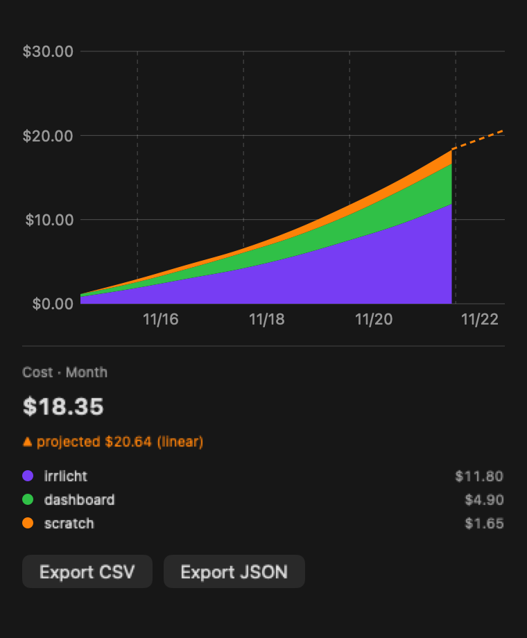

A new History view turns every recorded session into cost analytics — a cumulative spend chart with a linear projection, breakdowns and drill-downs by project, branch/worktree, provider and model, a concurrent-agents timeline, and a productive-vs-reverted "yield ratio" per project. Facet any axis, cross-filter by token type, and export the whole thing to CSV or JSON. It ships in both the macOS app and the web dashboard.

**Why it matters:** you can finally see where your agent spend actually goes — which project, which model, and how much of it landed versus got reverted — without exporting anything by hand.

(#752, #761, #771, #773, #778, #772)

#### Backchannel — act on your agents

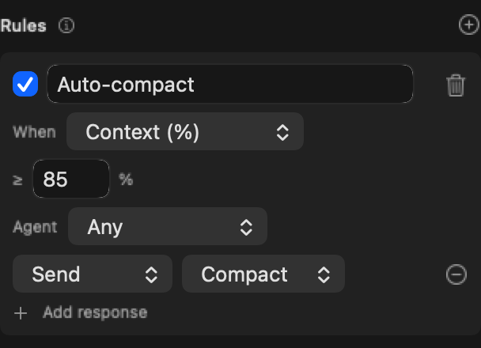

Backchannel turns Irrlicht from a read-only monitor into something that can talk back: control discovered agents locally or remotely, across agents and terminal backends. Define event→action rules (e.g. when context crosses 85%, send the compact command), pick from agent-translated command presets, or write your own Custom command — and trigger them by a backchannel token.

**Why it matters:** routine babysitting — compacting a full context, answering a prompt, nudging a stuck session — can now happen automatically or with one click, from any machine.

(#731, #733, #769)

#### Plain-language session summaries

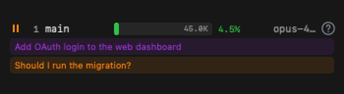

Session rows now lead with a human-readable headline instead of raw transcript text: a purple block summarizing what the agent is working on, and an amber block with the exact question it's waiting on. Summaries are generated from lightweight markers with a pluggable compaction step.

**Why it matters:** a glance at the menu bar tells you what each agent is doing and which one actually needs you — no expanding rows to read the last message.

(#765, #770, #743)

### Added
- ETA accuracy improvements, surfaced sooner — a replay-based estimator informs the task-completion estimate earlier in a turn. (#768)
- Built-in diagnostics bundle — a `/debug/bundle` endpoint and an `irrlichd --diagnose` flag collect a redacted snapshot for bug reports. (#742)
- Cache-creation regression detection — sessions that stop reusing prompt cache are flagged and attributed to the upstream agent version that changed. (#749)
- Generic GUI-host fallback for click-to-focus, so focusing a session works for more terminal/IDE hosts out of the box. (#741)
- Agent-legible HTML snapshot artifacts for the session list, plus an enriched opt-in lifecycle trace that makes ghost sessions reconstructable. (#764, #760)

### Fixed
- Detached background agents are now badged instead of showing as phantom rows. (#747)
- The macOS sidebar no longer double-lists local projects echoed back by the relay. (#748)
- Ghost sessions age out / get reaped: antigravity PID==0 ghosts age out, and sessions bound to a `claude --bg-spare` infra PID are reaped. (#740, #734)
- The Settings panel no longer janks at ~2fps / high CPU. (#730)
- A text-to-speech crash on macOS is fixed. (#781)
- The macOS app no longer crashes at launch when built against the macOS 26 / Xcode 26 SDK — `FocusMonitor` resolves the Focus singleton via a guarded selector instead of KVC, which now raises `NSUnknownKeyException`. (#782)
- Price non-Anthropic-frontend sessions correctly: synced the model-alias map with codeburn and added new aliases (OpenAI Codex `gpt-5.5`, Hermes lowercase `glm-5.2`). (#726)

### Changed / Docs / Distribution
- History and Settings panels decluttered on macOS. (#781)
- New `/ir:exec` skill — an end-to-end issue loop (worktree → visual HTML plan → implement → PR → /review → /simplify); it now marks the issue in progress before implementing. (#758, #767)
- Antigravity 1.8 + 5.1 scenarios flipped to observed by capturing and serving the `conversations/<id>.db` store in replay, with the context-window replay test pinned hermetic. (#775, #776, #777)
- Snapshot coverage added for the unobservable session-row states. (#762)
- Dependency bump: `form-data` 4.0.5 → 4.0.6 in `platforms/web`. (#739)

### Technical appendix
- **History view — web (#752, #771, #778) and macOS (#761, #773).** A cost-analytics surface built entirely from on-disk recordings: Phase 1 lands the cumulative cost chart with a linear projection and Export CSV/JSON; Phase 2 adds branch/worktree and provider/model attribution with drill-downs; Phase 3 adds a concurrent-agents timeline computed from recording overlap; #778 adds faceted cross-filtering with token-type grouping and a cumulative chart. The macOS side reaches cost-analytics parity with the web dashboard. (#369, #750, #751, #755)
- **Yield ratio per project (#772).** A productive-vs-reverted spend metric per project — spend that survived in the tree versus spend on changes later reverted — surfaced in the History view. (#373)
- **Cache-creation regression detection (#749).** Detects sessions whose prompt-cache reuse drops off and attributes the regression to the upstream agent version in play, so an agent update that breaks caching is visible rather than silently doubling cost. (#374)
- **Backchannel control (#731).** Control discovered agents locally and remotely, across agents and terminal backends, reusing Focus's `Launcher` targeting; gated behind a `control` permission so nothing is exercised while pending or denied. (#724)
- **Backchannel read-back (#733).** Adds the terminal backend (tmux/kitty/iTerm) as a complementary observation source that reads back the agent's terminal, alongside the transcript tailer. (#732)
- **Backchannel command presets (#769).** Agent-translated command presets plus a Custom option, so an action like "compact" maps to the right per-agent command; #781 adds a backchannel token trigger. (#754)
- **Concise session summaries (#765, #770, #743).** Session rows render a purple user-intent block and an amber waiting-question block built from lightweight summary markers; #770 adds concise intent + waiting headlines with a pluggable compaction step; #743 adds the human-readable task summary for waiting/ready sessions; #765 also fixes a global collapse bug. (#738, #759)
- **ETA estimator (#768).** Replay-based research into the task-completion estimator improves accuracy and surfaces the ETA earlier in a turn. (#753)
- **Diagnostics bundle (#742).** A `GET /debug/bundle` endpoint and an `irrlichd --diagnose` flag assemble a redacted diagnostics snapshot for bug reports. (#736)
- **Click-to-focus GUI-host fallback (#741).** A generic outermost-top-level-`.app` host-detection fallback so click-to-focus resolves the right GUI host for more terminal/IDE embeddings. (#728)
- **Ghost-session lifecycle (#740, #734).** Antigravity PID==0 ghost sessions age out via the no-substantive-activity gate; sessions bound to a long-lived `claude --bg-spare` infra PID are reaped via the infra-reaper self-healing sweep. (#735, #727)
- **claudecode detached background agents (#747).** Detached background agents that land in the `claude daemon run` pool are badged rather than rendered as phantom active rows. (#744)
- **Relay sidebar dedupe (#748).** The macOS sidebar de-duplicates local projects echoed back by the relay. (#746)
- **Settings panel jank (#730).** Eliminated the ~2fps / high-CPU redraw storm in the Settings panel. (#729)
- **TTS crash + macOS declutter (#781).** Fixes a text-to-speech crash and declutters the History + Settings panels.
- **FocusMonitor SDK launch crash (#782).** `resolveFocusStatusCenter()` resolved `INFocusStatusCenter.default` via KVC `value(forKey:)`, which under the macOS 26 / Xcode 26 SDK raises `NSUnknownKeyException` (uncatchable from Swift) instead of returning nil — SIGABRTing every Developer-ID launch (the path is DevID-gated, so ad-hoc/CI builds never hit it; only the release smoke test does). Now resolved with a `responds(to:)`-guarded selector `perform`.
- **Agent-legible observability (#760, #762, #764).** #760 enriches an opt-in daemon lifecycle trace (with `replay --ghosts`) so ghost sessions are reconstructable; #762 snapshots the unobservable session-row states; #764 emits agent-legible HTML snapshot artifacts for the session list. (#757)
- **Model-alias sync (#726 + this release).** Re-synced `core/pkg/capacity/aliases.go` against codeburn's `BUILTIN_ALIASES`; this release adds `openai-codex:gpt-5.5` → `gpt-5.5` (in LiteLLM) and the lowercase `glm-5.2` → `glm-5p1` Hermes spelling.
- **Antigravity replay observability (#775, #776, #777).** Captures and serves antigravity's sibling `conversations/<id>.db` store in replay (#775), flips the 1.8 + 5.1 cells to observed via golden-summary surfacing and a re-record (#776), and pins the LiteLLM cache so the replay context-window test is hermetic on cold CI (#777). (#766)
- **`/ir:exec` skill (#758, #767).** An end-to-end issue execution loop — open a worktree, present a visual HTML plan for approval, implement, open a PR, run /review and /simplify; #767 marks the issue in progress before implementing. (#756)
- **Dependencies.** `form-data` 4.0.5 → 4.0.6 in `platforms/web`. (#739)

## [0.5.3] — 2026-06-21

### Google Antigravity support, publish your sessions to a remote relay, and a clutch of daemon + adapter fixes.

### Added
- Google Antigravity adapter — one adapter covers both the `agy` CLI and the Antigravity IDE. Discovery is transcript-first, so PID-less IDE sessions are first-class. (#715)
- Publish to relay — a macOS toggle that streams this daemon's sessions out to a standalone relay so you can watch them from another machine; pushing outbound means the daemon needs no inbound reachability (works behind NAT). The forwarder hot-reloads, so toggling Publish on/off or editing the URL/token applies to the running daemon with no relaunch and no interruption to session monitoring — and it works whether the app spawned the daemon or adopted an already-running one. (#718, #721, #722, #723)
- Relay native multi-tenant workspace isolation, so one relay can serve several daemons' sessions kept apart per workspace. (#709, #713)

### Fixed
- Antigravity: the context bar now renders — tokens and the canonical model are read from the sibling conversation store rather than the transcript. (#719, #720)
- Claude Code sessions now stay `waiting` across a daemon restart instead of flipping back to `working`. (#705, #706)
- Brand: the flame gradient is legible on light backgrounds. (#708)
- Adapters: assistant-text truncation is unified into a single tailer rule, so every adapter truncates long assistant text the same way. (#710)

### Changed
- Daemon: `buildAgentWatchers` now does an exhaustive `Source → watcher` dispatch so a new source can't silently land without a watcher. (#714)
- Dashboard: extracted a collapsed-groups store out of the web monolith. (#712)
- Adapters: share one todo-snapshot reconciler instead of per-adapter copies. (#711)

### Docs
- onboarding-factory skill gains an overnight push-through mode. (#717)
- Removed the task-ETA figure from the landing page. (#704)

### Technical appendix
- **Relay publish hot-reload (#722 / #723).** A new `relay.PublishController` (`core/adapters/outbound/relay/controller.go`) owns the forwarder lifecycle — `Apply(enabled, url, token)` starts, stops, or reconfigures a single forwarder (cancel the ctx + start a fresh `relay.NewForwarder`), idempotent when the effective config is unchanged, mutex-guarded so concurrent PUTs serialize, and a blank URL counts as "off". The controller is always constructed and seeded once at startup from `IRRLICHT_RELAY_URL` / `IRRLICHT_RELAY_TOKEN` so headless/standalone daemons are unchanged. A loopback-only `PUT /api/v1/relay/publish` accepts `{enabled,url,token}` → `Apply` → returns the resulting status (same shape as `GET`). On macOS, `DaemonManager.publishSettingsDidChange()` PUTs the config to the running daemon (via the new `PublishClient`) instead of relaunching, re-syncing on spawn and on adopt; the relay token moves from a spawn-time env var to the loopback PUT body (same 127.0.0.1 trust boundary as every other daemon endpoint). `buildDaemonEnv` strips inherited `IRRLICHT_RELAY_URL` / `IRRLICHT_RELAY_TOKEN` so an app-spawned daemon never self-seeds from a stale value, and the publish PUT retries a few times so a single dropped request can't strand the daemon in the wrong state.
- **Publish to relay (#718 / #721).** The original macOS toggle, UserDefaults URL + Keychain token, with a `PublishStatusMonitor` poll surfacing the live link state (connecting / connected / auth_failed / disconnected) as a status dot.
- **Relay multi-tenant workspace isolation (#709 / #713).** The relay keeps each daemon's sessions partitioned per workspace so a single relay can host several daemons without cross-talk.
- **Antigravity adapter (#715).** One adapter onboards both the `agy` CLI and the Antigravity IDE; discovery is transcript-first so PID=0 sessions are first-class, with a multi-root source over the brain stores and a path-based session id (constant `transcript.jsonl`).
- **Antigravity context bar (#719 / #720).** Tokens and the canonical model live in a sibling SQLite protobuf (`conversations/<conv>.db`, `gen_metadata`), not the transcript; the adapter reads it on `turn_done` so the context bar renders.
- **Claude Code waiting-across-restart (#705 / #706).** Session waiting state is preserved across a daemon restart rather than recomputed back to working.
- **Adapter assistant-text truncation (#710).** Collapsed into one shared tailer rule.
- **Daemon watcher dispatch (#714).** `buildAgentWatchers` switched to an exhaustive `Source` dispatch so an unmapped source is an explicit gap, not a silent no-op.
- **Dashboard collapsed-groups store (#712)** and **shared todo-snapshot reconciler (#711)** are internal refactors with no user-visible behavior change.

## [0.5.2] — 2026-06-19

### Gemini CLI joins the lineup, the menu bar gets ~3× lighter under load, and context-pressure alerts become configurable.

### Highlights

#### Gemini CLI is now a supported agent

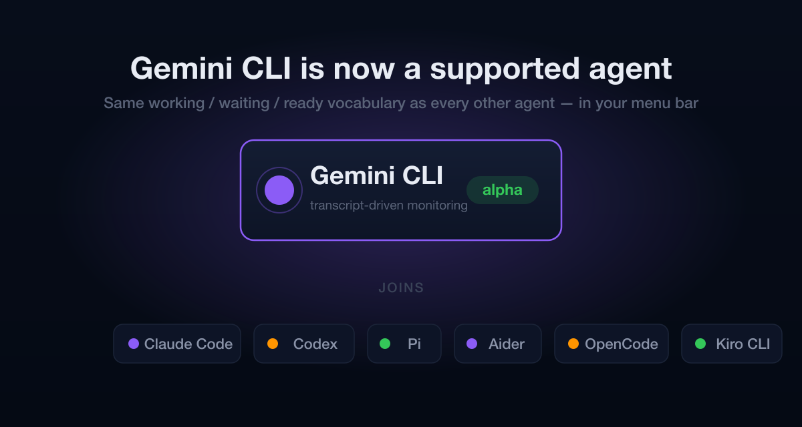

Irrlicht now watches Gemini CLI sessions and reports them in the same working / waiting / ready vocabulary as every other agent. It reads Gemini's JSONL transcripts under `~/.gemini/tmp`, follows nested subagent chats, and tracks per-turn token deltas — no SDK, no config. The adapter ships at the alpha maturity stage with 44 recorded scenarios behind it.

**Why it matters:** if quota pushes you from Claude Code or Codex over to Gemini CLI, your monitoring follows you instead of going dark.

(#668, #659, #679, #680, #681)

#### ~3× less CPU when you're running a lot of agents

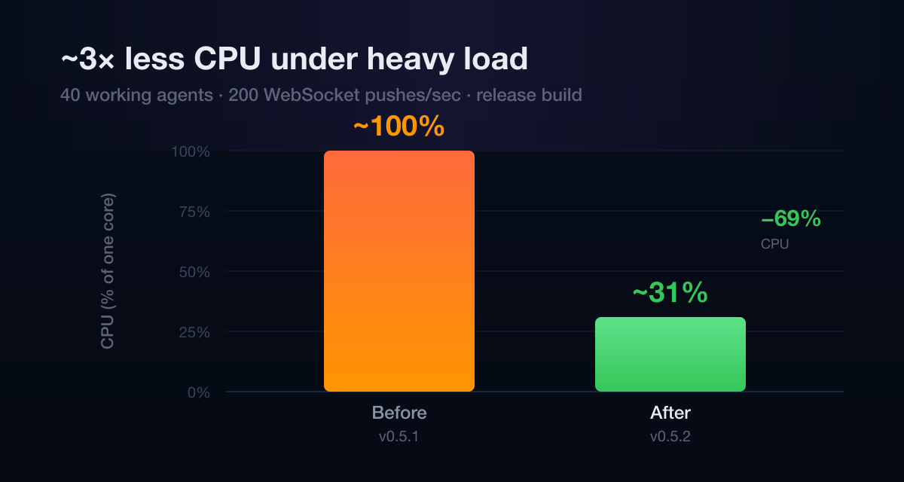

With dozens of agents all ticking metrics at once, the macOS app used to redraw the whole session list on every single WebSocket message and saturate a CPU core. WebSocket-driven refreshes are now coalesced into one redraw per ~100ms window, and the per-row 1-second timers collapse into a single shared clock. State changes still flash through immediately, so the menu bar stays as responsive as ever.

**Why it matters:** running a fleet of agents no longer spins up your fan or drains your battery — measured ~100% → ~31% of a core under 40 agents.

(#693, #690)

#### Context-pressure alerts you can tune

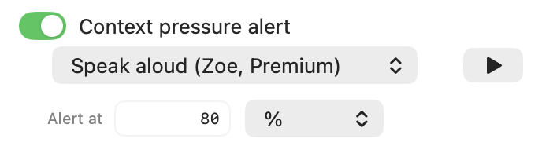

The context-fill alert that warns you before a session runs out of room now has a threshold you set yourself — fire it at 80%, 90%, or wherever you like — instead of a fixed cutoff. The new alert lives in a tidied-up settings panel where less-common options collapse under an **Advanced Settings** group and in-progress features carry a **Beta** badge.

**Why it matters:** people who want an early heads-up and people who only want a last-second warning can each set the threshold that fits how they work.

(#692, #689, #702, #694)

### Added

- **Gemini CLI adapter** — transcript-, process- and PID-aware monitoring for Gemini CLI sessions, at the alpha stage. (#668)
- **`/ir:doc-review` skill** — an objective, binary-criteria documentation audit that files one agent-ready GitHub issue per doc surface; supports a `--report-only` dry run. (#698, #691)
- **Configurable context-fill alert threshold** — set the context-pressure alert as a percentage (default 80%) or an absolute token count; the former 95% critical tier is folded into the single configurable threshold. (#692, #689)
- **Settings: Advanced Settings group + Beta badges** — less-common controls collapse under a disclosure group, and in-progress features are marked Beta. (#702, #694)
- Full documentation of every environment variable, hook, and focus/CLI endpoint in the site docs. (#699, #700, #701)

### Fixed

- Dead sessions now age out correctly: a no-op refresh no longer bumps `updated_at`, so a crashed or abandoned agent stops looking alive. (#684, #667)
- A manual `/compact` now shows the full lifecycle — **working** for the whole compaction window, back to **ready** when it finishes — instead of staying frozen at the pre-compact state or stranding a mid-tool-use compaction in "working". The fix adds a Claude Code `PreCompact` hook and treats the manual `compact_boundary` as a turn boundary; existing installs pick up the hook on the next daemon restart, and an interrupted compaction is bounded by a timeout. (#658, #656, #657; follow-up to #641)
- The curl installer downloads and verifies the new build before removing the existing install, so a failed download can't leave you with no app. (#654)
- gemini-cli: ESC-cancel and aborted-turn notices now settle the turn, and a batch of detector edge cases are consolidated. (#659, #679, #680, #681)

### Changed / Distribution

- Gemini CLI moves from **planned** to **alpha** in the compatibility grids.
- Release DMGs are now codesigned before notarization, so Gatekeeper's primary-signature check passes on the DMG file itself. (#652)
- Dependency bumps: `vite` 8.0.14 → 8.0.16, `form-data` 4.0.5 → 4.0.6. (#686, #687, #688)

### Technical appendix

- **gemini-cli adapter** (`core/adapters/inbound/agents/geminicli/`): new transcript + process + PID adapter. Watches JSONL session files under `~/.gemini/tmp` named `session-<ts>-<first8hex>` (session id is the filename stem, not the header UUID), with nested subagent chats at `chats/<parent-uuid>/<child-uuid>.jsonl`. Process discovery matches the `bin/gemini` command line (the OS process is `node`); cwd is read from the transcript body, not a header line, which forced an `EnrichNewSession` pass off `m.LastCWD`. No explicit end-of-turn marker — a text-only assistant message maps to `turn_done`, benign info notices ("Model set to …") are ignored, and ESC-cancel / aborted-turn notices settle the turn (#659, #665). 44 scenarios recorded; consolidated detector fixes in #679 cover #660–#664, #676. (#668)
- **WebSocket refresh coalescing** (macOS): `session_updated` pushes are batched into a single `flushUIRefresh` per ~100ms window that patches all dirty sessions in one map pass + one recompose (`patchApiGroups(sessions:)`) rather than O(K·N) per-message recomposes. Per-row 1Hz duration `TimelineView`s collapse into one shared `DurationClock` observed only by leaf labels. Context-pressure alerts ride `rebuildSessionsFromMap` and are deferred by at most one window; state-transition notifications still fire synchronously at message time. Per-message debug `print()`s are gated behind `IRRLICHT_DEBUG` via the cached `irrlichtVerboseLogging` global. Added `tools/wsload` (a faithful WS load harness) plus a deterministic coalescing regression test. Measured 40 sessions / 200 pushes/sec, release: ~100% → ~31% of a core. (#693, #690)
- **Configurable context-fill alert threshold** (macOS): new `ContextPressureThreshold` value type (value + unit) as the single source of truth with a pure `isExceeded(by:)`; `SessionManager` seeds the 80%/percent default, drives `checkContextPressureAlerts` off the configured value (fires once per session, re-arms when the setting changes), and adapts the notification title/body to the unit. The session-row badge reads the threshold via `@AppStorage` and collapses to one tier — the former 95% critical tier (red badge + escalation notification) is removed. A token-count mode also fires when the model's context window is unknown (where percentage utilization stays 0). (#692, #689)
- **Settings reorganization** (macOS): less-common controls collapse under an **Advanced Settings** disclosure group; in-progress features carry a **Beta** badge. (#702, #694)
- **Detector no-op refresh** (`core/`): a refresh that produces no state change no longer advances `updated_at`, so the idle-sweep age-out timer isn't reset on every poll and dead sessions transition out as designed. (#684, #667)
- **claudecode manual `/compact` lifecycle**: a `PreCompact` hook forces **working** during compaction and the manual `compact_boundary` is treated as a turn boundary (releases to **ready** after); `EnsureHooksInstalled` adds the new hook on daemon restart, and an interrupted compaction is bounded by a timeout. (#658, #656, #657)
- **`/ir:doc-review` skill**: audits every documentation surface against binary criteria, anchors each finding to a quoted location with a stable ID so independent runs converge, and files one GitHub issue per surface with exact fixes. (#698, #691)
- **Docs**: documented all environment variables in `configuration.html` (#699), hooks + focus endpoints in `api-reference.html` (#700), and `irrlicht-focus` + `irrlichtrelay` in `cli-tools.html` (#701).
- **Release tooling**: `tools/build-release.sh` codesigns the DMG between `hdiutil create` and `notarytool submit` so the stapled ticket covers the signed bytes (#652); release-skill docs record the DMG-signature ordering, pre-v0.5.2 spctl interpretation, and port-safe smoke/canary guidance (#653, #655).
- **Dependencies**: `vite` 8.0.14 → 8.0.16 in `platforms/web` (#686, #687); `form-data` 4.0.5 → 4.0.6 in the onboarding viewer (#688).

## [0.5.1] — 2026-06-07

### Ghost sessions and stuck states fixed: /compact strandings, Claude Code 2.1.168's background daemon, and restart amnesia.

No new features this time — five fixes that together remove every known way a
session row could lie to you: sessions stuck "working" after `/compact`,
permanent ghost `proc-…` rows minted by Claude Code 2.1.168's new
background-daemon processes, a "?" agent icon from a startup race, and idle
sessions resurrected as "working" by a daemon restart.

### Fixed

- Running `/compact` in an idle session no longer strands it in "working" —
  the synthetic compact-summary transcript event is no longer mistaken for a
  real user turn. (#641, #642)
- Claude Code 2.1.168's background-daemon infrastructure (`claude daemon run`,
  `--bg-pty-host` PTY hosts, `--bg-spare` spares) no longer mints permanent
  ghost `proc-…` rows, and ghosts persisted by earlier versions are retired
  automatically on the first scan after upgrading. (#644, #648)
- Ghost pre-session rows whose real session is bound to a sibling process
  (e.g. a second `claude --resume` of the same session) are now swept
  continuously, not only at daemon startup — with a 90-second grace period so
  a freshly opened second agent in the same directory still gets its row.
  (#645, #646)
- Sessions created during a daemon-startup race no longer show "?" instead of
  the agent icon: the adapter identity is backfilled on the next activity
  event, which also unblocks PID discovery and ghost cleanup for that
  session. (#643, #647)
- A daemon restart can no longer resurrect an idle session as permanently
  "working": the last event type is persisted in the metrics ledger
  (schema v4), and older ledgers get a one-time full re-scan that also heals
  sessions stranded by the pre-fix parser. Dead background processes are
  likewise purged from the ledger instead of resurrecting on every restart.
  (#649, #650)

### Docs

- Corrected the documented `permissions.json` location: it lives in the
  daemon data dir, not Application Support. (#640)

### Technical appendix

- claudecode parser: `handleUserEvent` now skips user events carrying
  `isCompactSummary` / `isVisibleInTranscriptOnly`
  (`core/adapters/inbound/agents/claudecode/parser.go`), so a manual
  `/compact` — which never starts a turn — can't trip classifier rule 4 into
  `working`. Regression-covered by `compaction_test.go` against the recorded
  #641 transcript shape. (#642)
- processlifecycle: new `ProcessObserver.ArgvOf(pid)` port primitive —
  `KERN_PROCARGS2` parse on darwin (sharing the preamble decoder with the env
  reader via `procargs2ArgvOffset`), `/proc/<pid>/cmdline` on linux, stub
  elsewhere — and a per-adapter `agent.Process.ExcludeArgv` predicate
  consulted by the scanner. claudecode declares `IsInfraArgv`: positional
  matches on `daemon run` / `--bg-pty-host` / `--bg-spare` argv elements
  (never substring scans, so prompts merely mentioning those tokens stay
  matched; a nil argv is never excluded — no exclusion on absence of
  evidence). Verdicts are cached per PID (argv is immutable for a process's
  lifetime), nil reads are retried next poll, and the first excluded verdict
  emits a one-shot retirement removal that deletes pre-sessions persisted by
  pre-filter daemons. (#644, #648)
- detector: `sweepSupersededPreSessions` now also runs on the
  `CheckPIDLiveness` tick instead of seed-only. `findSupersedingSession`
  stays the single matching predicate, extended to return the match kind:
  PID matches retire immediately; the CWD fallback only retires pre-sessions
  older than 90s whose superseding session has a live, distinct PID —
  guarding the #113 two-agents-one-cwd regression. Deletions route through
  `deletedSessions` so the scanner can't flap-remint. (#645, #646)
- detector: `processActivityLocked` backfills `state.Adapter` from the
  watcher identity under `WithSessionStateLock` (#606 discipline), healing
  sessions created through the no-identity debounce/refresh fallback; since
  the PID-discovery retry passes `state.Adapter`, discovery and pre-session
  cleanup unblock on the same pass. (#643, #647)
- tailer: `LastEventType` is persisted in `LedgerState` and restored in
  `SetLedgerState`; `LedgerSchemaVersion` bumped to 4 with the load side
  aliasing the canonical const so write and validate can't drift.
  Older-schema ledgers are discarded on load → one-time full re-scan under
  the current parser, which heals sessions already persisted as `working`
  over silent transcripts. The background-process liveness probe's dead
  verdict now calls `PurgeDeadBackgroundProcs`, dropping phantom
  `background_procs` ledger entries that previously resurrected as
  `background_process_count=1` on every restart. (#649, #650)
- claudecode permissions: the transcripts (observe) permission's user-facing
  `Touches`/`Detail` text now discloses the process scanning it has always
  gated — reading the working directory and command line of running `claude`
  processes. (#648)

## [0.5.0] — 2026-06-06

### Consent-first permissions, agent-authored task ETAs, and Kiro CLI joins the watch list.

### Highlights

#### Nothing is read or modified until you grant it

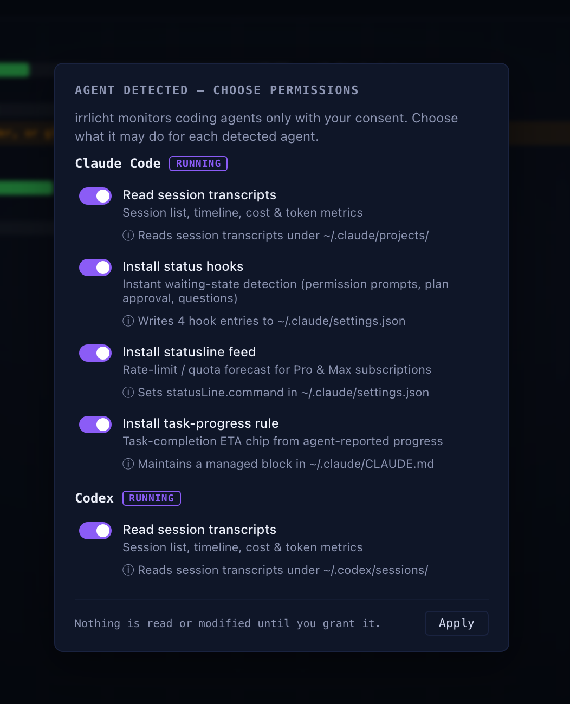

Every read and modification irrlicht performs — transcript tailing, hook installs, statusline wraps, database polling — is now a declared per-agent permission behind explicit consent. When irrlicht detects a coding agent it hasn't asked about, a wizard appears on whichever surface you're looking at (macOS app or web dashboard), shows exactly what each permission touches, and exercises nothing until you hit Apply. Revoking actively undoes: hooks uninstall, watchers stop.

**Why it matters:** you can see — and veto — every way irrlicht touches your system, per agent, before it happens.

**Heads-up on upgrade:** existing installs see the wizard once after updating, and monitoring is paused until you answer it. Notifications are now opt-in by default too.

(#570, #571, #579, #583)

#### Know when your agent will be done

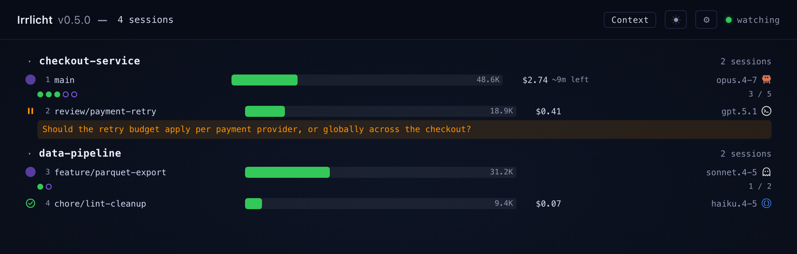

Working sessions now carry a task-completion ETA chip — "~9m left" — in the web dashboard and the macOS menu bar. The agent authors its own progress estimate and emits it as a hidden in-band marker; irrlicht parses it read-only, projects a completion time from the measured pace, and degrades honestly: a range while the rate is barely measurable, dimming when the last report goes stale, and a tasks-derived fallback when no marker arrives at all.

**Why it matters:** "is it nearly done or should I grab lunch?" is now answered at a glance, for every working session, without asking the agent.

(#558, #567, #605, #621, #626)

#### Kiro CLI joins the watch list

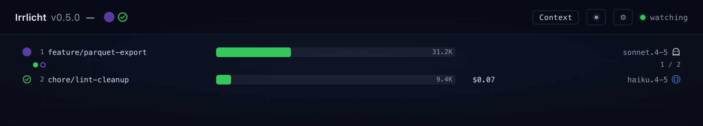

Irrlicht now watches AWS Kiro CLI sessions: live working/waiting/ready state, project + branch resolution, PID binding, task progress synthesized from Kiro's todo lists, and model + context-window metrics read from Kiro's session sidecar.

**Why it matters:** if Kiro is one of your agents, it now shows up beside Claude Code, Codex, and the rest — same row anatomy, same states, no special casing.

(#280, #590, #603, #613)

### Also in this release

**Added**
- **`irrlicht-ls` reaches dashboard parity and ships in the default install** (#554, #580, #609) — hierarchical subagent display, project group headers, color-coded context utilization, cost and adapter columns, task-progress detail lines, `--format json`, and `--id`/`--state`/`--project`/`--adapter` filters; the PKG now symlinks it into `/usr/local/bin`.
- **Menu-bar attention icon for pending permission items** (#607) — the macOS icon signals when an agent is waiting on a permission decision.
- **Gas Town: unified rig/role/cost display in the session list** (#559, #560).

**Fixed**
- **Gas Town polling no longer spikes CPU** (#557, #575) — event-driven polling replaces the hot loop.
- **Stale subagent badges** (#601, #600, #637) — waiting-path cleanup, observable deletions, and push Seq-gap detection with immediate re-hydration keep parent badges truthful.
- **Sessions survive daemon restarts mid-run** (#576, #584) — stale transcripts owned by a live process are rescued at backfill instead of being dropped.
- **Web: rows of a single collapsed group render** (#564, #566).
- **macOS login item re-registers on every launch** (#562, #563) — a self-heal for installs where the login item silently vanished.
- **macOS: premium voices whose names carry a quality suffix match again** (#569).
- **First launch after install no longer races Gatekeeper** (#553) — the installer pre-warms assessment so the app is ready before the daemon wait expires.
- **Ready-state icon stays inside its layout box** (#596, #598).
- **Workflow-tool subagents link to their parent session** (#565, #635) — and workflow run journals are no longer mistaken for transcripts.
- **Kiro: permission-gated edit-tool prompts classify case-insensitively** (#588, #612).
- **Claude Code: task IDs are taken from TaskCreate results** (#620) — and pruned task lists clear instead of lingering.

**Changed**
- **The eyed-flame mark lands everywhere** (#587, #594) — app icon, menu bar, favicon, landing page, and docs all swap to the new mark; shape-only, the state-color system is unchanged.
- **Notifications are opt-in by default** (#579) — part of the consent-first rollout; kitty click-to-focus asks before using remote control.

**Docs**
- **macOS setup guide on the site** (#574).

### Technical appendix

- **Consent-first permission architecture (#570, #571, #579, #583).** New `core/domain/permission` package: `State`/`Kind`/`Set` with absent-key-means-pending as the upgrade path. Adapters declare `Permissions` on `agent.Agent` with Apply/Remove effect closures — claude-code: transcripts/hooks/statusline/instructions; codex + pi: transcripts; aider: history; opencode: database; gastown: state; launcher: env; kitty: remote-control. `PermissionService` exercises grants, undoes revokes (hook uninstall, watcher stop), persists `permissions.json`, arbitrates wizard answers across surfaces (first answer wins; a dataless `permissions_updated` push dismisses the other surface), and runs an always-on detection poller (pgrep / GT_ROOT stat probe, no session reads) only while something is pending in ask mode. `SessionDetector` + `OrchestratorMonitor` gained `AddWatcher` seams so monitoring starts/stops dynamically at grant/revoke; the startup seed and stale-working refresh honor per-adapter consent for persisted sessions. `GET /api/v1/permissions` + `POST /api/v1/permissions/answer`; hook and statusline receivers drop payloads (200) while ungranted. `IRRLICHT_PERMISSION_MODE=grant-all` auto-grants for demo/record/test daemons, strictly in-memory, never persisted. `--uninstall-hooks` also records hooks=denied so a restart cannot silently reinstall. The task-eta CLAUDE.md managed block became the `instructions` permission (#577, #583); notifications flipped to opt-in and kitty remote-control got its own consent (#579). The auto wizard locks its agent set at presentation — a mid-decision detection flip or a newly detected agent never disturbs an open wizard; only answers dismiss it.
- **Task-completion ETA pipeline (#558, #567).** The agent emits `<!-- {"marker":"irrlicht-eta","total_rounds":N,"completed_rounds":M} -->` in-band; the claudecode adapter scans full text blocks tolerantly (accepts key drift, rejects absurd values, latest valid wins, never errors — `AssistantText` is tail-truncated to 200 runes so the scan runs pre-truncation). `TaskEstimate` mirrors through tailer → domain (`SessionMetrics.TaskEstimate` + `TaskCompletionEta`, nil carry-over in `MergeMetrics`) → metrics adapter. `ForecastTaskCompletion` is the single swappable projection seam: measured rate `elapsed/completed` anchored at session start. Web chip: hidden unless working with reported progress, range below half completion, stale dimming past 3 min, minute resolution (`taskEtaPresentation`, mirrored in `SessionListView.swift`).
- **ETA hardening (#605, #621, #626, #619, #638, #620).** #605 makes the chip drop-proof: a tasks-derived estimate falls back when no marker arrives, a PostToolUse-hook carrier survives text-block drops, and a 0/N "estimating…" chip appears within seconds of the first marker. #621 widens the point ETA into a pinned-high range between markers — the low bound counts down in real time, the high bound stays pinned until fresh progress, so the ETA never silently drifts upward. #626 adds subagent-aware aggregation and freshness-based source precedence (marker > tasks > subagents with 180 s grace). #619 (v3) makes the per-phase marker mandatory via the Bash-description carrier; #638 (v4) moves the first marker onto that carrier too, after server-side text-block drops were observed eating pre-tool-call prose. #620 takes task IDs from authoritative TaskCreate results and clears pruned task lists.
- **Kiro CLI adapter (#280, #590, #603, #613, #612).** `FilesUnderRoot`/`JSONLineParser` adapter watching `~/.kiro/sessions/cli/<uuid>.jsonl` (verified against kiro-cli 2.5.1). Versioned envelope events Prompt / AssistantMessage / ToolResults / Clear; no explicit end-of-turn marker — a text-only AssistantMessage maps to turn_done, one carrying toolUse keeps the turn open. The transcript carries no cwd: `pid.go` and `GetCWDFromTranscript` fall back to the `<uuid>.json` metadata sidecar via `transcript.ExtractCWDFromSidecar` (token-walk; the conversation state blob is never fully parsed). CWD-based PID discovery via `pgrep -x kiro-cli` — the chat parent owns the session cwd and the transcript isn't kept open between writes. #603 adds the sidecar `MetricsReader`: model + context window surface live (per-turn credits parsed but not yet priced). #613 synthesizes `TaskCreate`/`TaskUpdate` deltas from Kiro's `todo_list` create/complete events. #612 fixes permission-gated edit-tool classification to match case-insensitively (#588). Onboarded as a matrix column with an interactive tmux driver (headless `--no-interactive` persists no session file).
- **Session-detection internals (#576/#584, #572/#573, #606/#618, #628/#634, #592/#595, #565/#635).** Backfill rescues stale transcripts owned by a live process instead of dropping the session (#584). `BuildAgentGroups` no longer mutates its input sessions (#573). PID assignment is synchronized with the detector loop (#618) and the pidmanager's sweep paths were brought under `assignMu` with the safe paths documented (#634). The dead `ContentChars` pipeline is gone and kiro tool-status semantics are pinned by test (#595). Workflow-tool subagents link to their parent via the run journal's parent field, and run journals themselves are excluded from transcript discovery (#635).
- **Web client (#566, #637, #601).** A single collapsed group renders its rows (#566). Clients detect gaps in the push Seq counter and re-hydrate immediately instead of waiting for the next poll (#637, closing the 64-slot drop window from #601's diagnosis). Stale subagent state fixes: waiting-path cleanup, summary ordering, observable deletions, history leak (#601).
- **Gas Town (#575, #560, #633).** Polling is event-driven, eliminating the CPU spike of the 1 s hot loop (#575). Rig/role/cost render as one unified block in the session list (#560). `gt` fetch timeouts are logged instead of silently falling back (#633).
- **macOS app (#607, #598, #569, #563, #585, #610).** Menu-bar attention icon when permission items are pending (#607); ready-state icon clamped to its size × size layout box (#598); premium-voice matching tolerates quality suffixes in voice names (#569); login-item registration reconciles on every launch (#563); `swift test` passes clean on main (#585); GroupView snapshots pinned to dark aqua (#610).
- **CLI + install (#580, #609, #553).** `irrlicht-ls` gains the dashboard's full feature set — hierarchy with `[N agents: Ww/Rr]` badges, group headers, context-pressure coloring, cost/adapter columns, waiting-question and `N/M completed` detail lines, `--format json` in the grouped `/api/v1/sessions` shape, and id/state/project/adapter filters — still file-only, no daemon required (#580). It ships in the app bundle and the PKG postinstall symlinks it into `/usr/local/bin` (#609, #608). The curl installer pre-warms Gatekeeper assessment so first launch beats the daemon wait (#553).
- **Brand (#594).** The eyed-flame mark replaces the previous flame as a shape-only swap across app icon, menu bar, favicon, landing page, docs, and the design system; state colors and gradients carry over unchanged (#587).
- **Tooling / CI / tests.** gofmt sweep with a CI gofmt gate (#629, #632) and a follow-up format + golden-regen-doc pass (#623). Test de-flakes: FSWatcher event timeout widened for loaded CI runners (#630), ParentBadgeCleared polls for condition (#624, #631), gastown replay settle window widened under `-race` (#611), deterministic cursor-GC aging in the opencode watcher test (#614), child-ready polling instead of fixed sleeps (#578, #582). Onboarding-factory (internal fixture tooling, no runtime impact): on-disk recordings became the single source of truth (#556), coverage-matrix viewer paginates agent columns (#591), kiro-cli `auto-classified-permission` re-recorded at 5/5 with full daemon coverage (#627), claudecode `workflow-fanout` recorded at 7/7 phases (#636). Release-skill docs record `build-release.sh` as the authoritative build path + canary port hazard (#552).
- **Model aliases.** codeburn `BUILTIN_ALIASES` sync ran at release time: no new entries (the lone upstream addition, `gpt-4.1` → `gpt-4.1`, is a self-alias irrlicht intentionally omits); all eight `LOCAL_OVERRIDE` entries unchanged upstream.

## [0.4.8] — 2026-05-30

### Watch your agents from any machine — the `irrlichtrelay` ships, alongside a Linux daemon and per-provider quota tracking.

### Highlights

#### Watch every machine from one place

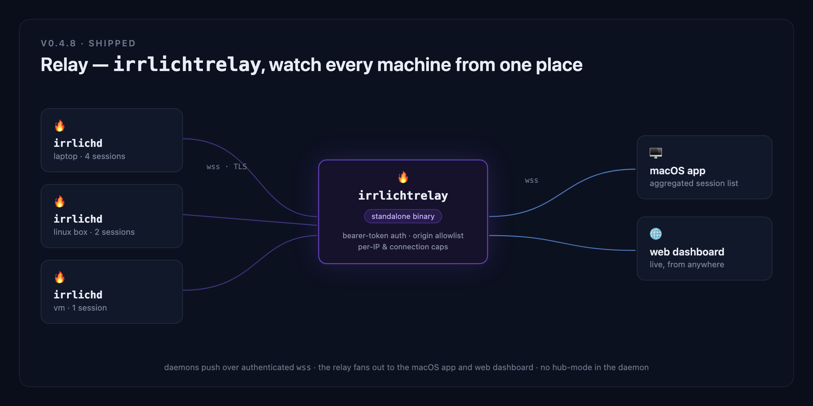

`irrlichtrelay` is a new standalone binary. Point each machine's daemon at it and your macOS app and web dashboard show every session from every host in one aggregated list — your laptop, a Linux box, a VM — without being at any of them. The link is secured end-to-end: TLS/`wss`, bearer-token auth (with a token-minting CLI), an origin allowlist, and per-IP / per-connection caps.

**Why it matters:** you no longer have to sit at the machine running an agent to see what it's doing — one relay, every host, from anywhere, over an authenticated connection. (#483, #547, #544, #548, #519)

### Added
- **Linux daemon** (#482, #478) — `irrlichd` now builds and runs on Linux (amd64 + arm64), daemon-only, behind a portable `ProcessObserver` observation layer; install via the same `curl … | sh` one-liner.
- **Per-provider windowed usage spend + subscription empty-state** (#441, #386) — usage and quota are tracked per provider, with a clean empty-state before the first window of data lands.
- **OpenCode inherits OpenAI rate limits** (#424) — OpenCode sessions pick up the OpenAI rate-limit window via the JWT `account_id`, so quota burndown is accurate for OpenCode→OpenAI users.
- **Background Bash processes hold a session `working`** (#450, #452) — a claudecode session with a live backgrounded process stays `working` until it finishes, instead of falsely settling to `ready`.
- **Editable relay URL + token fields in macOS Settings** (#550) — the relay endpoint and bearer token are now editable text fields in the app's Settings.

### Fixed
- **Surface claudecode tool-use permission prompts as `waiting`** (#490) — a session paused on a permission prompt now flips to `waiting` instead of looking busy.
- **Codex: settle interrupted turns** (#464) — a `turn_aborted` is treated as turn-end, so an interrupted Codex turn settles instead of hanging in `working`.
- **Price Warp / Cursor / Antigravity sessions correctly** — added 22 new model aliases synced from codeburn (Warp auto-routers and codex display strings, Cursor dash-form reasoning tiers, Antigravity Gemini 3.5 Flash, and human-readable display-name forms), so these frontends price at real dollars instead of $0. Closes the alias-sync gap deferred in v0.4.7.
- **claudecode: strip trailing period from background-process output path** (#501).

### Changed / Distribution
- **Web dashboard split into three files** (#418) — `index.html` + `irrlicht.css` + `irrlicht.js`, with Vitest unit tests; the daemon serves them from disk, no codegen.
- **Linux replay Dockerfile relocated** to `tools/` (#499).

### Technical appendix

- **Relay (`irrlichtrelay`).** v0 round-trip daemon → relay → macOS + web (#483); v1·A secure exposure — TLS/`wss`, bearer-token auth + token-minting CLI, origin allowlist (#547); v1·B hardening — websocket read-limit + per-IP / per-connection caps (#544); v1 epic C–G — compound session keying across hosts, origin glyph, deploy artifacts, fade-on-disconnect, coding-factory demo (#548); macOS auto-connect on relay URL, connection-status dot, restored ⓘ + scroll (#519); editable relay URL + token Settings fields (#550); live cross-host round-trip testbed under `examples/` (#486).
- **Cross-platform observation layer.** New `ports.ProcessObserver` seam with build-tagged `process_{darwin,linux,other}.go`; the adapters are unchanged (internal seam, not DI), and a Linux daemon falls out — Windows is now "add one file" (#482, #478).
- **Quota / pricing.** Per-provider windowed usage spend + subscription empty-state (#441, #386); OpenCode→OpenAI rate-limit inheritance via JWT `account_id` (#424); 22 new frontend aliases in `core/pkg/capacity/aliases.go` synced from codeburn's `BUILTIN_ALIASES`. Five Warp codex aliases resolve to `gpt-5.3-codex`, which LiteLLM does not yet price — they log on miss and are flagged for a follow-up sync rather than blocking the release.
- **Session detection.** claudecode tool-use permission prompts surface as `waiting` (#490); backgrounded-Bash tracking keeps the session `working` and recognizes `TaskOutput` / `<task-notification>` completion in SDK-harnessed claude as well as `BashOutput` / `KillShell` in bare claude (#450, #452, #501); codex `turn_aborted` treated as turn-end (#464).
- **Onboarding factory (internal fixture tooling — no runtime impact).** Eight-phase rewrite of the scenario × adapter coverage matrix: `tools/agent-onboarding` → `tools/onboarding-factory`, with the `of` CLI as the sole writer of everything under `replaydata/` (#522–#530). Schema cutover to per-scenario shards — one catalog (`scenarios.json`) plus per-cell `metadata.json` in id-prefixed folders, every recording moved under `recordings/<name>/` (#510, #511, #514, #524). New 4-verb `ir:onboarding-factory` skill (create-scenario / create-agent / assess / record) retiring `ir:onboard-agent`; `of validate` as a CI integrity gate. Per-adapter column recordings landed across claudecode, codex, opencode, aider, and pi (#515, #517, #518, #504, #489, #477, and others).
- **Tests / CI.** Per-worktree state isolation + headless daemon startup smoke test (#448); hermetic replay so byte-identity goldens reproduce (#447, #451); fswatcher flake fixes (#485, #487); three-dot diff in the replaydata deletion guard (#466); web dashboard Vitest suite (#418).

## [0.4.7] — 2026-05-22

### macOS distribution levels up: Sparkle auto-updates and a notarized DMG, plus OpenCode task progress reaches dashboard parity.

### Added
- **Sparkle 2.x auto-update integration** (#413) — the app now checks for updates on launch and offers a one-click upgrade; a manual "Check for Updates…" button lives in both the popover and the Settings panel. Public EdDSA key baked into the Info.plist; signed appcast served from `irrlicht.io/appcast.xml`. First Sparkle-enabled release is v0.4.7; users on v0.4.6 must do one manual upgrade before auto-updates begin.
- **Web dashboard ports the macOS overlay's provider quota chip** (#417, closes #387) — popover and dashboard now show identical 5h/7d subscription bars (or cumulative usage spend) for the same `/api/v1/sessions` response. Stacked bars with pace marker and matching color thresholds; Settings modal gains a Provider-quota section with the same auto/subscription/usage controls as the macOS app.
- **OpenCode `todowrite` snapshots now surface as task-progress dots** (#410, closes #277) — parity with Claude Code's TaskCreate/TaskUpdate pipeline. Content-keyed deltas survive OpenCode's lack of stable todo IDs.

### Fixed
- **OpenCode working→ready latency** (#412, closes #278) — sessions flip from working to ready ~2.5 s faster; the SQLite metrics path was waiting on a debounce timer that no longer applies once the session is idle.
- **Claude Code wrapped command preserves user statusLine output** (#404) — irrlicht's status injection no longer overwrites a user's custom statusLine config.
- **Curl installer survives GitHub API rate limits** (#401) — falls back to the redirect-based latest-release URL when the API returns 403.

### Changed / Distribution
- **Developer-ID signed + Apple-notarized DMG** (#406, #409, closes #233) — first launch through the curl installer or Homebrew cask no longer trips Gatekeeper; the quarantine-strip workarounds in `site/install.sh` and the cask postflight are gone. Build script exits 1 if `DEVELOPER_ID` is set without `NOTARYTOOL_KEYCHAIN_PROFILE` to prevent shipping an un-notarized DMG.
- **`com.apple.security.get-task-allow` removed from production entitlements** (#407, #415) — Apple notarization rejects binaries with the debug entitlement set to true. Build-time + canary-install guards both assert the entitlement is absent on the shipping artifact, using value-aware XPath so an explicit `<false/>` doesn't false-fail.

### Regressed (temporary)
- **Focus-aware DND notification silencing disabled** — `com.apple.developer.focus-status` is a restricted entitlement that requires an embedded provisioning profile from Apple's developer portal; the Developer-ID cert alone doesn't grant it, so AMFI was killing v0.4.7 launches with POSIX 153. Entitlement stripped to unblock notarized shipping. The DND-silencing path from #338 is dark until a follow-up lands the provisioning profile work. Tracked in a fresh issue.

### Docs
- **Kitty terminal-host docs** (#402) — clarify that font/config changes require a full app restart, not just a reload.

### Removed
- **`tools/coverage-viewer` and `tools/find-flicker-sessions.sh` deleted** (#411, #414) — superseded by the unified agent-onboarding viewer (`tools/agent-onboarding`, port 8765).

### Internal
- **`/ir:onboard-agent` pipeline lands** (#328, #408) — drives every adapter through a shared agent-agnostic scenario catalogue keyed by capabilities; records lifecycle fixtures and surfaces material drift vs. committed recordings. First-class opencode driver added in this release. Scenarios marked `applicable: false` for the current adapter are now skipped rather than miscounted as failures.

### Deferred
- **Model alias map sync from codeburn skipped this release** — 13 upstream additions remain unsynced; several target canonicals (e.g. `gpt-5.3-codex`) are not yet in LiteLLM's pricing table, so adding them now would still resolve to zero-cost capacity. Will land in a follow-up once LiteLLM catches up.

### Technical appendix

- **Sparkle 2.x integration (#413)** — Sparkle 2.9.2 added via SwiftPM with a thin `UpdateManager` wrapping `SPUStandardUpdaterController` under `platforms/macos/Irrlicht/Managers/`. EdDSA keypair generated; public key `nKRcUPAmK6syLFEvp9O30FFvjhTIfGxYVv/6y8zpZI0=` baked into both the tracked `Info.plist` and the `tools/build-release.sh` heredoc. Settings panel gains an Updates section; popover gains a "Check for Updates…" row between Settings and Quit. `tools/build-release.sh` copies `Sparkle.framework` into `Contents/Frameworks/`, adds the `@executable_path/../Frameworks` rpath, and signs the nested helpers (Downloader.xpc, Installer.xpc, Updater.app, Autoupdate, framework binary) deepest-first before the outer bundle in both DevID and ad-hoc branches. New `site/appcast.xml` ships with one signed entry for v0.4.6 so the feed serves a valid response immediately. Private key lives in macOS Keychain with an out-of-band backup. **After installing v0.4.7, drag the app to `/Applications/`** — Sparkle refuses to self-update from a Gatekeeper-translocated `~/Downloads/` path.
- **Notarized + Developer-ID signed DMG (#406, #409)** — `tools/build-release.sh` signs the app bundle with the Developer ID cert + hardened runtime + entitlements when `DEVELOPER_ID` is set; notarizes and staples the DMG when `NOTARYTOOL_KEYCHAIN_PROFILE` is also set. The build exits 1 if `DEVELOPER_ID` is set but `NOTARYTOOL_KEYCHAIN_PROFILE` is not — a DevID-signed-but-un-notarized DMG would block Gatekeeper now that the cask postflight is gone. Build script now also signs the SwiftPM resource bundle (`Irrlicht_Irrlicht.bundle`) and copies AppIcon to Resources/ before the outer sign — both were missing and would have produced unsignable / iconless bundles. `FocusMonitor.swift`'s NSClassFromString-dispatch pattern remains for the future provisioning-profile path; the entitlements file ships empty in v0.4.7 because the focus-status restricted entitlement needs a portal-provisioned profile that we don't have yet (kept the dynamic-dispatch source so re-enabling is a one-line entitlements + cert-profile change).
- **`get-task-allow` removed from production entitlements (#407, #415)** — `platforms/macos/Irrlicht/Resources/Irrlicht.entitlements` no longer declares `com.apple.security.get-task-allow=true`. `Irrlicht-dev.entitlements` still carries it for local Xcode debug builds. The build's entitlement verification uses value-aware XPath rather than key-grep so an explicit `<false/>` doesn't false-fail. The canary install check in step 9 re-runs the same assertion against the actually-shipping bundle.
- **OpenCode todowrite → task-progress dots (#410)** — `opencode.Parser` is now stateful: each `todowrite` snapshot translates into the minimal `TaskCreate` / `TaskUpdate` delta sequence the tailer expects, content-keyed because OpenCode's todos carry no stable IDs. A parallel ~15-line accumulator in `core/adapters/inbound/agents/opencode/metrics.go` populates `metrics.Tasks` on the SQLite metrics path (replay-only would have been a single-file change). Replay fixture `replaydata/agents/opencode/regression/todowrite-basic/` covers the create / status-change / append / non-pending-on-first-sight matrix. New `TestComputeMetrics_TodowriteTasks` drives `querySessionMetrics` with a synthetic SQLite DB to cover the inline TaskDelta fold.
- **OpenCode latency fix (#412)** — eliminates a ~2.5 s tail where the SQLite metrics path waited on a debounce timer that no longer applied once the session went idle. New `core/application/services/debounce_test.go` pins the timing invariant.
- **`/ir:onboard-agent` pipeline (#328, #408)** — unifies fixture refresh + adapter bootstrap + new-agent onboarding into one skill. Drives the real CLI (currently `claude` and `opencode`) through a shared agent-agnostic scenario catalogue keyed by `requires: [capability]`; adapters declare `Capabilities` and the matrix cells fall out automatically. New `drive-opencode-interactive.sh` driver: each `send` step is an `opencode run --session <id>` subprocess; post-run SQLite export to the parts JSONL the parser expects.
- **Installer rate-limit hardening (#401)** — `site/install.sh` falls back to the `/releases/latest` redirect URL when the GitHub API returns 403.

## [0.4.6] — 2026-05-17

### Public roadmap page lands, with screenshots and concept tiles for every release row

### Highlights

#### Public roadmap at `/docs/roadmap.html`

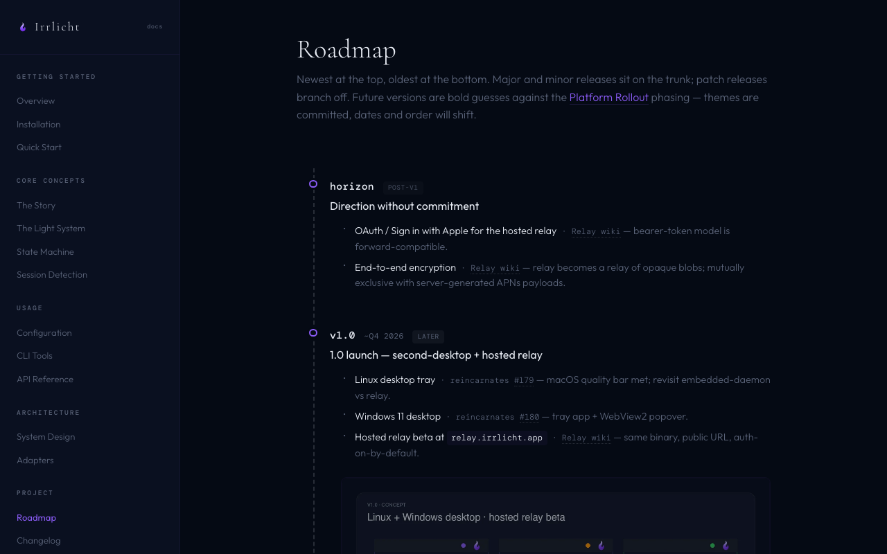

A chronological newest-at-top timeline shows every shipped release with big milestones, italic notes for narrower changes, and a compact `ALSO SHIPPED` roll-call of every other issue/PR. Future versions (v0.5 → v1.0 plus horizon) are bold guesses against the [Platform Rollout](https://github.com/ingo-eichhorst/Irrlicht/wiki/Platform-Rollout) wiki, with concept tiles for the in-flight relay-v0 work, the planned VS Code panel, iOS / iPadOS, Android + Apple watch, and the v1.0 second-desktop + hosted relay launch.

**Why it matters:** where the project is going is now discoverable without spelunking GitHub issues. Linked from every docs sidebar, the landing footer, and the `CHANGELOG.md` preamble. Future releases will migrate items from above the today line down across it as they ship. (#395)

### Added
- **Moonshot Kimi family in the alias map** — `kimi-auto`, `kimi-code`, `kimi-for-coding` resolve to `moonshot.kimi-k2-thinking` in LiteLLM (codeburn sync). Sessions on Kimi-routed frontends now price at non-zero.

### Changed
- **Brand: gradient flame refresh propagates across the remaining surfaces** (#394) — picks up the docs sidebar dot, design-system preview tiles, and the few last places where the old wisp survived the v0.4.5 rollout.
- **Working-state icon: heartbeat halo → breathing solid dot** (#393) — the SMIL halo animation was distracting; the solid dot with a gentle opacity breathe reads cleaner at 14px in the menu bar.
- **Web dashboard: subagent dot-matrix row dropped to match the macOS overlay** (#397) — the 89/96-style dot strip was a web-only detail that no longer matched the unified row anatomy shipped in v0.4.5.

### Fixed
- **Claude Code task list: prune entries absent from `task_reminder` snapshots** (#396) — the in-memory task list is reconciled against the authoritative snapshot so dropped tasks no longer linger as `in_progress` indefinitely.

### Docs / Tooling
- **Release-flow friction removed from `CLAUDE.md`** (#392).
- **`/ir:release` release-notes template + Step 4a-roadmap mechanics** — three-layer release notes (Headline → ≤3 Highlights with screenshots → Also → Technical appendix) at `.claude/skills/ir:release/release-notes-template.md`. Step 4a-roadmap codifies the roadmap-update protocol (Python recipe for ALSO SHIPPED, row-shape templates, today-line bump, pill rotation for minor releases).

### Technical appendix

- **Public roadmap page (#395)** — `site/docs/roadmap.html` is a single file with all CSS scoped inline (no `docs.css` edits). Pure-CSS git-branch via pseudo-elements: vertical spine via `.timeline-section::before`, minor-release nodes centered on the spine via `.release.minor::before`, patch nodes offset right via `.release.patch::before` (horizontal stub) + `.release.patch::after` (small dot at end of stub). Depth = 2 on the regex that finds release-block bounds, since both `
` and `
` open before the version label. ALSO SHIPPED list extracted via `git log <prev-tag>..<this-tag>` then noise-filtered for hex colors (`#34C759`) and natural-language `#N` uses (`sweep #2`, `Phase-narration #2`). Refs already cited in highlights / italic notes are pruned from each row's ALSO SHIPPED line to avoid duplication. Linked from every `docs/*.html` sidebar (new "Project" section between Architecture and Community), the landing-page footer, and the `CHANGELOG.md` preamble.
- **Roadmap concept tiles** — six future-section composites generated via Python + PIL + rsvg-convert, using the new gradient flame brand on a dark-themed dark panel matching the docs.css palette. Tiles live under `assets/roadmap/v<ver>/` (source) and `site/assets/roadmap/v<ver>/` (WebP + PNG). Past-section figures use the existing `assets/releases/v<ver>/` namespace. CSS `.release-figure` renders future tiles at 0.78 opacity and past at 0.92 — concept reads as concept, screenshot reads as shipped UI.
- **Release-notes template + Step 4a-roadmap expansion** — three-layer template at `.claude/skills/ir:release/release-notes-template.md` with worked example from v0.4.5. Step 2 / Step 4a in the skill updated to consume it; Step 4a-img enforces the highlight-image asset checklist (source PNG, site PNG, site WebP); Step 4a-roadmap codifies a 5-substep protocol (A. extract refs via git log, B. insert release row in past section, C. bump today line, D. pill rotation for minors, E. verify desktop + mobile + link spot-check).
- **Brand refresh continuation (#394)** — propagates the v0.4.5 single-path gradient flame to surfaces the original PR missed: docs sidebar `.dot` swapped for an inline gradient flame SVG, design-system preview tiles updated, AppIcon iconset regenerated via the reproducible `tools/build-app-icon.sh` builder so the .icns is byte-identical on re-runs.
- **Working-state breathing dot (#393)** — `svgIcons.working` in `platforms/web/index.html` swaps the SMIL heartbeat halo for a solid `<circle class="core" fill="#8B5CF6">` with a CSS keyframe `opacity` breathe (no animation under `prefers-reduced-motion`). macOS `SessionStateIcon` updated to match — `BreathingDot` SwiftUI view with `repeatForever` opacity transition, honoring `accessibilityReduceMotion`. Snapshot fixtures refreshed.
- **Web: subagent dot-matrix row removed (#397)** — the 89/96 progress-dot strip below the session row no longer renders. The strip was a web-only artifact that conflicted with the unified row anatomy in v0.4.5. macOS overlay never had it; this brings web in line. Removed `.subagent-dot-matrix` CSS + the corresponding row builder.
- **Claude Code task-list pruning (#396)** — the tailer treats `task_reminder` attachments as authoritative: after the existing `TaskDelta` loop, any local `in_progress` whose ID is missing from the snapshot is demoted to `completed`, and present-but-divergent-status entries take the snapshot value. Mirrors the v0.3.12 phantom-`in_progress` fix (#289) but for the absent-task case.
- **CLAUDE.md friction (#392)** — drops the reminder paragraph that conflicted with the `/ir:release` skill's own step ordering.
- **Model aliases — codeburn sync** — adds `kimi-auto`, `kimi-code`, `kimi-for-coding` to `core/pkg/capacity/aliases.go`, all `LOCAL_OVERRIDE` to `moonshot.kimi-k2-thinking` since LiteLLM only ships the dotted-prefix key. Five changed entries in the codeburn diff (`claude-4-opus`, `claude-4-sonnet`, `claude-4-sonnet-1m`, `copilot-openai-auto`, `gpt-5.1-codex-high`) are intentional `LOCAL_OVERRIDE`s — not updated.

## [0.4.5] — 2026-05-16

### Added
- **Pro / Max subscription burn-rate forecast in the macOS overlay** (#309, #379) — Two ingestion paths cover the major subscription combos: Codex CLI's `token_count` events carry `rate_limits` in-band (parser extension), and Claude Code's statusline JSON is captured via a new `statusLine.command` that POSTs to `/api/v1/hooks/claudecode/statusline`. The statusline chain is wrapped in `bash -c '...'` so the bash-only `tee >(...)` process substitution survives Claude Code's POSIX-sh invocation; v1 wraps installed before the fix are recognised and migrated on the next daemon start without losing the user's original statusline command. Snapshots flow into `SessionMetrics`; a 5-sample rolling history feeds a linear-projection forecast; the menu-bar header shows a provider chip (Anthropic / OpenAI inferred from `plan_type` or adapter) with stacked 5h / 7d horizontal progress bars carrying percent + reset time inline, coloured via the existing pressure-level ramp. Version moves out of the header and into a small footer in Settings so the header slot is always reserved for quota data.
- **Brand: new single-path gradient flame across design system + macOS app** (#388) — Replaces the old "outer + inner-highlight + tear ellipse" wisp (viewBox 32) with a single-path silhouette designed at viewBox 1254, plus per-state gradient treatments (purple / orange / green) and a flat mono + black/white variant set. Six source SVGs land under `assets/irrlicht_flame_*.svg`; the design-system preview gains a "state colors" tile row and refreshed palette swatches per hue; `OffFlameImage.swift` is rescaled to viewBox 1254 with the single path and the unused core gradient dropped; `AppIcon.icns` is regenerated via a new reproducible builder `tools/build-app-icon.sh` (rsvg-convert with qlmanage fallback) that produces a byte-identical `.icns` on re-runs. The landing-page navbar swaps its 8×8 `.sparkle` dot for an inline 22×22 gradient flame SVG using the new mark, keeping the breathe animation.
- **Unify per-row state icons across web and macOS** (#382) — Replaces the dashed circle (web) and SF Symbol hammer/hourglass (macOS) with a shared visual vocabulary: `working` = heartbeat halo (purple), `waiting` = two-bar pause (orange), `ready` = unchanged checkmark. Web swaps `svgIcons.working` for an inline SMIL heartbeat-halo SVG, drops the now-unused `.working` spin rules, and hides the animated halo under `prefers-reduced-motion` (steady inner dot remains). macOS adds a new `SessionStateIcon` SwiftUI view that renders the halo natively (`repeatForever`, honors `accessibilityReduceMotion`) and the pause bars as two `RoundedRectangle`s. Snapshot fixtures impacted by the icon swap are re-recorded. Closes #380.
- **`/ir:triage` assigns release milestones on `ready-for-agent`** (#375) — Triage was applying labels but leaving milestone empty, so every ready-for-agent issue still needed a manual maintainer pass to land in a release bucket. The skill now picks a milestone from priority and creates one if the bucket doesn't exist: `Priority-High` → `ACTIVE` (in-progress release), `Priority-Medium` → `NEXT`, `Priority-Low` → `FUTURE`. The three buckets are computed once per run from the latest published release tag (`gh release view --json tagName`), so the skill survives a version bump without an edit. Skipped on `needs-info` / `wontfix` and on issues already carrying a maintainer-set milestone. Bundled into the existing `gh issue edit` call, so still one round-trip per issue. The brief template gains a `**Milestone:**` line.

### Fixed
- **Detect imperative waiting cues without a literal `?`** (#381, #383) — `IsWaitingForUserInput` now classifies turns ending with an imperative ask ("let me know if it's right", "verify locally and reply with the diff", "awaiting your go-ahead before I merge") as `waiting` instead of falling through to `ready`. Adds `ExtractWaitingCue` alongside the existing `ExtractQuestionSnippet` — both are OR'd in the public predicate, leaving snippet semantics unchanged. The cue regex set comes from issue #381's coverage matrix: five buckets (direct asks, approval framings, action gates, curated imperatives, trailing soft asks), all running against the trailing 1–2 sentences so earlier paragraph content can't trigger false positives. `ExtractWaitingCue` walks the tail newest-first so when both the last and second-to-last sentence match a cue, the more recent (typically more natural for display) sentence is returned. State-classifier Rule 2a now reports `turn ended with question or cue → waiting`. Adds the `agent-imperative-pending` replay scenario and refreshes five existing claudecode goldens whose trailing assistant text contains imperative cues that should always have been waiting.
- **Web: migrate sessions when `project_name` lands after the first push** (#377) — The web dashboard's `applySessionUpdate` updated agent fields in place but never reconciled group membership when `project_name` changed. So if the first `session_created` WS push arrived before git-metadata enrichment had filled in `project_name`, the agent was placed in the "unknown" bucket and stayed there permanently. The macOS app dodges this because `patchApiGroups` schedules a full re-hydration on a missed session id; the web view had no equivalent path. Fix: on a `session_updated` for an existing top-level entry, detect when the new `project_name` points at a different group than where the agent currently lives, splice it out, find-or-create the target group, and clean up the source group if it goes empty (mirroring the pruning logic in `applySessionDelete`). Children inherit their parent's group and have their `sessionIndex` entries re-anchored via `indexChildren` so no stale group reference lingers.
- **Pricing: normalize frontend-rewritten model names — 63-entry alias map synced from codeburn** (#371, #376) — Sessions running through frontends that rewrite the model name before the LLM call (Cursor's `claude-4.6-opus-fast-mode`, OMP's `anthropic--claude-4.6-opus`, Antigravity's `gemini-3.1-pro-high`, …) priced at $0 because `CapacityManager.GetModelCapacity` did an exact LiteLLM-key lookup with no normalization. Adds `core/pkg/capacity/aliases.go` (a 63-entry alias map ported from codeburn's `BUILTIN_ALIASES`) and resolves it inside `GetModelCapacity` before the existing lookup. Exact-match only; no prefix/fuzzy logic. `logPricingMiss` now surfaces the canonical when an alias was resolved. Five aliases whose codeburn canonicals are missing from LiteLLM are marked with `// LOCAL_OVERRIDE: <reason>` and re-pointed to LiteLLM-present keys — every entry now resolves to non-zero pricing. Adds the `/ir:refresh-aliases` skill (standalone-PR + release-inline modes) that diffs against codeburn upstream and recognizes `LOCAL_OVERRIDE` markers, wired into `/ir:release` as Step 1.5 (fail-soft) so every release picks up new aliases. Verified end-to-end via replay against `claudecode/06-cost-calculation-07f5cca9`: an OMP-aliased input produces byte-identical $86.83 cost vs the canonical baseline. (The v0.4.5 Step 1.5 codeburn fetch was blocked by the local agent's permission classifier, so the in-repo alias map is unchanged from v0.4.4; no new aliases were added this cycle.)

### Docs
- **List VS Code extension as a planned platform** (#370) — Adds "VS Code extension" between CLI (alpha) and Linux (planned) in both the landing-page Platforms column (`site/index.html`) and the README Platforms table; the README row links to the tracking issue (#350). Groups editor/UI surfaces (menu bar, web, CLI, VS Code) before OS-target planned items (Linux, Windows, iOS/iPadOS).

## [0.4.4] — 2026-05-16

### Added
- **Web dashboard reaches overlay parity (beta)** (#354) — The dashboard served at `http://127.0.0.1:7837` now reaches visual and functional parity with the macOS menu-bar overlay, in service of the upcoming VS Code panel (#350) and future relay-served clients. Row anatomy matches `SessionListView.swift`: state · num · subagent badge · branch · ctx-bar (with token overlay inside) · cost · model · adapter icon, with strict `flex-wrap: nowrap`, branch + bar growing into available slack, and a 22 px row height that survives the Context ↔ history mode toggle without shifting rows. Stacked below the row are the waiting question, task progress dots, the right-anchored 89/96-style subagent dot-matrix, and the pressure alert. The header carries the version chip, aggregated state icons (≤ 3 inline, else "N sessions"), a view-mode cycle (`Context / 1 Min / 10 Min / 60 Min`), a theme toggle (☀/☾), a settings cog (⚙), and a 3-state connection indicator (`watching` / `reconnecting` / `disconnected`) with a banner when the daemon connection drops. A new Settings modal mirrors `SettingsView.swift` minus the bits the web can't do — show-cost, debug mode (toggles row-id/row-elapsed/row-created chips), and three notification toggles (ready / waiting / context pressure) that fire `new Notification(...)` only when the dashboard isn't the focused tab. Themes pick `icon_svg_light` vs `icon_svg_dark` per resolved theme so the Codex icon is now visible on both. Group headers cycle day/week/month/year on click, persist their collapse state in `localStorage`, and Gas Town groups get a ⛽ glyph. A responsive cascade keeps the context bar — the load-bearing signal — visible at any width: cost drops below 420 px, model below 360, adapter icon below 320. On the daemon side this added exactly one route: `GET /api/v1/version` returning `{"version": "..."}`. The previous timeline-heatmap and Raw-JSON tab — both debug surfaces the overlay never had — are removed. Click-row-to-jump, per-event sound pickers, and Launch at Login remain overlay-only by intent. Marked **beta** in `README.md` and `site/docs/quickstart.html`.

### Fixed
- **Codex split-event `token_count` priced at $0** (#361) — Codex sessions reported $0 cost because the parser emitted `PerTurnContribution{Model: ""}` on every `token_count` event — Codex splits the model name onto `turn_context` and the usage cursor onto `token_count`, so the tailer bucketed deltas under `cumByModel[""]`, which has no pricing. In `applyContribution`, contributions with no model now fall back to `t.metrics.ModelName` (already maintained by `applyModelMetadata` from `turn_context`) so pricing and the UI's model display read the same field by construction. `LedgerState` persists `ModelName` so the fallback still works on the first `token_count` after a daemon restart, when the next `turn_context` might not arrive until the following turn boundary. Six Codex replay goldens regenerated with the corrected pricing; `proposed-plan-pending` stays uncosted because its model (`gpt-5.2-codex`) isn't in the LiteLLM cache — the explicit out-of-scope case in the issue.
- **Adapters honor agent-CLI env vars for relocated session dirs** (#349) — Three coding-agent adapters now respect their upstream env-var convention for relocating session transcripts: **Pi** via `PI_CODING_AGENT_SESSION_DIR` (the absolute session dir itself), **Claude Code** via `CLAUDE_CONFIG_DIR` with `/projects` appended (transcripts only — the PID-metadata directory at `~/.claude/sessions/` remains hardcoded because that hunk is unverified), and **Codex** via `CODEX_HOME` with `/sessions` appended. `fswatcher.New` treats an absolute `dir` as-is and falls back to `$HOME`-relative for relative paths, one small seam with no caller signature change. Non-absolute env values (relative paths, unexpanded `~`, trailing slashes) are `filepath.Clean`-ed and rejected with a `log.Printf` warning so a misconfigured path surfaces in logs instead of silently watching the wrong place. Env vars are read once at `Agent()` construction (daemon startup), so a daemon restart is required after changing them. Default-install behavior is unchanged. Aider and OpenCode are intentionally untouched — aider is per-CWD with no root to override, and opencode uses XDG via SQLite.

### Docs
- **Subtle mascot illustrations + sentence-level correctness audit** (#365) — Adds 9 thematically-matched flame-mascot figures across `site/docs/*.html` (one centered hero on the docs index, eight float-right on the major pages), designed to read on both light and dark themes — 28 × 1024×1024 source PNGs committed under `assets/mascot/transparent/` (~45 MB) become 9 × 640px WebP at quality 88 under `site/assets/mascot/` (908 KB, ~6% of source). Floats reflow to centered blocks at ≤ 720 px. Three parallel review passes then cross-checked every factual claim in the docs against the current Go source and fixed 17 stale or wrong statements: `light-system.html` context-pressure thresholds corrected from `0–70% / 70–85% / 85%–155K / 155K+ tokens` to `0–60% / 60–80% / 80–90% / 90%+` to match `core/pkg/tailer/tailer_metrics.go`; `installation.html` flame icon called a "sparkle"; six `contributing.html` references to the deleted `./validate.sh` script replaced with the current `go test ./core/... -race -count=1` + `tools/replay-fixtures.sh` workflow; `adapters.html` package rename `processscanner/` → `processlifecycle/` plus a corrected recursive two-level claude-code fswatcher description and a generalized per-adapter `pgrep -x` or `pgrep -f` claim with backoff; `architecture.html` HTTP/WS diagram updated to `/api/v1/sessions(/stream)`; `api-reference.html` `adapter` field listing all 5 wired adapters plus empty (was only `claude-code` or `codex`); `cli-tools.html` removed never-implemented `--format json` and `--id <prefix>` flag docs and corrected log filename to `events.log`; `configuration.html` log filename to `events.log`; `session-detection.html` `lsof` command updated to include the `-Fn` flag actually used in `osutil.go`.

### Distribution
- **Five release-skill guardrails against v0.4.3's shipping defect** (#360) — v0.4.3 shipped a binary that crashed on every end-user install (#357 root-caused it; #356 + #358 landed the code/config fixes). Five further guardrails make the same shape of bug unable to recur. (1) Drop `NSFocusStatusUsageDescription` from the Info.plist template — with `Intents.framework` statically linked, TCC preflights `kTCCServiceListenEvent` at process startup regardless of whether any Intents API runs, and SIGABRTs ad-hoc-signed builds regardless of the usage description; for ad-hoc builds the key is harmful, not helpful. (2) Rewrite the coupling-rule prose with a per-key include/exclude table for ad-hoc vs Developer-ID modes, explaining the actual three-way relationship between Apple-restricted entitlements (AMFI-gated), `NS*UsageDescription` keys (TCC-gated *if* the matching framework is linked), and the linked frameworks themselves (the structural lever). (3) Add a framework-link audit between Swift build and signing: `otool -L` the freshly-built binary against a `FORBIDDEN_FRAMEWORKS` list and abort the release on any match with a reason and a pointer to the source-level fix pattern (the `FocusMonitor` `NSClassFromString` dance from #358). (4) Strengthen smoke-test failure semantics with explicit "DO NOT SHIP" framing on failure, a `tccutil reset` prereq to clear poisoned cache, and a four-step debugging checklist anchored in the diagnostic moves that actually surface root cause. (5) Replace Step 9 verify with a real end-to-end install canary that runs `curl ... | sh` against the just-published release and validates the app is running, at the right version, with no entitlements — `pgrep`-based ground truth because the installer's `"Launching... ✓"` lies when AMFI kills the app immediately.

## [0.4.3] — 2026-05-15

> **Note:** Assets re-cut later the same day. The original v0.4.3 binary statically linked `Intents.framework` (via `FocusMonitor.swift`'s direct `INFocusStatusCenter` calls), which made macOS TCC preflight `kTCCServiceListenEvent` at process startup and AMFI/TCC SIGABRT the ad-hoc-signed binary with `launchd POSIX 153` on every end-user install. The re-cut moves `FocusMonitor` to dynamic dispatch (`NSClassFromString` + `SecCodeCopySigningInformation` gate) so Intents.framework is never loaded on ad-hoc builds. DND-aware notification silencing is paused until Developer-ID signing lands (#233); restoration tracked in #357. Release-skill regression fix that prevents recurrence: #356.

### Added
- **macOS: autostart Irrlicht.app at login, on by default** (#343) — On first launch the app registers itself as a login item via `SMAppService.mainApp` so the menu-bar overlay is up before you open your first terminal. A new toggle in Preferences flips the setting, and the choice is persisted to `UserDefaults`; a one-time gate (`didApplyDefaultLoginItem`) ensures the default never re-enables itself after you turn it off. The XPC call to launchd runs on a detached `userInitiated` task so the toggle animation stays smooth on slower Macs. The unsigned-then-signed-build dev edge case is called out inline in `applyDefaultIfNeeded` so future maintainers know why the gate exists.

### Fixed
- **macOS: focus VS Code windows on other Spaces** (#344, #348) — When VS Code (or Cursor / Windsurf) was fullscreen on a different macOS Space, clicking a session row in the overlay was a silent no-op. AX's `kAXWindowsAttribute` omits cross-Space fullscreen windows for Electron hosts, so the title-matching activator never saw the target window. The fix enumerates the app's Window menu instead — that list is always complete — and AX-presses the title-matching item so macOS performs the Space switch and window raise atomically. Window-menu titles are recognized across the major macOS-supported locales (en/de/fr/es/it/pt/nl/sv/da/no/fi/pl/cs/ru/tr/ja/zh-Hans/zh-Hant/ko) so the path works for non-English users too. Hardening from /simplify review: drop the second-to-last-menu positional fallback (could trigger a destructive action in non-Cocoa-standard apps), unwrap `menuBarRef` before `CFGetTypeID`, and collapse the imperative lookup into `first(where:) + compactMap`.
- **daemon: session disappears when a second Claude is opened in the same VS Code window** (#345, #347) — Opening a second Claude Code session inside the same VS Code window briefly leaves the new process in the parent CWD before it `cd`s into its worktree. The scanner minted a `proc-<NEW>` pre-session for that CWD; the claudecode adapter's CWD-based PID discovery — with no transcript yet, so the metadata-based filter is bypassed — then returned the *neighbor* process's PID, and `HandlePIDAssigned`'s same-PID cleanup deleted the legitimate neighbor's session row. The row reappeared later via the activity-driven recovery path, which presented as a confusing flicker. Fix: pre-session IDs already encode the PID by construction (`fmt.Sprintf("proc-%d", pid)` in `processlifecycle/scanner.go`), so the daemon now short-circuits adapter-level discovery for them and calls `HandlePIDAssigned` directly with the parsed PID. The short-circuit sits above the `ProcessWatcher == nil` / `discoverFn == nil` guards so it's robust against future adapters that have a process matcher but no `PIDForSession`. Real sessions (UUID IDs with a transcript path) continue through the adapter unchanged. E2E regression test uses `sync/atomic.Int32` for the discovery-call counter so a future regression races visibly under `-race`.

### Docs
- **Landscape page refresh against live GitHub data** (#346) — `site/landscape/index.html` and `site/landscape/compare/index.html` regenerated from a fresh `gh api` sweep of 38 tracked agents (May 15, 2026 snapshot). Aider and OpenCode flip from `planned` to `live` in the landscape table to match their existing adapters under `core/adapters/inbound/agents/`. Two repo renames propagated: Pi `badlogic/pi-mono` → `earendil-works/pi` (the v0.74 move) and Warp `warpdotdev/Warp` → `warpdotdev/warp`. Two plausibility-rule trips noted with explicit reasoning: Warp jumped 26.5k→58.5k stars after open-sourcing its codebase (description and language metadata flipped from null to "Warp is an agentic development environment, born out of the terminal." / Rust / AGPL-3.0); Ruflo grew 33.1k→51.3k on viral promotion. The `ir:agent-releases` skill's `tracked-releases.md` adds 22 new versions across Claude Code (v2.1.120–v2.1.142), Codex (v0.125–v0.130 stables), Pi (v0.71–v0.74), and Gas Town (v1.0.1, v1.1.0), with five upstream items flagged for verification against the live adapters (all five verified post-release; findings recorded on #312 and a new ticket filed at #349 for Pi's `PI_CODING_AGENT_SESSION_DIR` env-var support).

## [0.4.2] — 2026-05-15

### Changed
- **macOS app: drop legacy file-polling, retire vaporware `IRRLICHT_DISABLED` env var** (#337) — `IRRLICHT_DISABLED` was never wired into any code path, and `IRRLICHT_USE_FILES` gated a fallback path in `SessionManager` that the WebSocket transport has fully replaced; both are removed. ~165 lines of dead Swift in `SessionManager.swift` go with them (file watcher, debounce/periodic timers, `loadExistingSessions`, `createInstancesDirectoryIfNeeded`); init unconditionally uses WebSocket. Equivalent orphan reaping still happens daemon-side via `PIDManager`'s `syscall.Kill(pid, 0)` sweep — no safety net was lost. The macOS app no longer reads from the daemon-owned `instancesPath`; that ordering dependency is now documented inline.

### Docs
- **configuration: document four real env vars with concrete recipes** (#337) — `site/docs/configuration.html` drops the `USE_FILES` / `DISABLED` rows and adds rows for the four env vars that exist in code but were undocumented: `IRRLICHT_UI_DIR`, `IRRLICHT_BIND_ADDR`, `IRRLICHT_MDNS`, `IRRLICHT_DEBUG`. A "When to use these" section walks three real recipes — LAN phone access (with both shell-env and `launchctl setenv` flows so it works whether the daemon is shell-launched or auto-spawned by the macOS app), "Dashboard UI not found" recovery (showing the full four-place auto-detect order so the override slots in clearly), and a debug state dump. The original `IRRLICHT_DEBUG=1 open -a Irrlicht` example was broken on macOS — LaunchServices spawns GUI apps without inheriting shell env — and is replaced with three working alternatives (direct binary invocation, `open --env`, `launchctl setenv`).
- **architecture, SECURITY: drop vaporware kill-switch bullet, cross-link network-exposure docs** (#337) — `site/docs/architecture.html` no longer mentions the `IRRLICHT_DISABLED` kill switch (which never existed). `SECURITY.md` cross-links the network-exposure paragraphs to `configuration.html` and to the planned hub-mode design.

### Distribution
- **Release skill: enforce long-line paragraphs in release notes / PR body** (#335) — GitHub renders release-body markdown with the GFM "breaks" extension, so every soft line break inside a paragraph or bullet becomes ` `. The v0.4.0 and v0.4.1 release bodies were hand-wrapped at ~75 cols and shipped as a stack of short ragged lines on the release page (both since fixed via `gh release edit --notes-file`). Step 2 of `/ir:release` now carries an explicit line-wrap rule explaining the difference between GFM-with-breaks (release notes, PR body, issue body) and standard CommonMark (`CHANGELOG.md`); Step 8 switches the example from `--notes` to `--notes-file` pointing at a tempfile, so the body is reviewable, re-runnable, and the long lines survive shell escaping.
- **assets: version reference screenshots** (#336) — `assets/session_limits.png` and `assets/straeter_light.png` are now versioned alongside the other reference shots used in README drafts and social posts.

## [0.4.1] — 2026-05-14

### Fixed
- **kitty: click-to-focus lands on the right window and tab** (#326) — Three failures in the kitty click-to-focus path, fixed end-to-end. (1) When kitty is launched from a shell whose env contains `TERM_PROGRAM=vscode` (e.g. a VS Code integrated terminal), kitty inherits that value because kitty itself does not set `TERM_PROGRAM` (upstream kitty #4793); the daemon captured the inherited value and the click was routed to VS Code's activator. `ReadLauncherEnv` now overrides `TermProgram` to `"kitty"` whenever `KITTY_WINDOW_ID` is set and process ancestry confirms kitty.app is a parent — same precedence pattern as the existing `VSCODE_PID` / `TERMINAL_EMULATOR` overrides. (2) With multiple kitty processes running, `AppActivator.activate(bundleID: "net.kovidgoyal.kitty")` always picked one — typically the oldest — and a post-`kitten focus-window` re-activate fired *async*, outside the menu-bar click context, racing macOS yield-focus rules and producing the "raises then drops back" symptom. The daemon now whitelists `KITTY_PID`; a new `Launcher.KittyPID` field is plumbed through to the Swift app; `KittyActivator` calls `NSRunningApplication(processIdentifier:).activate(options: [])` synchronously inside the click handler (right kitty instance, no race) and dispatches `kitten @ focus-window` async with no follow-up re-activate. (3) Apple-signed agents like `pi` (and `/bin/zsh`) hide their env from sysctl, so `KITTY_*` env vars never reached their sessions — every click hit bundle fallback. Three new darwin-only helpers in `osutil_darwin.go` derive these fields without reading the agent's env: `kittyAncestryPID` walks `ppid` to find kitty.app, `kittyListenOnFor` probes the canonical `/tmp/kitty-{kitty_pid}` socket, and `kittyWindowIDForPID` shells `kitten @ ls` and finds the window whose `foreground_processes` contain the session PID. `backfillLauncher` was extended so pre-existing sessions get all four kitty fields refreshed on daemon restart (was previously TTY-only). Docs gain a "Terminal hosts → Kitty" section explaining the required `allow_remote_control yes` + `listen_on unix:/tmp/kitty-{kitty_pid}` kitty.conf config — macOS does not support Linux-style abstract sockets so a filesystem path is required.

### Security
- **kitty: uid-check on `/tmp/kitty-{PID}` socket probe** — `/tmp` is world-writable, so `kittyListenOnFor` could be tricked into trusting a pre-planted Unix socket at the canonical path and sending `kitten @ ls` to a hostile listener. `kittyListenOnFor` now stats the candidate socket and skips any whose owner uid doesn't match `os.Getuid()` — kitty binds with its own credentials, so a foreign-owned socket at the canonical path is either stale or hostile. Test coverage in `osutil_darwin_test.go` exercises the current-uid, foreign-uid (root-gated), non-socket, missing-file, and zero-PID branches.

### Changed
- **kitty: cache ancestry walk in `ReadLauncherEnv`** — The kitty-via-vscode `pi` worst-case path was walking the parent-process chain up to three times (each walk shells `ps` up to `maxAncestry` times): once to verify the inherited `TERM_PROGRAM`, once to recover `term_program` from a hardened-env agent, once again to extract kitty's PID. A new `resolveHostFromAncestry` returning `(termProgram, hostPID)` is memoized inside `ReadLauncherEnv` via a closure, so the chain is walked at most once. `resolveTermProgramFromAncestry` and `kittyAncestryPID` become thin wrappers; call-site behavior is unchanged.

### Docs
- **api-reference, contributing: catch v0.4.0 sweep gaps** (#332) — `site/docs/api-reference.html` still referenced `agentCfgs` in the `GET /api/v1/agents` blurb; renamed to `allAgents` to match `cmd/irrlichd/main.go`. `site/docs/contributing.html` adapter-PR checklist still said "Implements the `AgentWatcher` interface"; replaced with the current `Agent()` / `agent.Agent` / `allAgents` contract.

### Distribution
- **Release skill hardening** (#332) — Step 6 checksum recipe now includes `irrlichd-darwin-universal.tar.gz` (`site/install.sh` verifies it on the curl `--daemon-only` path; omitting it shipped a release where the standalone daemon installer failed the integrity check). Step 7b drops `--delete-branch` from `gh pr merge --squash` with an explanation, so the release branch remains addressable post-squash. Step 4b trigger table gains rows for adapter-package edits (flag `AGENTS.md`) and `main.go` slice/wiring renames (flag `api-reference.html` + `contributing.html`) so future Phase-A-style shape changes can't slip past doc sweeps.

## [0.4.0] — 2026-05-14

### Added
- **macOS: per-event notification sound picker** (#253) — Preferences gains a separate row per notification event (ready / waiting / context-pressure) with its own enable toggle, sound picker (Ping / Chime / Funk / Whoosh / Sosumi / None / Speak aloud / Custom), and preview button. Custom audio (`aiff/wav/mp3/m4a/caf`) is imported into `~/Library/Sounds/`, transcoding `mp3`/`m4a` to LPCM-in-CAF via `AVAudioFile` so `UNNotificationSound` will play it. "Speak aloud" routes title+body through `AVSpeechSynthesizer`, pinned to en-US, and exposes three voice variants (Default / Zoe-Premium / Jamie-Premium); if a premium voice isn't installed, the row renders an inline "Install … in System Settings" button that deep-links to Accessibility → Spoken Content. Defaults: all three events enabled; Ready=Funk, Waiting=Ping, Context=Sosumi. Existing preferences preserved on upgrade.

### Fixed
- **Claude Code: don't bounce ready→working on post-turn `away_summary`** (#329) — Claude Code writes a `system/away_summary` recap ~3 minutes after a turn ends. The parser correctly marked it `Skip=true`, but the fswatcher's mtime trigger still ran the full classification pipeline, and the force-bounce in `processActivity` saw the stale `LastEventType` from the prior `turn_done` and flipped the ready session back to working indefinitely. The tailer now surfaces a `NoSubstantiveActivity` signal when a pass consumed new content but produced no state-relevant change (every line `Skip=true`, no `SubagentCompletions`, no `TaskSnapshot`); the detector short-circuits the force-bounce / re-classify path on that signal while still refreshing `LastEvent`, `EventCount`, `UpdatedAt`, and broadcasting so the UI's "last activity" stays current. Regression fixture `17-issue-329-away-summary` reproduces the bug; six other fixtures' same-timestamp `ready→working→ready` flicker pairs disappear post-fix.
- **Claude Code: detect AskUserQuestion / ExitPlanMode via `PreToolUse` hook** (#307) — Claude Code can lag flushing the assistant `tool_use` block to JSONL for minutes after rendering an `AskUserQuestion` / `ExitPlanMode` overlay; the transcript-driven detector never saw the open tool call, so the session sat in `working` while the user stared at the prompt. A `PreToolUse` hook scoped to `AskUserQuestion|ExitPlanMode` fires synchronously when the model emits the tool_use and flips `permissionPending`; the existing `PostToolUse` matcher is widened to include both tools so the same edge clears the flag when the user answers. The hook handler also rejects `PreToolUse` for any tool name outside the allow-list, so a hand-edited matcher covering `Bash` (etc.) can't flip every tool call to `waiting`. Legacy installs are migrated in place by `upgradeStaleHookMatchers`.
- **Codex: treat `<proposed_plan>` as user-blocking like `ExitPlanMode`** (#322) — Codex's Plan Mode ends a turn with a `<proposed_plan>…</proposed_plan>` block — semantically identical to Claude Code's `ExitPlanMode`. The block arrives as plain assistant text, so the classifier never saw an open user-blocking tool and fell through `IsAgentDone()` → `ready`, leaving the dashboard green while the agent was actually blocked on the user. When an assistant message contains a fully-closed `<proposed_plan>…</proposed_plan>` block, the codex parser now synthesizes a virtual `ExitPlanMode` tool-use — same user-blocking path as Claude Code; the existing `ClearToolNames` hook on user messages closes it when the user replies. Detection scans raw content blocks directly because the shared `ExtractAssistantText` helper truncates to the last 200 runes.
- **Daemon: reject zombie sessions with missing cwd** (#321) — A daemon restart within 2 minutes of `claude --resume` against a session whose worktree had been deleted re-admitted the session as a ghost: the transcript-mtime check treated the refreshed mtime as live, PID discovery failed, and the steady-state sweep only cleaned it up ~75s later. Admission now checks cwd existence alongside the stale-transcript guard at both `onNewSession` and `seedAlivePIDs`; a missing cwd directory is unambiguous, since no live process can run in a directory that no longer exists.

### Changed
- **#159 Phase A — Agent declaration replaces `agents.Config`** — The legacy `agents.Config` struct + its five per-adapter `Config()` constructors and four map helpers (`ParserMap`, `PIDDiscoverMap`, `ProcessNameMap`, `MetricsProviderMap`) are removed. Each adapter now exports a single `Agent()` constructor returning the new sealed-sum declaration: `Agent = Identity × Process × Source`, where `Process` is `ExactName | CommandPattern`, `Source` is `FilesUnderRoot | FilesUnderCWD | ProcessOwnedStore`, and `FileParser` (when applicable) is `JSONLineParser | RawLineParser`. The daemon consumes `[]agent.Agent` directly, with per-projection helpers (`Parsers`, `PIDDiscoverers`, `ProcessNames`, `SubagentCounters`, `MetricsProviders`) in `adapters/inbound/agents/maps.go`. The variant-dispatched watcher wiring in `cmd/irrlichd/wiring.go` replaces the per-adapter loop and omits two useless fswatchers (aider rooted at `~/.aider`, opencode rooted at the SQLite directory) that emitted nothing in production. Phase A also lands an M0 contract-test layer (`SessionState` on-disk, 7 `PushMessage` shapes, `GET /api/v1/agents`) to guard the public surface across the remaining phases.
- **#159 Phase A — `Watcher` port replaces `AgentWatcher`; identity carried on the merge pipeline** — The inbound watcher port gains an `Identity()` method and `WithIdentity()` builder; each per-watcher drain goroutine in `SessionDetector.Run()` captures identity once and wraps every event with it, so `agent.Event.Adapter` is removed. The old `AgentWatcher` interface is deleted. `NewSessionDetector` panics at construction when any watcher's `Identity()` is the zero value, so sessions can no longer be bootstrapped with empty `state.Adapter` (previously papered over by a fallback in `onNewSession`). `metrics.New` takes a single `Registry` struct (parsers, subagents, providers, fallback by name) instead of four positional maps.

### Docs
- **`/ir:release` skill — adapt to PR-required `main` + fix tap-publish race** (#306) — `main` is now protected by a "Changes must be made through a pull request" repo rule, so the old skill's `git push origin main --tags` was rejected with `GH013` during the v0.3.13 release. The release flow now stages on a short-lived `release/v$NEW_VERSION` branch, opens a PR with the drafted release notes, squash-merges, hard-resets local `main` to `origin/main`, and tags the merged commit. Step 6.5 now patches the in-repo cask template via `sed` and leaves the sibling tap untouched until Step 8.5, so the external publish can't be poisoned by a pre-existing local commit in the sibling tap that trips `update-cask.sh`'s "nothing to commit" guard.

### Distribution
- All release artifacts as before: signed universal `Irrlicht.app` (DMG + PKG + curl-installer ZIP) plus `irrlichd-darwin-universal.tar.gz` for the `--daemon-only` curl install. Checksums in `checksums.sha256`.

## [0.3.13] — 2026-05-11

### Fixed
- **OpenCode: suppress ghost sessions when no opencode process is live** (#22e10ef) — the OpenCode watcher's startup scan emitted `EventNewSession` for every non-archived row whose `time_updated` fell within `maxAge`, regardless of whether `opencode` was actually running. On every daemon restart, every historical session in the DB became a "live" row in the menu bar with no path that ever removed them. Now gates emission on a live opencode process owning the session's CWD via `processlifecycle.LiveCWDs(processName)`. Sessions in the DB with no live process are tracked (cursor seeded so historical activity isn't back-filled if the process later starts) but not surfaced; a new `emitted` flag enables `EventNewSession` to fire on the dormant→live transition. Also drops the "skip first call" branch in `emitRemovedForArchivedSessions` so pre-startup archives get cleaned up correctly.
- **OpenCode: clean up carryover ghost state on startup** (#fec4a59) — the previous fix gates *new* emissions on a live process, but users upgrading from v0.3.12 whose state directory already contains ghost session JSON files weren't helped: `syscall.Kill` skips `PID=0` and `isStaleTranscript` short-circuits to false for `?session=` paths. Adds a third branch to `isStartupZombie`: `PID=0` sessions whose `TranscriptPath` is DB-backed and whose adapter has a registered process name are deleted iff no live process of that name owns the session's CWD. Safety: only deletes when `liveCWDs` returns a definitive non-nil result; on lookup error or unregistered adapter, the session is kept.

### Changed
- **OpenCode: GC stale cursors, drop dead initialArchiveCleanupWindow** (#ec2fe04) — `gcExpiredCursors` drops cursor entries whose `lastObserved` predates `maxAge` so the cursor map can't grow without bound for users who accumulate many sessions but rarely run the CLI. Tracked separately from `cur.lastTS` so a session whose `time_updated` bumps without new parts isn't wiped prematurely. Reverts the unused first-call cutoff tweak.
- **OpenCode: consolidate DB-backed predicate, cache liveCWDs lookup** (#85f4bb4) — DRYs the "is this path DB-backed?" check (one source of truth in `helpers.go`) and caches `liveCWDs` per adapter inside `CleanupZombies` so M ghost candidates sharing an adapter pay one `pgrep` fork, not M. Tightens the `isStartupZombie` testable surface.
- **Release: keep homebrew tap from silently lagging** (#299) — the tap was stranded at v0.3.8 across four releases because Step 8.5 no-op'd silently when `IRRLICHT_TAP_DIR` was unset. `update-cask.sh` now auto-discovers a sibling `../homebrew-irrlicht` clone before bailing and hard-fails on `--push` without a tap dir instead of exiting 0; the skill's Step 8.5 verifies the published cask version after publish and prints a loud WARNING on mismatch.

### Docs
- **README: supported platforms table** (#301, #302, #303) — adds a Platforms table with CLI access references and links the macOS access cell to the releases page.
- **Landing: mark OpenCode alpha; teach release skill the landing-page grid** (#1c78f83) — `site/index.html` listed OpenCode as `planned` even though the adapter shipped in v0.3.12; the parallel grid on the landing page was missed because the Step 4b sweep only enumerated `site/docs/*.html`. Extends the dynamic enumeration to scan `site/*.html` and adds explicit trigger-table rows for adapter maturity-stage changes and new platforms so future stage promotions can't slip through.
- **README: note codeburn alongside other quota & cost trackers** in the positioning section.

## [0.3.12] — 2026-05-09

### Added
- **OpenCode adapter** (#255) — first agent on the new SQLite-backed monitoring path. OpenCode stores all session data in a single WAL-mode database rather than JSONL files; the adapter ships an fsnotify WAL watcher polling `session`/`part` tables, a parser mapping step-finish / text / tool rows to normalized events, a `MetricsProvider` that bypasses the JSONL tailer for cost + token snapshots, CWD-based PID discovery, parent-child session linking via `parent_id` from the DB, and `EventRemoved` emission on `session.time_archived`. Closes #100.
- **`ir:triage` skill** (#283) — strictly diagnostic GitHub-issue triage skill that scores each issue against a 6-axis readiness rubric (Scope / Specification / Verifiability / Context / Independence / Reversibility) and lands it at `ready-for-agent` or `needs-info` with a one-line justification per label decision. Never invents acceptance criteria or sketches implementation; bulk sweep skips already-triaged issues but explicit `/ir:triage #N` always re-triages and edits the prior comment in place.

### Fixed
- **History bar right-anchors when states overflow `bucketCount`** (#286) — `HistoryBarView`'s anchor math only worked when `states.count <= bucketCount`. After #249 lowered `bucketCount` from 150 → 60, the 150-state test fixture started rendering an all-green bar because `offset` collapsed to 0 and the loop drew the *oldest* states inside the canvas while the newest tail was clipped past the right edge. Now takes `states.suffix(bucketCount)` and recomputes offset against the visible slice.
- **Claude Code: reconcile phantom `in_progress` from `task_reminder` snapshots** (#289) — Claude Code occasionally emits a `TaskUpdate` against a stale taskId and never sends a follow-up `completed`, so the UI hung at `n / total` forever. The tailer now treats the `task_reminder` attachment as authoritative — after the existing TaskDelta loop, any local `in_progress` whose ID is missing from the snapshot is demoted to `completed`, and snapshot status wins on any present-with-divergent-status case. Closes #282.
- **macOS: sync `apiGroups` on local session delete + reset** (#287) — local deletes/resets only updated `sessions` (menu bar) and `sessionMap` and skipped `apiGroups` (list view), so a deleted session lingered in the list until rehydration and a reset row stayed `working` in the list while the menu bar already showed `ready`. Mirrors the WS handler and adds `SessionState.withState(_:)` so all 10 optional fields (children, role, subagents, adapter, launcher, …) survive the round-trip instead of being silently dropped by field-by-field reconstruction.

### Changed
- **Co-locate adapter display name + icons with Go adapters** (#284) — adds `DisplayName` + `IconSVGLight`/`IconSVGDark` to `agents.Config` and a new `GET /api/v1/agents` endpoint serving them. Adapter is now the single source of truth for its own branding; adding a new adapter is a Go-only change. The macOS app and web dashboard look up name and icon from the registry — the five Swift `<adapter>SVG` functions and two switch statements in `SessionState.swift` are gone. Web dashboard renders adapter SVGs via `` so the browser image-loading sandbox blocks scripts even if the daemon binary is tampered with. `AgentRegistry` is `@MainActor`-isolated for Swift 6 strict-concurrency cleanliness. Closes #260.

### Docs
- **Adapter interfaces documented with exact Go signatures** (#292) — `site/docs/adapters.html` gains an "Adapter Interfaces" section with the actual `agents.Config`, `tailer.TranscriptParser` (plus the optional `RawLineParser`, `IdleFlusher`, `PendingContributor`, `ParserStateProvider` hooks), `agent.PIDDiscoverFunc`, and `agent.Event` / `inbound.AgentWatcher` types, with file paths so readers can jump from doc to source.
- **Release skill sweeps every docs page on each release** (#293) — `/ir:release` Step 4b now enumerates `site/docs/*.html` and top-level READMEs dynamically (rather than from a hardcoded list) and walks each against the release diff so new pages cannot be silently missed.

### CI
- **Coverage workflow surfaces badge update failures** (#281) — validates `GIST_SECRET` / `COVERAGE_GIST_ID` up front, captures the gist `PATCH` response so a non-2xx fails the job with the actual error body instead of dying silently inside `curl -sf … > /dev/null`, and adds connect/max-time + retry settings so transient 5xx and stalled handshakes don't hang the step.

### Tests
- **Replay: refresh stale opencode `baseline-hello` golden** (#285) — golden was committed in #255 with a populated `source_transcript` field that the test zeros before comparison; regenerated via `UPDATE_REPLAY_GOLDENS=1` to bring opencode in line with the other 4 adapters.

## [0.3.11] — 2026-05-02

### Fixed
- **Serve stale LiteLLM cache instead of zeroing all costs** (#275) — when the model-pricing cache was older than 24h, every cost calculation silently fell to zero (and `omitempty` dropped `estimated_cost_usd` from output entirely). Stale pricing is now served to non-daemon callers (replay tool, CLI, tests); `IsCacheStale` keeps its job of driving the daemon's background refresh.
- **Aider: keep turn open across multiple `> Tokens:` lines** (#274) — under `--yes-always`, aider auto-accepts file-add prompts and re-prompts the model within one user turn. The parser now treats `> Tokens:` as end-of-one-model-call (emitting `assistant_message`) and synthesizes the `turn_done` via an idle-flush hook, so sessions don't flip to `ready` mid-turn.
- **Aider: emit turn_done on LLM-layer error** (#273) — when aider prints a `> litellm.BadRequestError: …` blockquote without a `> Tokens:` line, the session no longer hangs in `working` forever.
- **Tailer: drop bufio.Scanner cap so JSONL lines >2 MB don't wedge sessions** (#271) — large transcript lines used to silently stop being processed once they exceeded the default 64 KB scanner buffer.
- **Close 13 Code Scanning alerts** (#266).
- **macOS: use brand off-flame for idle/empty state** (#248).

### Changed
- **Performance: shrink mobile payload, unblock render path** (#272) — image optimization and CSS deferral for the marketing site; meaningful drop in mobile LCP/CLS.
- **Daemon serves dashboard from disk, drops `//go:embed`** (#267) — runtime walk-up search for `platforms/web/index.html` so the dashboard can be hot-edited in dev and shipped as a separate file in production bundles.
- **Session history streams over WebSocket; bit-pack 60-bucket rings** (#249) — replaces polling with live updates and a more compact wire format.
- **Centralize per-adapter transcript extension** (#251).

### Distribution
- **`onboard-agent` covers claudecode/codex multi-turn + interrupted-turn** (#269) — fixture matrix gains coverage for two real-world replay scenarios.

### Docs
- **Maturity-stage rubric and adapter onboarding section** (#264).

### Tests
- **Replay: zero `source_transcript` so goldens are worktree-portable** (#250).

## [0.3.10] — 2026-04-27

### Fixed
- **Sweep zombie sessions on startup** (#242) — Claude Code sessions no longer linger in the menu bar / UI after the underlying `claude` process has exited. The daemon now reaps stale entries on launch.
- **Prune deleted sessions from `apiGroups` synchronously** (#244) — when a session is removed, the overlay now updates immediately instead of showing a stale row until the debounced rehydrate lands. Walks agents, child subagents, and nested groups; drops project groups that become fully empty (gas-town excepted, since it renders even with no rigs).

### Changed
- **Daemon: drop recycled-PID predicate from `CleanupZombies`** — simpler, more reliable startup-cleanup path. Groundwork for #242.

### Tests
- e2e regression test for the startup zombie sweep (#242).
- 5 new `SessionManagerApiGroupsTests` cases covering top-level / child / parent removal, gas-town empty-rigs survival, and unknown-id no-op (#244).

## [0.3.9] — 2026-04-27

### Added
- **Aider adapter** (#220, #224, etc.) — first agent shipped through the new `/ir:onboard-agent` discovery flow. Includes parser, tmux-driven interactive driver, scenario fixtures, and a pinned trailing-`?` waiting-state contract. Aider sessions show alongside Claude Code, Codex, Pi, and Gas Town with the same three-state vocabulary.
- **`/ir:exec` skill** — issue-driven plan generation. Reads a GitHub issue and produces a structured implementation plan to start a fresh worktree.
- **`coverage-viewer` dev webview** (#222) — local web UI for the agent × scenario fixture matrix; shows which lifecycle events each adapter has recorded.
- **`tui` capability + category taxonomy** — adapters can now declare `tui` as a discoverable capability so the canonical scenario matrix can target TUI-style agents.
- **`IRRLICHT_DEMO_MODE=1`** — daemon flag that disables ProcessWatcher and per-adapter AgentWatchers so `tools/seed-demo-sessions` can stage screenshot scenarios without live processes leaking into the dropdown.
- **Process discovery: `CommandLineMatch` + `TranscriptFilename` probes** — wrapper-launched agents (e.g. invoked via `pgrep -f`) and per-CWD agents that write their transcript next to the project are now detected without a kqueue race.
- **Transcript activity emission for CWD-resident transcripts** — processlifecycle now emits `transcript_activity` events for agents whose transcript lives next to the working directory.

### Fixed
- **Tailer survives `SendMessage` tool across `turn_done`** (#81) — Claude Code emits a `turn_done` between the assistant message and a follow-up `SendMessage` tool call; the tailer used to drop the second half. Sessions stay coherent across that boundary now.
- **Mid-paragraph question detection + snippet trim** (#236) — the waiting-state classifier used to require a question at the end of the assistant message. It now picks up questions mid-paragraph and trims the surfaced snippet for the menu bar block.
- **Skip rhetorical Q&A pairs in question detection** — `"Did X happen? Yes."`-style self-answered questions no longer flip a session to waiting.
- **Menu-bar button stays highlighted while panel is open** (#224) — the NSPanel migration in 0.3.8 lost the button-pressed appearance; restored with explicit highlight-on-show / unhighlight-on-close.
- **Tooltips restored after NSPanel migration** (#218) — switched from SwiftUI `.help()` (silently dropped inside NSPanel) to an `NSView`-bridged tooltip modifier.
- **History bars align with Context layout; modes renamed to "Min" with tooltips** (#210).
- **Cost display drops cents at ≥$100** (#214, #215) — `$132.41` was line-breaking the row; now renders `$132`.
- **Stale session ledger files GC'd** (#185) — the per-session ledger directory used to grow without bound; now cleaned alongside session expiry.
- **Claude Code hook errors silenced when daemon is down** (#221) — hooks no longer print noisy connection errors when irrlichd isn't running.
- **Replay byte-identity test excludes bare `events.jsonl`** — the bare events file is regenerated and shouldn't be part of the byte-identity check.
- **Coverage-viewer rejects path-traversal in API + uses `aider.Parser` after stub removal**.

### Changed
- **`/ir:onboard-agent` overhaul** (#199, #200) — moved from a hardcoded scenario list to a `features.json` + `replaydata` layout with 3-subagent discovery, reasoned merge, and cross-agent feature widening. Adds Codex + Pi drivers and scenario columns; gastown gets its own orchestrator scenario axis. Onboarding aider through this flow validated the design end-to-end.
- **Canonical scenario × adapter fixture matrix** (#228, #231) — covers the 7 actionable scenario × adapter cells plus `agent-question-pending` for claudecode/codex/pi. Adds `drive-pi-interactive.sh` and two pi script-based fixtures.
- **Dev scripts consolidated under `tools/`** — standalone tooling (HTTP viewers, fixture generators, homebrew-tap helper) now lives in top-level `tools/` rather than `core/cmd/`.
- **`tools/homebrew-tap/update-cask.sh` simplified** — single source of truth for cask updates; the in-repo template and external tap repo are bumped from one script.
- **Aider parser**: single regex match per line; documented interface contract.
- **e2e tests for processlifecycle crash, concurrent sessions, fswatcher** (#205) — extracts `IsCanonicalState` and `assertWatchersExited` helpers.

### Distribution
- **Homebrew cask via own tap** (#187) — `brew tap ingo-eichhorst/irrlicht && brew install --cask irrlicht` now resolves to the latest release. The cask is auto-bumped on each release via `tools/homebrew-tap/update-cask.sh`.

### Site
- **Landing page rewrite** — restructured around a "first 30 seconds" pain → state → install flow, with stage-tag legend, install stats strip, and expanded "why" section. New menu-bar explainer screenshot and dark-forest backdrop.
- **README** restaged for first-30-seconds skim, adapters tagged by stage, explainer image promoted to hero banner.
- **Design system reference** added under `tools/irrlicht-design-system/`.

## [0.3.8] — 2026-04-24

### Added
- **Menu bar rewrite: NSStatusItem + NSPanel** (#196) — replaces SwiftUI's `MenuBarExtra(.window)` with a hand-rolled `NSStatusItem` + `NSPanel` so content changes and panel resize land in the same runloop tick. Eliminates the one-frame background flash when a group is collapsed or expanded, and keeps the panel top pinned to the status item while height grows downward. Panel opens rightward from the icon with 10 pt continuous-curve rounded corners; screen-edge clamp + notch fallback cover narrow right-edge displays.
- **SessionListView column rebalance** (#196) — panel 350 → 380 pt, context bar 80 → 100 pt, cost column 40 → 36 pt; branch column shrinks to 44 pt when a subagent badge is present so the context bar's x-position stays constant across rows. `FlowLayout.placeSubviews` is now a two-pass layout so the 7 pt task-progress circles align with the taller "done/total" label.

### Fixed
- **Settings overlay background no longer transparent** — the `NSStatusItem` + `NSPanel` rewrite (#196) intentionally uses a transparent panel so the hosting controller's corner-radius clip can draw the rounded edges, which meant every SwiftUI branch had to paint its own background. `SessionListView` did (`windowBackgroundColor`), but the Settings pane didn't — the desktop wallpaper bled through. `SettingsView` now paints the same `windowBackgroundColor`, and a new `SettingsViewTests` pixel-opacity assertion samples the four corners + center to catch any future regression.
- **"…" overflow indicator beyond 5 menu-bar groups** (#193) — when more than five project groups are active, the menu bar icon shows a trailing "…" so you know the list is truncated rather than silently dropping the extras.
- **Replay harness mirrors daemon parent-hold, permission-pending, and orphan promotion** (#198) — the sidecar-driven replay was skipping three pieces of daemon logic (parent-child hold when subagents are active, permission-pending overlay from PermissionRequest/PostToolUse hooks, and stale-sweep promotion of children whose transcripts go quiet). Extended-check now passes on the subagent and permission-hook fixtures without regenerating their sidecars.

### Changed
- **Core ARS composite 8.0 → 8.2** (#195) — large internal refactor that splits `session_detector.go` into `_activity`/`_helpers`/`_lifecycle`/`_subagent` files, splits `cmd/replay/main.go` into `lifecycle`/`metrics`/`replay_sidecar`/`replay_transcript`/`extended_check`/`types`/`fixtures_test`, and factors `cmd/irrlichd/main.go` request handlers into `handlers.go`. Behavior unchanged; smaller files make each concern easier to locate and test.
- **Unified agent registration via `agents.Config`** (#199) — adding a new agent adapter previously required edits in three disconnected places (metrics `parserFor`, `main.go` `pidDiscovers` map, each adapter's `New()`). Now: one `Config()` constructor per adapter + one line in `main.go`'s `agentCfgs` slice. `PIDDiscoverFunc` moved to `domain/agent/` so `Config` can reference it without violating hexagonal layering. Metrics adapter inverted to accept its parser map from the caller (outbound no longer imports inbound).
- **Shared constants between daemon and replay** — `HookPermissionRequest`/`PostToolUse`/`PostToolUseFailure` in the claudecode adapter, exported `services.SubagentQuietWindow`, and `services.ForceReadyToWorkingReason` — so hook names, the 30 s stale-sweep window, and the force-ready-to-working reason string can't drift between the live classifier and the replay.

### Developer tooling
- **`/ir:onboard-agent` skill** (#199) — produces a canonical scenario × adapter fixture matrix. Scenarios are defined once, agent-agnostically, with a `requires: [capability]` list; adapters declare `Capabilities`, and matrix cells fall out automatically. Unifies the refresh, bootstrap, and new-agent-onboarding workflows behind a single driver.
- **`/ir:agent-landscape` hardened against hallucinations** (#191) — every agent in the landscape report is now verified against the GitHub API before publishing, and the skill refuses to emit entries it can't resolve.

### Site
- **Landing page: Terminals & IDEs column dropped** (#192) — the click-to-focus host list grew past what fit cleanly in the features grid; the column has been removed in favor of a single "works with your terminal" sentence.

### Added
- **Agent history bar with 1s/10s/60s granularity** — server-side pre-aggregates per-session state buckets (`working`/`waiting`/`ready`) under `/api/v1/sessions/history`, so clients can plot state timelines without bloating the WebSocket envelope. A single cycling mode button in the menubar lets you switch between context display and the three history granularities.
- **History persistence across daemon restarts** — history buffers are saved to `~/.local/share/irrlicht/history.json` every 60s and on shutdown, so the timeline survives a restart instead of resetting to empty.
- **Waiting-state question block in the session row** — when a session goes to `waiting`, the menubar row now shows the last assistant question (or the AskUserQuestion text) in an orange block beneath the row so you can see what's being asked without clicking in.
- **Claude Code task list progress** — `TaskCreate` / `TaskUpdate` tool calls are parsed and surfaced as a progress dot strip on the session card (purple outline for pending, purple filled for in-progress, green filled for completed) with a live "N/M" count.
- **Click-to-focus across 17 terminal/IDE hosts** — extending v0.3.6's launcher work, the click-through now covers Zed, Rio, Tabby, WaveTerm, Alacritty, Nova, cmux, Kitty (socket-based) and the JetBrains family in addition to iTerm2/Terminal.app/VSCode.
- **Web UI timeline seeded from persisted daemon history** — on page load the dashboard pulls `/api/v1/sessions/history?granularity=1` and paints the last 60 s immediately instead of starting empty and waiting for live ticks.

### Fixed
- **Menu-bar rows stop updating context/cost mid-session** — the Swift app's incremental WS→`apiGroups` patch path silently dropped updates whose session id wasn't in the hydration-snapshot `groupedSessionIds` set, and never walked `agent.children`, so child/subagent rows only refreshed every 30 s. Now `collectSessionIds` includes children, `patchGroup` patches children in place (and reattaches them when the parent is replaced, since WS payloads don't carry `children`), and a guard miss schedules a debounced rehydration instead of silently dropping. Covered by `SessionManagerApiGroupsTests`.
- **Accurate per-model cost estimation across all adapters and restarts** — the cost tracker now handles usage maps consistently for Claude Code, Codex, and the pi adapter, and survives daemon restarts without double-counting.
- **Offline-at-startup: LiteLLM capacity fetch retries with backoff** — the capacity table used for context-window classification no longer stays empty when the laptop is offline at daemon boot.
- **History timeline ticks flow right→left** — new ticks land in the rightmost bucket and older ones shift left as time passes; previously partial-fill bars grew left→right until they hit the cap. Applies to both the Swift `HistoryBarView` and the web dashboard canvas.
- **Waiting-state detection survives long assistant messages** — `ExtractAssistantText` now keeps the tail of long messages (with a leading ellipsis) so a question-mark at the end still trips the waiting classifier. `AskUserQuestion` tool calls with no text block now fall back to `questions[0].question`.
- **Menubar popover: dynamic height + collapse state survives apiGroups updates** — a single ScrollView with `.fixedSize(vertical:)` lets the popover size to content up to 560 pt; collapse state is lifted onto `SessionManager.collapsedGroupNames` so it persists across session-list refreshes.
- **Tasks: state resets on transcript rotation, stable across schema bump** — the in-memory task list is cleared on file rotation, and the ledger schema is bumped to v2 to force a re-scan so task history is consistent.
- **Menubar tooltips work inside MenuBarExtra panels** — switched from `.help()` (which silently drops inside MenuBarExtra) to an `NSView`-bridged `.tooltip(...)` modifier.
- **Launcher: ProcessRunner calls dispatched off the main thread** — focus/open operations no longer stall the UI.
- **Launcher: fullscreen Space handling** — correctly raises windows that live on a fullscreen Space.
- **Swift: `Task` model renamed to `SessionTask`** so it stops shadowing Swift's built-in concurrency `Task`.

### Changed
- **Parsers split per-adapter** — format-specific transcript parsers (Claude Code `AskUserQuestion`, `TaskCreate`/`Update`) live under the agent adapter packages instead of the shared tailer.
- Cost tracker usage-map extraction and ledger hot-path simplified; history granularity parsing cleaned up; `$0` cost toggle stays visible so the timeframe cycle button remains reachable.
- Task parsing switch flattened; status constants lifted to one place.

### Tests
- History persistence round-trip (save/load/missing-file/corrupt-file/version-mismatch) on `HistoryTracker`.
- `AskUserQuestion` text fallback (short message) and long-text tail storage on the Claude Code parser.
- Integration test for `GET /api/v1/sessions/history` (response shape + bad-granularity 400).
- `SessionMetrics.formattedCost` two-decimal regression (`$12.50`, `$105.00`).
- New `SessionRowView` snapshot suite — waiting-question block and ContextBar token-count label; `NSHostingView.appearance` pinned to `.darkAqua` so snapshots are deterministic regardless of the tester's system appearance.

## [0.3.6] — 2026-04-19

### Added
- Jump to the launching terminal or IDE on session click (#170) — clicking
  a session row (or a delivered desktop notification) now brings the
  originating iTerm2 tab, Terminal.app window, or AXTitle-matched editor
  to the front. Host resolution walks the session's ppid chain; iTerm2
  sessions are matched by UUID, Terminal tabs by tty, and generic apps by
  scoring window titles against the session CWD's deepest ancestor
  segment. Daemon captures the launcher env on first PID assignment
  (`$TERM_PROGRAM`, `$ITERM_SESSION_ID`, tty) so the lookup works even
  after the agent has been running for hours.

### Fixed
- `claude-code`: gate the PID negative filter on transcript mtime (#169)
  — after `/clear`, Claude leaves `~/.claude/sessions/<pid>.json`
  pointing at the old session for up to two minutes. The detector no
  longer holds onto the dead session; once the new transcript's mtime
  exceeds the stale metadata, the PID is reassigned and the old session
  is cleaned up immediately.
- Web UI: render sessions on initial load and drop the dead gastown
  endpoint (#167) — the initial-load handler now reads the bare-array
  response from `GET /api/v1/sessions` (previously it expected a
  `groups`/`orchestrator` wrapper, so the dashboard stayed empty until
  the 30s rehydrator or a WebSocket delta arrived). Also removes three
  stale references to the removed `/api/v1/orchestrators/gastown`
  endpoint.
- macOS: restore project-group reorder chevrons (#172) — the up/down
  chevrons in top-level project group headers came back; ordering is
  derived from `apiGroups` directly so the UI state stays in sync with
  persisted order.
- CLI: `irrlicht-ls` now `go run`s from the repo root via `--workspace`
  so the command works from any subdirectory (#175, carried forward from
  v0.3.5 mid-release).

### Changed
- macOS Launcher refactored into per-host activators behind a
  `HostActivator` protocol — `iTerm`, `Terminal.app`, and an
  `AXTitleMatchActivator` for generic apps each live in their own file.
  Window raising goes through the Accessibility API to raise a *specific*
  window rather than the frontmost one.
- Web UI initial-load path dropped a dead orchestrator assignment and a
  redundant array guard now that `/api/v1/sessions` returns an array
  directly.

### Tests
- End-to-end regression for #169: drives the real
  `claudecode.DiscoverPID` with a stale `~/.claude/sessions/<pid>.json`
  and asserts the full pipeline cleans up the old session inside the
  retry window.
- Snapshot tests for the project-group reorder chevrons; developer
  defaults are restored after the snapshot run.

### Distribution / Dev
- Persistent self-signed `"Irrlicht Dev"` identity — `ir:test-mac` now
  signs dev builds with a stable designated requirement so Accessibility
  and Automation grants survive rebuilds. Run
  `scripts/dev-sign-setup.sh` once to install it.

## [0.3.5] — 2026-04-19

### Added
- Per-group cost display with switchable time frames — project group headers
  now surface day / week / month / year cost totals via a timeframe toggle
  instead of a single hard-coded window (#83, #162).
- `curl | sh` installer at `irrlicht.io/install.sh` — one-line install pulls
  the latest release zip, verifies the sha256, and registers the app with
  LaunchServices. Rerunning removes any previous install cleanly.
- Raw tab in the web UI for inspecting the `/api/v1/sessions` JSON payload
  live.

### Changed
- Capacity data: LiteLLM is now the single source of truth for model
  context windows and pricing. The hand-maintained
  `core/pkg/capacity/model-capacity.json` table is removed; lookups go
  through a process-wide singleton that hot-reloads the LiteLLM cache
  when it's refreshed, so the daemon no longer needs a restart to see
  a new model. Fixes the 200K/1M flip on Claude Opus 4.7 and enables
  1M context for Sonnet 4.6 (#165).

### Fixed
- macOS: state-transition notifications only fire on `working → waiting`
  and `working → ready`. Previously a `waiting → ready` transition also
  fired a redundant "ready" notification (#161).
- Detector: sessions that ended on a user-blocking tool whose start was
  collapsed out of the transcript now get a synthetic `waiting` emitted
  so they don't linger as `working` forever (#150, #160).
- Replay: sidecar timelines now split at `process_exited` boundaries so
  `/continue` sessions with multiple process lifetimes don't report
  spurious extra transitions (#144, #163).
- Detector: subagents stop getting stuck when their parent session emits a
  task-notification (#134, #156).
- Installer: preserves extended attributes and registers with LaunchServices
  so the first launch isn't quarantined (#158).
- Security: `irrlichd` now binds to localhost only and rejects cross-origin
  WebSocket upgrades (#94, #155).
- Site: `curl | sh` install command wraps on narrow screens; hero spacing
  cleaned up.
- Tests: three stale `SessionManagerTests` unit tests updated to match
  the current `SessionState` decoder and the abbreviated
  `RelativeDateTimeFormatter` behavior (#166).

### Distribution / CI
- ARS badge workflow pinned to v0.0.9; `GOPROXY=direct` no longer required.
- `ir:release` skill guards against stale Swift binaries and missing SwiftPM
  resource bundles — the two root causes of the broken v0.3.4 bundle.

## [0.3.4] — 2026-04-14

### Added
- Gas Town full role support with recursive group nesting — first-class role
  registry surfaces all roles (mayor, deacon, witness, refinery, polecat,
  scribe, etc.) instead of treating them as ad-hoc strings, and codebase/rig
  groups can nest recursively for richer worker hierarchies (#154).
- Desktop notifications on macOS state transitions — system notifications
  fire when sessions transition into `waiting` or `ready`, with a Settings
  toggle to opt out (#147).
- Permission-pending state surfaced via Claude Code hooks — the daemon now
  consumes `PreToolUse` / `Notification` hooks to detect modal permission
  prompts directly, instead of inferring them from transcript heuristics
  (#108).
- Landscape page: 3-month growth trend lines, head-to-head comparison page,
  and alternative agent metrics for visitors evaluating the space.

### Fixed
- Push: broadcast buffer increased so bursty session updates no longer drop
  `waiting` transitions before clients can drain them (#152).
- Tailer: user-blocking tools (Bash, AskUserQuestion, …) are preserved
  across the `turn_done` sweep so an in-flight permission prompt is not
  cleared when the assistant briefly stops streaming (#148).
- Daemon: fswatcher event drops that occasionally missed user-blocking
  tool starts have been eliminated by switching to a non-blocking event
  pump (#143).
- macOS dev workflow: `ir:test-mac` now builds a real `.app` bundle and the
  bundle identifier was migrated to `io.irrlicht.app`, so dev and
  release builds no longer share state (#149).
- macOS: corrected dev fallback path for the bundled `irrlichd` binary so
  the menu bar app finds the daemon when running outside an installed
  bundle.
- Skill: `ir:test-mac` builds from the active worktree when invoked from
  one, instead of always rebuilding from the main checkout.

### Changed
- `replay-session` and `replay-lifecycle` consolidated into a single
  `replay` tool with subcommands, removing duplicated transcript-loading
  code and giving the harness one entry point (#141).

### Docs
- README problem section tightened to lead with the concrete user pain
  rather than the architecture.
- `CHANGELOG.md` added at the repo root and wired into the `ir:release`
  skill so every release updates it.

## [0.3.3] — 2026-04-11

### Added
- Cost display toggle in the macOS menu bar, off by default (#130).
- Full session lifecycle recording & replay — `ir:test-mac` writes a sidecar
  of presession/session/tail events; `replay` replays it byte-identically
  against the production tailer + classifier and fails on drift (#107, #138).
- Curated subagent fixtures, including an 11-background-agent transcript, so
  parent/child tracking regressions are caught offline.
- Tailer open-tool tracking replaced FIFO with an id-keyed map, removing
  ordering assumptions that broke under parallel tool calls (#117).

### Fixed
- Subagent count unified at the adapter level — in-process and file-based
  counts are reconciled inside the adapter so the daemon sees one authoritative
  value, eliminating impossible `count=0 / names=[...]` states (#132).
- Subagent quiet window bumped to 30s so long tool-call gaps no longer mark
  children idle prematurely.
- Orphaned subagents are fast-forwarded to `ready` when the parent turn ends,
  instead of hanging in `working`.
- Fast-forward path guarded so subagents whose transcripts are still being
  written aren't killed mid-stream.
- Parent is re-classified immediately when the liveness sweep removes its
  last child.
- FS watcher recursively observes newly-created subtrees so new project/session
  directories don't require a daemon restart.

### Docs
- README rewritten around real user pain and the competitive landscape.
- GitHub community health files added: `CODE_OF_CONDUCT.md`, `CONTRIBUTING.md`,
  `SECURITY.md`, issue and PR templates.

## [0.3.2] — 2026-04-07

### Fixed — Claude Code session state flicker (#102)
Four distinct bugs caused long-running Claude Code sessions to bounce between
`working`, `waiting`, and `ready`. All fixed:

- Stale-tool timer disabled for Claude Code — the 15s heuristic tripped on
  every multi-second Bash invocation. Permission-pending modals and long Bash
  are indistinguishable in the JSONL stream, so the false-positive rate
  swamped the signal. Claude Code now matches Pi's behaviour.
- Tailer open-tool tracking collapsed to a single source of truth. Parallel
  integer counters and a name slice could desync on orphan `tool_result`
  events (from `--continue` resumes or compact replays), producing impossible
  `has_open=false / open_tool_names=[Bash]` states that fooled the classifier.
  Now derived solely from the name slice.
- ESC interrupts distinguished from benign tool errors. The cancellation rule
  fired on any `tool_result.is_error=true` (grep misses, failed builds). A new
  `LastWasUserInterrupt` signal only fires on the literal
  `[Request interrupted by user` marker.
- `stop_reason` allow-list — only `null` is treated as intermediate streaming;
  `max_tokens` and `pause_turn` no longer trip `IsAgentDone()` mid-turn.
  Unknown future values default to "assume streaming".

### Fixed
- OpenCode agent registry corrected to `anomalyco/opencode`, marked as planned.
- Empty-state copy updated from "Claude Code" to the generic "coding agent".

### Added — Testing infrastructure
- Offline replay harness `core/cmd/replay` — any Claude Code, Codex,
  or Pi transcript runs through the production tailer + classifier in virtual
  time. A 500-hour session replays in under a second; every transition is
  logged with reason, metric snapshot, and trigger cause.
- Regression fixtures under `testdata/replay/<adapter>/` — four Claude Code,
  one Codex, one Pi — all post-fix flicker-clean.
- Local session scanner `scripts/find-flicker-sessions.sh` ranks transcripts
  across `~/.claude/projects`, `~/.codex/sessions`, and `~/.pi/agent/sessions`
  by flicker count for harvesting new regressions.

### Docs
- README updated: cost tracking, subagent visibility, corrected state detection.
- State machine cancellation section rewritten around `LastWasUserInterrupt`.
- API reference session metrics schema updated
  (`last_tool_result_was_error` removed, `last_was_user_interrupt` added).

## [0.3.1] — 2026-04-06

### Added
- Dynamic model capacity from LiteLLM — context window sizes and pricing are
  fetched from the LiteLLM API at daemon startup, replacing hardcoded fallbacks.
- Token usage metrics surfaced in debug mode for all models; percentage kept
  next to the context bar.
- Reorderable project groups in the macOS popup and menu bar.

### Changed
- Client-side session expiry setting removed — expiry is handled entirely by
  the daemon, simplifying macOS app settings.
- Stale-tool waiting is now adapter-driven rather than globally configured.

### Fixed
- Session state flicker between tool calls — the first streaming chunk of each
  new assistant message (`stop_reason=null`, new message ID) was misclassified
  as a final message, triggering false working→ready→working transitions.
- Stale-tool timeout raised from 5s to 15s to reduce false waiting transitions
  during long-running builds.
- Codex gpt-5.3 context window mapping corrected to 256K.
- Large appended transcript lines no longer skip events.
- Wrapped Codex transcript schema parsed correctly.
- Pi compaction events treated as activity for working-state detection.
- Subagent tool tracking and debug row display preserved correctly.
- False ready state during tool calls and subagent work prevented.

### Site
- Agent landscape page added with 63 tracked agents, 3-month trends, deny list.

## [0.3.0] — 2026-04-05

### Added
- Permission-pending detection — sessions with non-blocking tool calls awaiting
  user approval transition to `waiting` after a 5-second stale-tool timeout.
- Last-question display — when an agent asks a question and enters waiting
  state, the question text is captured and exposed via the API.
- Session state dots in the macOS menu bar and popover headers for at-a-glance
  status per session.
- Gas Town educational UI — role hierarchy visualization and active tool
  display for Gas Town orchestrator sessions.
- Web dashboard redesign with compact rows, DOM reconciliation for flicker-free
  updates, and a timeline heatmap.
- Adapter-specific PID lifecycle for Codex and Pi sessions.
- `ir:agent-releases` skill — tracks upstream coding agent releases and reports
  changes that impact irrlicht monitoring.

### Changed — Architecture
- Per-adapter transcript parsers — each agent adapter (Claude Code, Codex, Pi)
  now owns its own transcript parser instead of sharing a single parser,
  enabling format-specific handling and cleaner separation.

### Fixed
- PID assignment race condition — serialized PID assignment with state
  transitions so concurrent sessions can't claim the same process.
- Orphan session cleanup after `/clear`.
- Stuck `working` state from local command events (shell escapes).
- Daemon performance degradation when monitoring many concurrent sessions.
- Git root resolution for deleted worktree directories.
- Pi nested message parsing for `role`/`stopReason`/`content` fields.
- Pi PID discovery via command-line pattern matching.
- `assistant` included in `IsAgentDone` fallback for turn detection.

### Site
- Refined hero section — removed glow, shortened copy, cleaned up labels.
- Added counter.dev analytics.

## [0.2.4] — 2026-04-04

### Fixed
- Ready sessions are preserved while their Claude Code process is still alive,
  preventing false cleanup during idle periods.

### Added — Branding
- Will-o'-the-wisp macOS app icon.
- Will-o'-the-wisp SVG/PNG favicons across the landing page and documentation.
- SEO metadata (Open Graph, Twitter Card, canonical URL) on all site pages.

### Added — Distribution
- `ir:release` skill — automated release pipeline covering DMG, PKG, universal
  binary builds, changelog updates, and GitHub release creation.
- Branded DMG background asset for the installer experience.

### Docs
- `CLAUDE.md` development guide with project conventions, build commands, and
  architecture overview.
- `.gitignore` updated for stray build artifacts.

## [0.2.3] — 2026-04-04

### Added — Subagent lifecycle
- Subagent sessions detected and tracked — background and foreground subagents
  appear as child sessions linked to their parent, with real-time state updates
  across the daemon, CLI, and macOS app.
- Purple badge on the parent session row displays a live count of working
  subagents.
- Automatic cleanup — child sessions are removed when they finish (ready),
  when their parent session ends, or when their transcript goes stale.
- Cascade deletion — when a parent process exits, all child sessions are
  cleaned up in one sweep.

### Added — Hierarchical dashboard API
- Unified `GET /api/v1/sessions` response — sessions grouped into
  Orchestrator → Group → Agent → Children hierarchy, with `SubagentSummary`
  tracking total, working, waiting, and ready counts.

### Added — Reliability & multi-instance
- PID discovery retry with backoff (500ms, 1s, 2s) plus a CWD-based fallback,
  so sessions link to their process even when the transcript file isn't
  immediately open.
- Correct session assignment with multiple instances — running two Claude Code
  sessions in the same repo no longer causes one to steal the other's PID.
- No false `waiting` state during tool execution — only truly user-blocking
  tools (`AskUserQuestion`, `ExitPlanMode`) trigger waiting; Bash, Read, and
  Agent correctly show as working.

### Added — macOS app
- Custom purple will-o'-the-wisp flame icon.
- Debug mode — set `IRRLICHT_DEBUG=1` for verbose logging.
- Dev daemon support — the app connects to an already-running development
  daemon instead of spawning its own.
- Clean shutdown — `DaemonManager` properly terminates the embedded daemon on
  quit.
- Daemon version displayed in the app's settings area.
- WebSocket keepalive with periodic pings and auto-reconnect on failure.

### Changed — Architecture
- `SessionDetector` split into focused collaborators: `StateClassifier` (pure
  state transitions), `MetadataEnricher` (git/metrics), and `PIDManager`
  (process lifecycle). Each is independently testable.
- Process scanner and process watcher merged into a single `processlifecycle`
  adapter.

### CLI
- `irrlicht-ls`: `--format json`, `--id` prefix filtering, subagent hierarchy
  with indented child sessions and agent count badges.

### Distribution
- Branded DMG installer — dark-themed drag-to-install window with Irrlicht
  corporate identity, purple wisp glow, and dot grid pattern.
- Ad-hoc code signing with resolved `Info.plist` fixes the
  "damaged or incomplete" error on macOS.
- Ships as `.dmg`, `.pkg`, and standalone `irrlichd-darwin-universal`.

### Docs
- Will-o'-the-wisp favicon (SVG + PNG + ICO) across the landing page and all
  14 docs pages.
- Changelog, API reference (`DashboardResponse` + `SubagentSummary` schemas),
  session detection (subagent lifecycle), architecture (modular collaborators),
  and CLI tools pages all updated.

## [0.2.2] — 2026-04-04

### Added
- Embedded daemon in app bundle — `Irrlicht.app` is now a single artifact
  containing both the SwiftUI menu bar UI and the Go daemon. No separate
  services or LaunchAgents needed.
- `DaemonManager` — automatically spawns, monitors, and restarts the embedded
  daemon with exponential backoff.
- Session tooltips in the menu bar popover for extra context on hover.

### Fixed
- Sessions are removed immediately when their agent process exits, instead of
  lingering as `ready`.
- Stale transcript files from previous runs are no longer picked up as new
  sessions on startup.
- Old session deleted when `/clear` reuses the same PID, preventing duplicates.
- Daemon's own PID filtered from `lsof` so it no longer tracks itself as a
  session.
- Ready-session TTL cleanup — idle ready sessions auto-delete after 30 minutes
  (configurable in app settings).
- UI: horizontal settings/quit button layout with hover states, improved
  session group label sizing and centering.

### Site & docs
- Dark forest hero background with floating wisp animation.
- Project names and signal patterns rendered in hero dots.
- Responsive layout fixes for small screens.
- Landing page and documentation links added to README.
- Troubleshooting docs updated for the new session cleanup behaviour.

### Distribution
- DMG included alongside the existing PKG installer.

## [0.2.1] — 2026-04-03

### Fixed
- Session persistence — sessions with transcripts survive daemon restarts
  (kept as `ready` instead of deleted).
- Subagent sessions linked to parents via transcript path and shown as a
  count badge.
- MCP tool detection — browser automation and other `mcp__*` tools no longer
  flip state to waiting.
- ESC cancellation correctly detected from both working and waiting states
  using `is_error` on tool results.
- Worktree awareness — project name resolved through `git-common-dir`,
  `worktree-` prefix stripped from branches, CWD changes tracked mid-session.

### Added
- Codex support — recursive directory watching, model detection from config,
  token estimation with cost calculation.
- UI: state icons (hammer/hourglass/checkmark), combined cost per project
  group, context-pressure coloring on project names.

## [0.2.0] — 2026-04-03

### Added
- Codex adapter support — recursive directory watching, transcript parsing,
  model/token extraction for OpenAI Codex sessions.
- Cost estimation — per-model pricing data with estimated session cost
  displayed per-session and per-project group.
- Git worktree awareness — resolves main repo root, strips worktree branch
  prefixes, tail-reads transcripts for latest CWD.
- UI: dark-mode Codex icon, context-pressure coloring on project names.

### Distribution
- First bundled macOS installer `Irrlicht-0.2.0-mac-installer.pkg` containing
  the daemon, menu bar app, and auto-start LaunchAgent.

[Unreleased]: https://github.com/ingo-eichhorst/Irrlicht/compare/v0.5.7...HEAD
[0.5.7]: https://github.com/ingo-eichhorst/Irrlicht/releases/tag/v0.5.7
[0.5.6]: https://github.com/ingo-eichhorst/Irrlicht/releases/tag/v0.5.6
[0.5.5]: https://github.com/ingo-eichhorst/Irrlicht/releases/tag/v0.5.5
[0.5.4]: https://github.com/ingo-eichhorst/Irrlicht/releases/tag/v0.5.4
[0.5.3]: https://github.com/ingo-eichhorst/Irrlicht/releases/tag/v0.5.3
[0.5.2]: https://github.com/ingo-eichhorst/Irrlicht/releases/tag/v0.5.2
[0.5.1]: https://github.com/ingo-eichhorst/Irrlicht/releases/tag/v0.5.1
[0.5.0]: https://github.com/ingo-eichhorst/Irrlicht/releases/tag/v0.5.0
[0.4.8]: https://github.com/ingo-eichhorst/Irrlicht/releases/tag/v0.4.8
[0.4.7]: https://github.com/ingo-eichhorst/Irrlicht/releases/tag/v0.4.7
[0.4.6]: https://github.com/ingo-eichhorst/Irrlicht/releases/tag/v0.4.6
[0.4.5]: https://github.com/ingo-eichhorst/Irrlicht/releases/tag/v0.4.5
[0.4.4]: https://github.com/ingo-eichhorst/Irrlicht/releases/tag/v0.4.4
[0.4.3]: https://github.com/ingo-eichhorst/Irrlicht/releases/tag/v0.4.3
[0.4.2]: https://github.com/ingo-eichhorst/Irrlicht/releases/tag/v0.4.2
[0.4.1]: https://github.com/ingo-eichhorst/Irrlicht/releases/tag/v0.4.1
[0.4.0]: https://github.com/ingo-eichhorst/Irrlicht/releases/tag/v0.4.0
[0.3.13]: https://github.com/ingo-eichhorst/Irrlicht/releases/tag/v0.3.13
[0.3.12]: https://github.com/ingo-eichhorst/Irrlicht/releases/tag/v0.3.12
[0.3.11]: https://github.com/ingo-eichhorst/Irrlicht/releases/tag/v0.3.11
[0.3.10]: https://github.com/ingo-eichhorst/Irrlicht/releases/tag/v0.3.10
[0.3.9]: https://github.com/ingo-eichhorst/Irrlicht/releases/tag/v0.3.9
[0.3.8]: https://github.com/ingo-eichhorst/Irrlicht/releases/tag/v0.3.8
[0.3.7]: https://github.com/ingo-eichhorst/Irrlicht/releases/tag/v0.3.7
[0.3.6]: https://github.com/ingo-eichhorst/Irrlicht/releases/tag/v0.3.6
[0.3.5]: https://github.com/ingo-eichhorst/Irrlicht/releases/tag/v0.3.5
[0.3.4]: https://github.com/ingo-eichhorst/Irrlicht/releases/tag/v0.3.4
[0.3.3]: https://github.com/ingo-eichhorst/Irrlicht/releases/tag/v0.3.3
[0.3.2]: https://github.com/ingo-eichhorst/Irrlicht/releases/tag/v0.3.2
[0.3.1]: https://github.com/ingo-eichhorst/Irrlicht/releases/tag/v0.3.1
[0.3.0]: https://github.com/ingo-eichhorst/Irrlicht/releases/tag/v0.3.0
[0.2.4]: https://github.com/ingo-eichhorst/Irrlicht/releases/tag/v0.2.4
[0.2.3]: https://github.com/ingo-eichhorst/Irrlicht/releases/tag/v0.2.3
[0.2.2]: https://github.com/ingo-eichhorst/Irrlicht/releases/tag/v0.2.2
[0.2.1]: https://github.com/ingo-eichhorst/Irrlicht/releases/tag/v0.2.1
[0.2.0]: https://github.com/ingo-eichhorst/Irrlicht/releases/tag/v0.2.0
