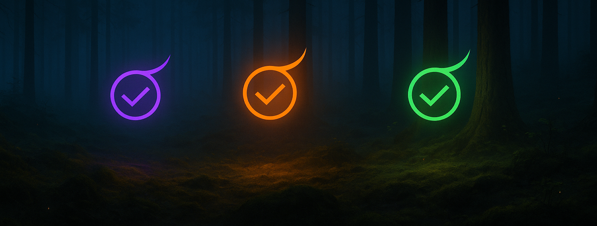

# ✦ Irrlicht — Claude Code Observability for MacOS



**Irrlicht** is a macOS menu bar application that monitors Claude Code sessions, providing instant visual feedback on session states. The name comes from German folklore—where an *Irrlicht* (will-o'-the-wisp) traditionally leads wanderers astray, this version does the opposite: it guides you with honest signals about where your attention is needed.

## The Light System

Each session appears as a simple icon that tells the truth:
- **🟣** **working** — the agent is thinking, building, streaming (purple)
- **🟠** **waiting** — it needs you; the story pauses for your judgment (orange)
- **🟢** **finished** — the path ahead is clear again (green)

No ghosts. **Hooks → State → Light.**

## Architecture

Irrlicht listens to Claude Code's lifecycle signals, turns them into a deterministic state machine, and renders them as quiet, legible beacons. Local-first, atomic writes, zero blur.

```
Claude Code Hook Events → Irrlicht Hook Receiver → State Machine → Menu Bar
```

## Quick Start

### Installation

1. **Clone the repository:**
   ```bash
   git clone https://github.com/ingo-eichhorst/Irrlicht.git
   cd Irrlicht
   ```

2. **Build the hook receiver:**
   ```bash
   ./tools/build-release.sh
   ```

3. **Install the hook receiver:**
   ```bash
   # Copy and rename the universal binary to your PATH
   sudo cp build/irrlicht-hook-darwin-universal /usr/local/bin/irrlicht-hook
   sudo chmod +x /usr/local/bin/irrlicht-hook
   ```

4. **Configure Claude Code hooks:**
   ```bash
   # Add hook configuration to Claude Code settings
   ./tools/settings-merger/settings-merger --action merge
   ```

### Verification

Test that everything works:
```bash
# Test with a sample event
./tools/irrlicht-replay fixtures/session-start.json

# Check that state files are created
ls ~/Library/Application\ Support/Irrlicht/instances/
```

## 🎯 Phase 2: Testing the UI

### Quick Demo
```bash
# Run the SwiftUI menu bar app
cd Irrlicht.app && swift run &

# Create test sessions
bash demo-phase2.sh

# Look for ✨ sparkle icon in menu bar, click to see sessions
```

### What You'll See
- **Menu Bar**: Individual colored status indicators for each session:
  - 🟣 Working sessions (Claude is thinking/building)
  - 🟠 Waiting sessions (needs your input)
  - 🟢 Finished sessions (task complete)
  - ✨ White sparkle when no sessions
- **Dynamic Sizing**: Indicators get smaller as session count increases
- **Overflow Handling**: Shows first 5 sessions + "…" when 7+ sessions
- **Dropdown**: Session list with project name, git branch, state, and model info
- **Real-time Updates**: Status changes reflected within 1 second
- **Empty State**: "No Claude Code sessions detected" when no files
- **Quit Button**: Right-click or button at bottom of dropdown to quit the app

### Cleanup
```bash
rm -rf ~/Library/Application\ Support/Irrlicht/instances  # Clear all sessions
killall swift  # Stop the app
```

### Kill by Process Name
```bash
# Find Irrlicht specifically
ps aux | grep Irrlicht

# Kill by PID
kill <PID>
```

## 🎨 Phase 3.5: Individual Status Indicators

The menu bar now displays individual colored status indicators for each active Claude Code session, providing instant visual feedback without needing to click the dropdown.

### Status Colors
- **🔨 Purple Hammer**: Working sessions (Claude is actively thinking, building, or processing)
- **⏳ Orange Hourglass**: Waiting sessions (Claude is waiting for your input or response)  
- **✅ Green Checkmark**: Finished sessions (Task completed successfully)
- **✨ White Sparkle**: No active sessions detected

### Dynamic Behavior
- **Responsive Sizing**: Indicators automatically resize based on session count
  - 1-2 sessions: Large indicators (14pt)
  - 3-4 sessions: Medium indicators (12pt)  
  - 5-6 sessions: Small indicators (10pt)
  - 7+ sessions: Mini indicators (8pt)
- **Overflow Management**: When 7+ sessions exist, shows first 5 + "…" overflow indicator
- **Real-time Updates**: Status changes reflected within 1 second via periodic refresh
- **State Transitions**: Smooth visual feedback as sessions change state

### Technical Implementation
- SF Symbols with state-based coloring for consistent native icons
- MenuBarExtra with custom SwiftUI label
- 1-second periodic timer combined with file system watching
- Dynamic font sizing and spacing algorithms
- Graceful overflow handling for many concurrent sessions

### UI Features
- **Header Icons**: Displays actual colored SF Symbol icons instead of text
- **Git Branch Display**: Shows git branch in parentheses below project name
- **Quit Button**: Convenient quit option at bottom of dropdown with hover effects
- **Empty State Centering**: Properly centered "No sessions" message
- **Session Layout**: Project name, git branch, state, model, and metrics in organized hierarchy

## Project Structure

```
├── fixtures/                    # Hook event samples and edge cases
├── tests/scenarios/             # Multi-session concurrency test scenarios
├── tools/
│   ├── irrlicht-hook/          # Go binary that receives hook events
│   ├── irrlicht-replay         # Python tool for testing event replay
│   ├── settings-merger/        # Go tool for managing Claude Code settings
│   ├── test-runner.sh          # Comprehensive test suite
│   ├── build-release.sh        # Cross-platform build script
│   └── stress-test.py          # Performance and load testing
└── specs/
    └── story.md               # Brand story and design philosophy
```

## Development

### Prerequisites

- Go 1.21 or later
- Python 3.8+ 
- macOS (primary target platform)

### Running Tests

```bash
# Run the complete test suite
./tools/test-runner.sh

# Run specific component tests
cd tools/settings-merger && go test -v

# Test hook receiver with sample events
./tools/irrlicht-replay fixtures/session-start.json

# Stress test with multiple concurrent sessions
python3 tools/stress-test.py --test concurrent --duration 60
```

### Building

```bash
# Build all components
./tools/build-release.sh

# Build just the hook receiver
cd tools/irrlicht-hook && go build -o irrlicht-hook .

# Build settings merger
cd tools/settings-merger && go build -o settings-merger .
```

## Hook Events

Irrlicht responds to these Claude Code hook events:

| Event | Description | State Transition |
|-------|-------------|------------------|
| `SessionStart` | New Claude Code session begins | → **working** |
| `UserPromptSubmit` | User submits a prompt | → **working** |
| `PreToolUse` | User responds to notification | → **working** |
| `PostToolUse` | Tool execution completed | → **working** |
| `PreCompact` | Context compaction starting | → **working** |
| `Notification` | System needs user attention | → **waiting** |
| `Stop` | Session stops (completed/cancelled) | → **finished** |
| `SubagentStop` | Subagent completes task | → **finished** |
| `SessionEnd` | Session terminates | → **finished** |

## Configuration

### Claude Code Settings

The hook configuration is automatically added to `~/.claude/settings.json`:

```json
{
  "hooks": {
    "irrlicht": {
      "enabled": true,
      "commands": {
        "SessionStart": ["irrlicht-hook"],
        "UserPromptSubmit": ["irrlicht-hook"],
        "PreToolUse": ["irrlicht-hook"],
        "PostToolUse": ["irrlicht-hook"],
        "PreCompact": ["irrlicht-hook"],
        "Notification": ["irrlicht-hook"],
        "Stop": ["irrlicht-hook"],
        "SubagentStop": ["irrlicht-hook"],
        "SessionEnd": ["irrlicht-hook"]
      }
    }
  }
}
```

### Kill Switch

Disable Irrlicht instantly:

```bash
# Via environment variable
export IRRLICHT_DISABLED=1

# Or via settings
./tools/settings-merger/settings-merger --action merge-disable
```

## State Files

Session states are stored as atomic JSON files:
- **Location**: `~/Library/Application Support/Irrlicht/instances/`
- **Format**: `<session_id>.json`
- **Content**: Current state, timestamp, metadata

Example state file:
```json
{
  "session_id": "sess_abc123",
  "state": "working",
  "timestamp": "2024-09-05T14:30:00.000Z",
  "last_event": "UserPromptSubmit",
  "model": "claude-3.7-sonnet",
  "cwd": "/Users/ingo/projects/my-project"
}
```

## Logging

Structured JSON logs with automatic rotation:
- **Location**: `~/Library/Application Support/Irrlicht/logs/`
- **Format**: `irrlicht.log` (current), `irrlicht.log.1` (rotated)
- **Max size**: 10MB per file, 5 files retained
- **Content**: All hook events, state transitions, errors

## Performance

- **Latency**: <1ms average event processing time
- **Memory**: <5MB typical footprint
- **Disk**: <100KB state files, <50MB logs (with rotation)
- **Concurrency**: Tested up to 8 simultaneous sessions

## Safety Guarantees

✅ **Idempotent**: Multiple runs produce identical results  
✅ **Reversible**: Settings changes can be fully rolled back  
✅ **Non-destructive**: Never corrupts existing configurations  
✅ **Atomic**: Either fully succeeds or fails cleanly  
✅ **Validated**: All inputs validated before processing  
✅ **Secure**: Path sanitization prevents directory traversal  
✅ **Kill switch**: Immediate disable capability  

## Phase Status

- ✅ **Phase 0**: Contracts & Drift Guard (Complete)
- ✅ **Phase 1**: Event Ingestion Core (Complete) 
- ✅ **Phase 2**: Menu Bar UI (Complete)
- ✅ **Phase 3**: Installer & Distribution Package (Complete)
- ✅ **Phase 3.5**: Individual Status Indicators (Complete)
- ✅ **Phase 4**: UI Polish & Experience Improvements (Complete)
  - SF Symbol icons with state-based colors
  - Improved layout and visual hierarchy
  - Git branch display and quit functionality
  - Enhanced empty state and hover effects

## Philosophy

> By night, in old stories, an *Irrlicht* lures wanderers off the path.  
> By day, in our terminals, the real danger is different: ten tasks, four Claude sessions, and no sense of where attention should go.
> 
> **Irrlicht** flips the myth: it's the *tamed* will-o'-the-wisp—small, honest lights that appear exactly where you need them.

**Kein Spuk. Hooks. Local-first.**

## Contributing

1. Fork the repository
2. Create a feature branch
3. Write tests for new functionality  
4. Ensure all tests pass: `./tools/test-runner.sh`
5. Submit a pull request

## License

MIT License - see LICENSE file for details.

## Support

- **Issues**: [GitHub Issues](https://github.com/ingo-eichhorst/Irrlicht/issues)
- **Discussions**: [GitHub Discussions](https://github.com/ingo-eichhorst/Irrlicht/discussions)

---

*Follow the right light.*