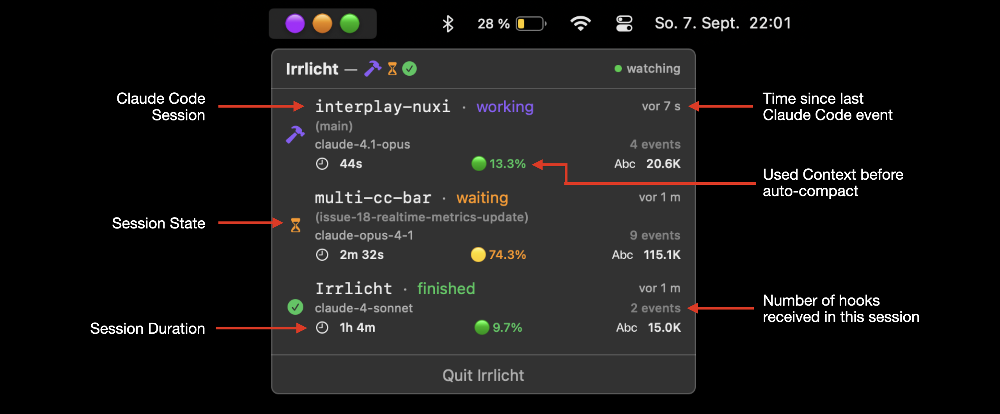

# ✦ Irrlicht — Menu-Bar Telemetry for Claude Code (macOS)


[](https://github.com/ingo-eichhorst/Irrlicht/actions/workflows/coverage.yml)
[](version.json)
[](LICENSE)

[](https://github.com/ingo-eichhorst/agent-readyness)

**Irrlicht** is a macOS menu bar application that monitors Claude Code sessions, providing instant visual feedback on session states. The name comes from German folklore—where an *Irrlicht* (will-o'-the-wisp) traditionally leads wanderers astray, this version does the opposite: it guides you with honest signals about where your attention is needed.

## Philosophy

> By night, in old stories, an *Irrlicht* lures wanderers off the path.
> By day, in our terminals, the real danger is different: ten tasks, four Claude sessions, and no sense of where attention should go.
>
> **Irrlicht** flips the myth: it's the *tamed* will-o'-the-wisp—small, honest lights that appear exactly where you need them.

Irrlicht watches Claude Code's transcript files, turns activity into a deterministic state machine, and renders them as quiet, legible beacons. Local-first, atomic writes, zero configuration.

```
Transcript Files → FSEvents/kqueue → SessionDetector → State Machine → Menu Bar
```

### The Light System

Each session appears as a simple icon that tells the truth:
- **🟣** **working** — the agent is thinking, building, streaming (purple)
- **🟠** **waiting** — it needs you; the story pauses for your judgment (orange)
- **🟢** **ready** — the path ahead is clear, ready for new work (green)
- **⚫** **cancelled_by_user** — session cancelled via ESC; auto-expires after 30s (gray)
- **✦** **no sessions** — clean slate, ready for new work (white sparkle)

No ghosts. **Files → State → Light.**

## Features



### Menu Bar Indicators
- **Individual colored status indicators** for each active Claude Code session
- **Scales with Demand**: Shows first 5 sessions + "…" when 7+ sessions exist
- **Real-time updates**: Status changes reflected within 1 second

### Session Information & Features
- **Complete session context**: Track project name, git branch, working directory, Claude model, and current state for each active session
- **Real-time performance metrics**: Monitor elapsed time, token usage (1.2K, 15.0K, 1.5M), and context utilization with live updates
- **Context pressure indicators**: Visual warnings (🟢 safe, 🟡 caution, 🔴 warning, ⚠️ critical) alert you before auto-compaction at 155K tokens
- **Session management tools**: Reset stuck sessions, delete completed ones, or drag-and-drop to reorder by priority
- **Smart display handling**: Clean empty state when idle, automatic overflow management for 7+ sessions

## Quick Start

### Prerequisites

- **macOS**: Primary target platform
- **Go 1.21+**: For building the daemon
- **Swift 5.9+**: For SwiftUI menu bar application
- **Claude Code**: Run one of the latest versions of Claude Code

### Installation

1. **Clone the repository:**
   ```bash
   git clone https://github.com/ingo-eichhorst/Irrlicht.git
   cd Irrlicht
   ```

2. **Build the daemon:**
   ```bash
   ./tools/build-release.sh
   ```

3. **Run the daemon:**
   ```bash
   ./build/irrlichtd-darwin-universal &
   ```

4. **Run Irrlicht UI:**
   ```bash
   cd frontend/macos
   swift run &
   ```

**That's it.** No hooks to configure, no settings to merge — Irrlicht watches transcript files automatically.

### State Files

Session states are stored as atomic JSON files:
- **Location**: `~/Library/Application Support/Irrlicht/instances/`
- **Format**: `<session_id>.json`
- **Content**: Current state, timestamp, metadata, performance metrics

Example state file:
```json
{
  "session_id": "sess_abc123",
  "state": "working",
  "timestamp": "2024-09-05T14:30:00.000Z",
  "last_event": "transcript_activity",
  "model": "claude-sonnet-4-6",
  "cwd": "/Users/ingo/projects/my-project",
  "pid": 12345,
  "metrics": {
    "elapsed_seconds": 180,
    "total_tokens": 15000,
    "context_utilization_percentage": 7.5,
    "pressure_level": "safe"
  }
}
```

## Development

### Project Structure

```
├── core/                      # Go daemon (single module, hexagonal architecture)
│   ├── cmd/irrlichtd/         # Daemon entry point
│   ├── domain/                # SessionState, TranscriptEvent, state types
│   ├── ports/                 # Outbound interfaces
│   ├── adapters/              # filesystem, transcript, process, graceperiod, git, logging, metrics
│   ├── application/services/  # SessionDetector orchestration
│   └── pkg/                   # tailer, capacity utilities
├── frontend/macos/            # SwiftUI menu bar application
│   ├── Irrlicht/              # Main app code (IrrlichtApp, SessionManager, Views)
│   ├── Tests/                 # SwiftUI app tests + concurrency scenarios
│   └── Package.swift          # Swift package configuration
├── fixtures/                  # Sample transcript files and edge cases
├── specs/                     # Design docs and adapter specs
└── tools/
    ├── test-runner.sh         # Comprehensive test suite
    ├── build-release.sh       # Build script
    ├── update-version.sh      # Version bump utility
    └── model-capacity.json    # Token capacity data by model
validate.sh                    # Single validation entry point (build + test + integration)
```

### Building from Source

```bash
# Build all components
./tools/build-release.sh

# Build daemon
cd core && go build ./cmd/irrlichtd/

# Build SwiftUI app
cd frontend/macos && swift build
```

### Validation

The single entry point for verifying the full system contract:

```bash
./validate.sh
```

This runs in order: Go build → Swift build → Go tests → Swift tests → integration tests. Exit code 0 means all claims passed. **A change is not done until `./validate.sh` passes.**

Individual components:

```bash
# Run the integration test suite
./tools/test-runner.sh

# Run specific component tests
cd core && go test -v ./...
cd frontend/macos && swift test
```

### Session Detection

Irrlicht detects Claude Code sessions via transcript file-watching:

| Detection | Technology | Transition |
|-----------|-----------|------------|
| New `.jsonl` file | FSEvents | → **working** |
| File write activity | FSEvents | Reset idle timer |
| 2s idle + no open tools | Grace timer | → **waiting** |
| Process exit | kqueue NOTE_EXIT | → **ready** |

See [events.md](events.md) for the full state machine.

## Technical Details

### Architecture

```
irrlichtd
  ├── TranscriptWatcher  (fsnotify → FSEvents on macOS)
  ├── TailerPipeline     (JSONL parsing → model, tokens, tool call tracking)
  ├── GracePeriodTimer   (per-session 2s idle → waiting)
  └── ProcessWatcher     (kqueue EVFILT_PROC NOTE_EXIT → ready)
```

- **Daemon** (Go): Watches transcript files, tracks state, serves HTTP API + WebSocket
- **State Machine**: Maintains deterministic session states in JSON files
- **UI Layer** (SwiftUI): Renders real-time visual indicators with 1-second refresh
- **File System**: Atomic writes ensure consistency across concurrent sessions

### Performance Specifications

- **Latency**: ~50-200ms session detection via FSEvents; ~1ms process exit via kqueue
- **Memory**: <5MB typical footprint
- **Disk**: <100KB state files, <50MB logs (with rotation)
- **Concurrency**: Tested up to 8 simultaneous sessions
- **Context Accuracy**: Real-time tracking with model-specific context windows

### Logging System

Structured JSON logs with automatic rotation:
- **Location**: `~/Library/Application Support/Irrlicht/logs/`
- **Format**: `irrlicht.log` (current), `irrlicht.log.1` (rotated)
- **Max size**: 10MB per file, 5 files retained
- **Content**: All session events, state transitions, errors

### Safety Guarantees

✅ **Zero configuration**: No hooks, no settings — install and run
✅ **Idempotent**: Multiple runs produce identical results
✅ **Non-destructive**: Never corrupts existing configurations
✅ **Atomic**: Either fully succeeds or fails cleanly
✅ **Kill switch**: `IRRLICHT_DISABLED=1` disables the daemon

## Support

### Troubleshooting

**Irrlicht not showing in menu bar:**
- Verify Swift app is running: `ps aux | grep Irrlicht`
- Check state directory exists: `ls ~/Library/Application\ Support/Irrlicht/`
- Look for error logs in `~/Library/Application\ Support/Irrlicht/logs/`

**Sessions not updating:**
- Check that irrlichtd is running: `curl http://127.0.0.1:7837/state`
- Check IRRLICHT_DISABLED environment variable
- Verify file permissions in state directory

**Orphaned sessions (session stuck after Claude Code exits):**
- Sessions include a `pid` field tracking the Claude Code process
- kqueue monitors process exit; orphaned sessions transition to ready automatically
- Legacy sessions without a PID are cleaned up after a 1-hour TTL
- To manually clear orphaned sessions: `rm ~/Library/Application\ Support/Irrlicht/instances/*.json`

### Contributing

1. Fork the repository
2. Create a feature branch (`git checkout -b feature/amazing-feature`)
3. Write tests for new functionality
4. Ensure all checks pass: `./validate.sh`
5. Commit your changes with descriptive messages
6. Submit a pull request

**For AI coding agents:** run `./validate.sh` after every change. A task is only complete when exit code is 0. Never mark a task done based only on compilation. If validation fails, inspect the failing test and fix the root cause — do not skip or comment out failing assertions.

## Coding Agent Support

Irrlicht is designed to be **agent-verifiable**: an AI coding agent can inspect app state and validate its own changes without human assistance.

### Passive observability — read current state

Session state files are the ground truth. An agent can read them directly:

```bash
# See all active sessions
ls ~/Library/Application\ Support/Irrlicht/instances/

# Check session count and states
cat ~/Library/Application\ Support/Irrlicht/instances/*.json | jq '{id: .session_id, state: .state}'
```

This works without any app changes — the state files are always present while sessions are active.

### Active validation — run executable claims

```bash
./validate.sh   # must exit 0 before any change is considered done
```

The validation harness is a semantic firewall around agent-authored changes:

```
agent generates change → ./validate.sh executes claims → only exit 0 counts as success
```

### Visual verification

To verify rendering without human review, open the menu bar popup and capture a screenshot:

```bash
# Open popup via AppleScript
osascript -e 'tell application "System Events" to click menu bar item 1 of menu bar 2 of process "Irrlicht"'
screencapture -x /tmp/irrlicht-check.png
# Pass the image to your vision model for visual assertion
```

Tools like [Peekaboo](https://github.com/steipete/Peekaboo) combine screenshot capture and vision analysis into a single CLI call.

## Star History

[](https://star-history.com/#ingo-eichhorst/Irrlicht&Date)

### License

MIT License - see [LICENSE](LICENSE) file for details.

### Community

- **Issues**: [GitHub Issues](https://github.com/ingo-eichhorst/Irrlicht/issues)
- **Discussions**: [GitHub Discussions](https://github.com/ingo-eichhorst/Irrlicht/discussions)

---

*Follow the right light.*
