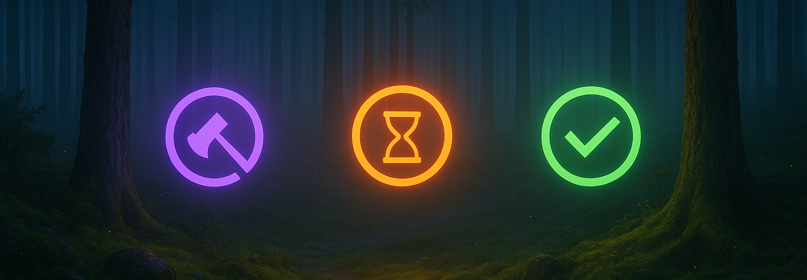
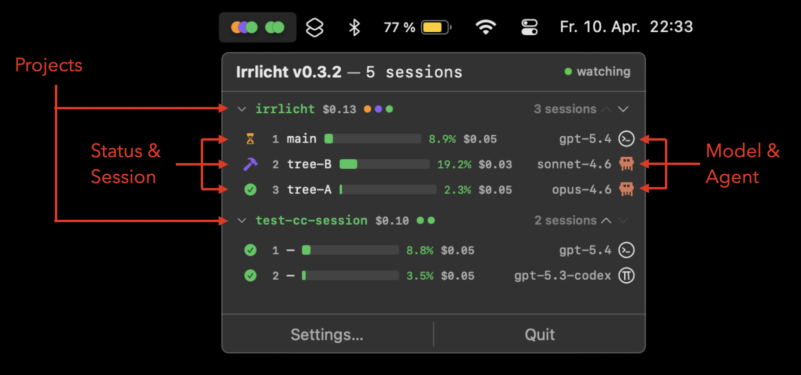

<div align="center">

# ✦ Irrlicht — Menu-Bar Telemetry for AI Coding Agents (macOS)



[](https://github.com/ingo-eichhorst/Irrlicht/actions/workflows/coverage.yml)
[](LICENSE)
[](version.json)
[](https://github.com/ingo-eichhorst/agent-readyness)

[🌐 Landing Page](https://ingo-eichhorst.github.io/Irrlicht/) · [📖 Documentation](https://ingo-eichhorst.github.io/Irrlicht/docs/quickstart.html) · [📦 Latest Release](https://github.com/ingo-eichhorst/Irrlicht/releases/latest)

</div>

---

> *In Goethe's Faust, an Irrlicht guides the way through the night. This one guides you through your agents — who's working, who's waiting, and where you're needed next.*

## The problem

Running AI coding agents in anger surfaces six concrete problems. Every one is documented — these aren't hypotheticals:

- **You don't know which session needs you.** Claude Code's desktop notifications [don't fire inside tmux](https://github.com/anthropics/claude-code/issues/19976) — the most common multi-session setup. So you alt-tab through terminals hunting for the one that beeped, while a different session has been stuck on a plan-mode prompt for ten minutes.

- **Parallel sessions shred your attention.** Two or three concurrent agents means constant context-switching with no shared status board — *"the mental gymnastics of context switching wears me out and makes me wonder how well I'm steering each session"* ([dev.to](https://dev.to/datadeer/part-2-running-multiple-claude-code-sessions-in-parallel-with-git-worktree-165i)).

- **Context compaction silently wrecks quality.** Auto-compact fires at ~80% of the window, but the model is already producing degraded output 20–30% before that ([MindStudio](https://www.mindstudio.ai/blog/claude-code-compact-command-context-management)). No warning, no pressure gauge — just worse answers, and [a GitHub issue with hundreds of reactions](https://github.com/anthropics/claude-code/issues/13112) confirms it hits everyone.

- **Cost runs away in the dark.** A recent prompt-caching bug silently inflated token usage 10–20× for weeks while the status page showed no incidents ([The Register](https://www.theregister.com/2026/03/31/anthropic_claude_code_limits/)). You find out when the invoice lands or the quota dies mid-afternoon — not while the session is burning.

- **Subagents are a black box.** Spawn three Explore agents and fork a background task and you see the parent, not each child's state. You learn the tree is done only when the parent surfaces a summary.

- **Quota makes you agent-hop — and monitoring doesn't follow.** Burn Claude Code by 11am, fall back to Codex or Gemini for the afternoon. Multi-provider *billing* trackers exist, but unifying consumption isn't the same as unifying *state*: each agent lives in its own terminal with its own vocabulary for "working", "waiting", and "done".

*(Irrlicht is German for will-o'-the-wisp — a light that guides you through the dark.)*

## The Light System

Each session is one icon in your menu bar that tells the truth:

- 🟣 **working** — the agent is thinking, building, streaming
- 🟠 **waiting** — it needs you; the story pauses for your judgment
- 🟢 **ready** — the path ahead is clear, ready for new work
- ✦ **no sessions** — clean slate



Three states. No ambiguity. Ambient, always visible, nothing to click through.

## What makes Irrlicht different

The space around AI-coding-agent observability is more crowded than it looks. Tools broadly fall into three camps, each with real gaps:

- **Quota and cost trackers** — [ccusage](https://github.com/ryoppippi/ccusage), [ClaudeBar](https://github.com/tddworks/ClaudeBar), [SessionWatcher](https://www.sessionwatcher.com/), [Claude-Code-Usage-Monitor](https://github.com/Maciek-roboblog/Claude-Code-Usage-Monitor), [tokscale](https://github.com/junhoyeo/tokscale). They track *how much you've consumed*. They don't tell you whether any given session is working, waiting on you, or done.
- **Observability platforms** — [Langfuse](https://langfuse.com/integrations/frameworks/claude-agent-sdk), [Helicone](https://www.helicone.ai/), [SigNoz](https://signoz.io/blog/claude-code-monitoring-with-opentelemetry/), and the rest of the OpenTelemetry stack. Rich tracing and metrics, but require SDK instrumentation, target teams, and live in a cloud dashboard — not in a single developer's menu bar.
- **Live session monitors** — [Claude Status](https://github.com/gmr/claude-status), [Agent Sessions](https://github.com/jazzyalex/agent-sessions), [Agent of Empires](https://github.com/njbrake/agent-of-empires), [Brizz](https://www.brizz.ai/blog/mission-control-for-claude-code), [recon](https://github.com/gavraz/recon). These actually track per-session state — but each locks you into one form factor: Claude-Code-only, iTerm2-only, tmux-only, or a separate app window you alt-tab to.

Irrlicht claims a narrower, more opinionated slot in that third camp:

- **Ambient, not a dashboard.** State is encoded directly in the menu bar as colored dots — 🟣 working, 🟠 waiting, 🟢 ready — so you never open a window or switch a tab to know what's happening. The closest peer, [Claude Status](https://github.com/gmr/claude-status), is Claude-Code-only and uses four states; [Agent Sessions](https://github.com/jazzyalex/agent-sessions)' live HUD is a separate window that only works inside iTerm2. Irrlicht is terminal-agnostic, IDE-agnostic, and doesn't ask you to context-switch to see the state.
- **Context pressure is a first-class signal.** Of the menu-bar and CLI tools surveyed above, *none* warn before auto-compact hits the 155K-token cliff. Claude Code Usage Monitor predicts *quota* exhaustion; SessionWatcher tracks *rate limits*; ccusage aggregates *tokens consumed*. Irrlicht's 🟢→🟡→🔴→⚠️ pressure gauge is per-session, tied to the actual context window, and early enough that you can `/compact` manually before quality drops.
- **Agents *and* orchestrators, one vocabulary.** Claude Code, OpenAI Codex, and Pi — plus Gas Town, an agent orchestrator. Quota trackers unify 9+ providers but only for billing; live-state monitors are usually single-agent. Irrlicht uses the same working/waiting/ready state across every one of them, so agent-hopping when your quota runs dry doesn't mean re-learning a new tool.
- **Zero integration, nothing to break.** No mendatory hooks, no SDK wrappers, no OpenTelemetry collectors. Irrlicht watches the `.jsonl` transcripts your agents already write via FSEvents and kqueue — install the app and it discovers every session. When Claude Code or Codex ships a new version, there's nothing to update. (Claude Status ships a Claude Code *plugin* that hooks into session lifecycle events; Langfuse/SigNoz need OTEL instrumentation; Irrlicht needs neither.)
- **Agent-verifiable by design.** State files live as atomic JSON at a known path (`~/Library/Application Support/Irrlicht/instances/*.json`). Any tool — including the coding agents themselves — can read them and verify their own work. Run `./validate.sh` in the repo, exit 0 means done. None of the tools surveyed above are explicitly designed to be read *by* the agents they monitor.

## What you get (and the pain it removes)

| Feature | The pain it removes |
|---|---|
| **Real-time state detection** (<1s via FSEvents/kqueue) | "Is it still running or did it finish ten minutes ago?" |
| **Context pressure warnings** (🟢 → 🟡 → 🔴 → ⚠️ before uncontrolled auto-compaction) | Quality cliff from silent compaction; wasted tokens in a degraded context |
| **Per-session cost tracking** in live USD (model-aware, via LiteLLM pricing) | Surprise invoices; no kill-signal when a run goes sideways |
| **Subagent visibility** — parent-child trees for background agents, Explore, Plan | "Is the whole task done, or just the parent?" |
| **Unified across agents** — Claude Code, OpenAI Codex, Pi, Gas Town | Mental overhead from four different UIs with four different vocabularies |
| **Git-aware grouping** — sessions clustered by project, branch, worktree | "Which session belongs to which checkout?" |
| **Zero configuration** — no mendatory hooks, no settings merges, no SDK | Per-project setup tax; breakage when an agent ships a new version |

## Install

**Homebrew (recommended):**

```sh
brew tap ingo-eichhorst/irrlicht
brew install --cask irrlicht
```

**DMG:**

1. Download `Irrlicht-<version>.dmg` from [Releases](https://github.com/ingo-eichhorst/Irrlicht/releases)
2. Open the DMG and drag **Irrlicht.app** to **Applications**
3. Launch Irrlicht

The app ships as a single `.app` bundle with the monitoring daemon embedded — no separate services, no version drift. To build from source instead, see [installation docs](https://ingo-eichhorst.github.io/Irrlicht/docs/installation.html).

## How it works

```
Transcript Files → FSEvents/kqueue → SessionDetector → State Machine → Menu Bar
```

Irrlicht watches agent transcript files (`.jsonl`) as they're written, turns the events into a deterministic state machine, and persists each session as an atomic JSON file under `~/Library/Application Support/Irrlicht/instances/`. The SwiftUI menu bar app reads that state over a local WebSocket and renders the lights. Local-first, ~5MB RAM, no telemetry leaves your machine.

For the full pipeline, hexagonal architecture, and state-machine rules, see [architecture docs](https://ingo-eichhorst.github.io/Irrlicht/docs/architecture.html).

## Next steps

**For humans:** [Documentation](https://ingo-eichhorst.github.io/Irrlicht/docs/) · [Installation](https://ingo-eichhorst.github.io/Irrlicht/docs/installation.html) · [Changelog](https://ingo-eichhorst.github.io/Irrlicht/docs/changelog.html) · [Issues](https://github.com/ingo-eichhorst/Irrlicht/issues) · [Discussions](https://github.com/ingo-eichhorst/Irrlicht/discussions)

**For coding agents:** Irrlicht is agent-verifiable. Read live session state from `~/Library/Application Support/Irrlicht/instances/*.json`, run `./validate.sh` to verify any change (exit 0 = done), and see [AGENTS.md](AGENTS.md) for conventions.

## Star History

[](https://star-history.com/#ingo-eichhorst/Irrlicht&Date)

## License

MIT License — see [LICENSE](LICENSE).
