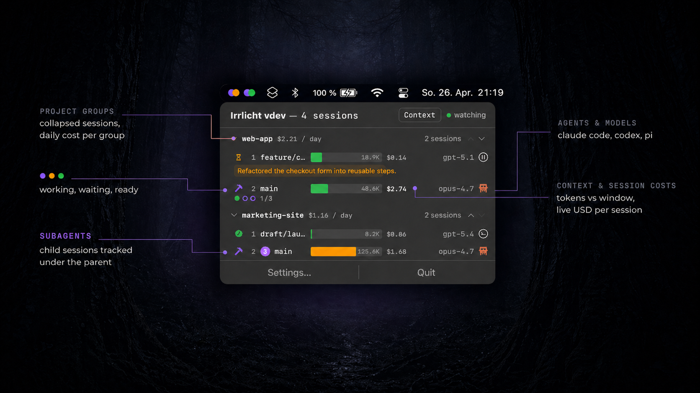

<div align="center">

# ✦ Irrlicht — Menu-Bar Lights for AI Coding Agents (macOS)



[](https://github.com/ingo-eichhorst/Irrlicht/actions/workflows/coverage.yml)
[](LICENSE)
[](version.json)

[](https://github.com/ingo-eichhorst/Irrlicht/actions/workflows/codescene-badge.yml)
[](https://github.com/ingo-eichhorst/agent-readyness)
[](https://sonarcloud.io/summary/overall?id=ingo-eichhorst_Irrlicht)
[](https://sonarcloud.io/summary/overall?id=ingo-eichhorst_Irrlicht)
[](https://sonarcloud.io/summary/overall?id=ingo-eichhorst_Irrlicht)

[🌐 Landing Page](https://ingo-eichhorst.github.io/Irrlicht/) · [📖 Documentation](https://ingo-eichhorst.github.io/Irrlicht/docs/quickstart.html) · [📦 Latest Release](https://github.com/ingo-eichhorst/Irrlicht/releases/latest)

</div>

> 🟣 working · 🟠 waiting · 🟢 ready — one ambient dot per session, multi-agent, one-click setup.

## Install

**Homebrew (recommended):**

```sh
brew tap ingo-eichhorst/irrlicht
brew install --cask irrlicht
```

**curl:**

```sh
curl -fsSL https://irrlicht.io/install.sh | sh
```

**DMG:** download `Irrlicht-<version>.dmg` from [Releases](https://github.com/ingo-eichhorst/Irrlicht/releases) and drag **Irrlicht.app** to **Applications**.

→ [Quickstart](https://ingo-eichhorst.github.io/Irrlicht/docs/quickstart.html) gets you to your first purple dot in 60 seconds.

## What it does

- **A menu-bar dot per session** — 🟣 working, 🟠 waiting, 🟢 ready, 🔴 error
- **Context-pressure gauge** — 🟢 → 🟡 → 🔴 → ⚠️ before the auto-compact cliff, so you can `/compact` while quality is still intact
- **Live per-session cost in USD** — model-aware via LiteLLM pricing
- **History view** — spend over time with projection, attribution by project / branch / model, a productive-vs-reverted yield ratio, DORA metrics, and an Activity Matrix of working/waiting/ready/error agent counts per project (macOS app + web dashboard)
- **Subagent trees** — parent ↔ Explore / Plan / background agents, not just the parent
- **Git-aware grouping** — sessions clustered by project, branch, worktree
- **Real-time** — <1s latency via FSEvents/kqueue; no polling

## Supported agents

Stages: `stable` production-ready · `beta` feature-complete, edge cases remain · `alpha` core detection works (state only, metrics not claimed) · `planned` on the roadmap.

The **11 onboarded coding agents** below declare their stage in [`replaydata/agents/adapters.json`](replaydata/agents/adapters.json), and `of validate` fails if a stage claims more than a core set of 12 scenarios earns. Orchestrator, platform and `planned` rows are editorial — no adapter exists for them yet, so nothing checks them.

**Coding agents**

| Agent          | Stage   |
| -------------- | ------- |
| Claude Code    | beta    |
| OpenAI Codex   | alpha   |
| Pi             | alpha   |
| Aider          | alpha   |
| OpenCode       | alpha   |
| Kiro CLI       | alpha   |
| Gemini CLI     | alpha   |
| Antigravity    | alpha   |
| Mistral Vibe   | alpha   |
| GitHub Copilot | alpha   |
| Hermes Agent   | alpha   |
| Cursor Agent   | planned |
| Amp            | planned |

**Orchestrators** (tools that coordinate multiple agent sessions/rigs, rather than being a single coding agent)

| Orchestrator          | Stage   |
| --------------------- | ------- |
| Gas Town              | alpha   |
| Claude Squad          | planned |
| Custom (plugin API)   | planned |

**Platforms**

| Platform              | Stage   | Access                    |
| --------------------- | ------- | ------------------------- |
| macOS (menu bar app)  | beta    | [Releases](https://github.com/ingo-eichhorst/Irrlicht/releases/latest) |
| Web dashboard         | beta    | `http://127.0.0.1:7837`   |
| CLI                   | alpha   | `irrlicht-ls` (`-w` for watch) — on PATH after install; DMG drag-installs: Settings → Install Command-Line Tool |
| VS Code extension     | planned | tracked in [#350](https://github.com/ingo-eichhorst/Irrlicht/issues/350) |
| Linux (**daemon**-only — background service, no menu-bar UI) | alpha   | `curl -fsSL https://irrlicht.io/install.sh \| sh` |
| Windows               | planned | —                         |
| iOS / iPadOS          | planned | —                         |

→ [Adapters reference](https://ingo-eichhorst.github.io/Irrlicht/docs/adapters.html#maturity-stages) for stage criteria, watch paths, model detection, and roadmap.

## The menu bar icon is hidden

macOS gives every app a slice of the menu bar and hands out what's left in
launch order. On a 13" or 14" screen — or any screen with a crowded menu bar —
Irrlicht's icon can end up behind the notch or behind the frontmost app's
menus, where you can neither see nor click it. Four things to try, cheapest
first:

1. **Cmd-drag it somewhere you can see.** Hold ⌘ and drag the icon along the
   menu bar. Irrlicht asks macOS to remember the spot, so it should still be
   there after a quit and a relaunch.
2. **Switch to a narrower icon style.** Settings → *Menu Bar Icon*. **Compact**
   collapses every project into one dot with a session count and drops the
   quota bars, so its width stays the same no matter how many projects you
   have open — from two projects on it is the narrowest style (measured:
   18.5pt, against 90pt for Lights and 117pt for Combined at six projects).
   **Lights** (the default) draws one dot-group per project and grows with
   them; **Combined** is the widest, adding quota bars on the right.
3. **Mind the notch.** On a notched Mac the menu bar has a dead zone in the
   middle. macOS does not flow icons around it — an icon pushed into that
   range is simply not drawn. Removing any other status item, or using a
   narrower style, moves Irrlicht back out.
4. **Use a menu bar manager** if you run a lot of status items:
   [Ice](https://github.com/jordanbaird/Ice) (free, open source),
   [Bartender](https://www.macbartender.com/), or
   [Hidden Bar](https://github.com/dwarvesf/hidden). All three let you pin
   Irrlicht to the always-visible section.

If the icon is gone entirely and none of the above brings it back, Irrlicht is
probably not running — relaunch it from `/Applications`.

## Posture

Local-first · no telemetry · MIT · ~5 MB RAM · signed Homebrew cask · transcripts read-only.

## Why Irrlicht (vs. the rest)

- **Quota & cost trackers** ([ccusage](https://github.com/ryoppippi/ccusage), [codeburn](https://github.com/getagentseal/codeburn), [ClaudeBar](https://github.com/tddworks/ClaudeBar), [SessionWatcher](https://www.sessionwatcher.com/)) count tokens and dollars, not state.
- **Observability stacks** ([Langfuse](https://langfuse.com/integrations/frameworks/claude-agent-sdk), [SigNoz](https://signoz.io/blog/claude-code-monitoring-with-opentelemetry/)) need SDK instrumentation and a dashboard tab.
- **Single-agent monitors** ([Claude Status](https://github.com/gmr/claude-status), [Agent Sessions](https://github.com/jazzyalex/agent-sessions)) lock you to one CLI or one terminal.

Irrlicht is ambient (menu bar, not a window), multi-agent (Claude / Codex / Pi / Aider / OpenCode / Kiro CLI / Gemini CLI / Antigravity / Mistral Vibe / GitHub Copilot / Hermes Agent, plus the Gas Town orchestrator, in one vocabulary), and transcript-driven — no SDK wrappers, no OpenTelemetry collectors, no dashboard tab to keep open.

## The problem (why this exists)

> *In Goethe's Faust, an Irrlicht guides the way through the night. This one guides you through your agents — who's working, who's waiting, and where you're needed next.*

Six concrete pains, every one documented:

- **You don't know which session needs you.** Claude Code's desktop notifications [don't fire inside tmux](https://github.com/anthropics/claude-code/issues/19976) — the most common multi-session setup.
- **Parallel sessions shred your attention.** *"The mental gymnastics of context switching wears me out and makes me wonder how well I'm steering each session"* ([dev.to](https://dev.to/datadeer/part-2-running-multiple-claude-code-sessions-in-parallel-with-git-worktree-165i)).
- **Context compaction silently wrecks quality.** Auto-compact fires at ~80% of the window, but the model degrades 20–30% before that ([MindStudio](https://www.mindstudio.ai/blog/claude-code-compact-command-context-management); [GitHub issue with hundreds of reactions](https://github.com/anthropics/claude-code/issues/13112)).
- **Cost runs away in the dark.** A recent prompt-caching bug silently inflated token usage 10–20× for weeks ([The Register](https://www.theregister.com/2026/03/31/anthropic_claude_code_limits/)) — visible only on the invoice.
- **Subagents are a black box.** Spawn three Explore agents and a background task; you see the parent, not each child.
- **Quota makes you agent-hop — and monitoring doesn't follow.** Burn Claude Code by 11am, fall back to Codex or Gemini; each agent has its own vocabulary for "working", "waiting", and "done".

*(Irrlicht is German for will-o'-the-wisp — a light that guides you through the dark.)*

## How it works

```
Transcript files → FSEvents/kqueue → state machine → menu bar
```

Irrlicht reads the `.jsonl` transcripts your agents already write, persists each session as atomic JSON under `~/Library/Application Support/Irrlicht/instances/`, and renders dots in a SwiftUI menu-bar app over a local WebSocket. The app ships as a single `.app` bundle with the daemon embedded — no separate services, no version drift.

→ [Architecture](https://ingo-eichhorst.github.io/Irrlicht/docs/architecture.html) for the hexagonal pipeline and state-machine rules.

## For coding agents

Irrlicht is agent-verifiable by design — every session lives as atomic JSON at a known path, so any tool (including the coding agents themselves) can read live state and verify its own work.

- **State files:** `~/Library/Application Support/Irrlicht/instances/*.json`
- **Conventions and test gate:** [AGENTS.md](AGENTS.md)

## Next steps

[Documentation](https://ingo-eichhorst.github.io/Irrlicht/docs/) · [Installation](https://ingo-eichhorst.github.io/Irrlicht/docs/installation.html) · [Changelog](https://ingo-eichhorst.github.io/Irrlicht/docs/changelog.html) · [Issues](https://github.com/ingo-eichhorst/Irrlicht/issues) · [Discussions](https://github.com/ingo-eichhorst/Irrlicht/discussions)

## Star History

<a href="https://www.star-history.com/?repos=ingo-eichhorst%2FIrrlicht&type=date&legend=top-left">
 <picture>
   <source media="(prefers-color-scheme: dark)" srcset="https://api.star-history.com/chart?repos=ingo-eichhorst/Irrlicht&type=date&theme=dark&legend=top-left&sealed_token=39gJS4tcD4kfvmwSprUPlRZoS637fvMVuaDo4R6XMWxPrfCeqw1TvecoDt0U3RIOb4tDTO6pXDajykGfHvlgf076zXr_8PN0Z7wQ5lGT_snkSWc0UJdQAA" />
   <source media="(prefers-color-scheme: light)" srcset="https://api.star-history.com/chart?repos=ingo-eichhorst/Irrlicht&type=date&legend=top-left&sealed_token=39gJS4tcD4kfvmwSprUPlRZoS637fvMVuaDo4R6XMWxPrfCeqw1TvecoDt0U3RIOb4tDTO6pXDajykGfHvlgf076zXr_8PN0Z7wQ5lGT_snkSWc0UJdQAA" />
   
 </picture>
</a>

## License

MIT License — see [LICENSE](LICENSE).
