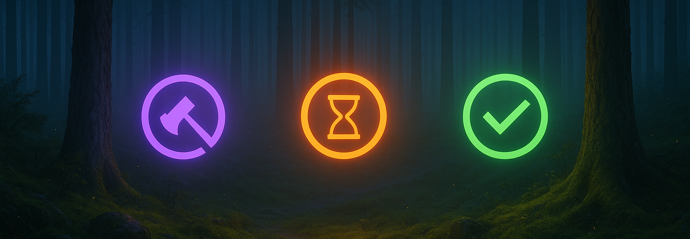

# ✦ Irrlicht — Menu-Bar Telemetry for Claude Code (macOS)



**Irrlicht** is a macOS menu bar application that monitors Claude Code sessions, providing instant visual feedback on session states. The name comes from German folklore—where an *Irrlicht* (will-o'-the-wisp) traditionally leads wanderers astray, this version does the opposite: it guides you with honest signals about where your attention is needed.

## Philosophy

> By night, in old stories, an *Irrlicht* lures wanderers off the path.  
> By day, in our terminals, the real danger is different: ten tasks, four Claude sessions, and no sense of where attention should go.
> 
> **Irrlicht** flips the myth: it's the *tamed* will-o'-the-wisp—small, honest lights that appear exactly where you need them.

Irrlicht listens to Claude Code's lifecycle signals, turns them into a deterministic state machine, and renders them as quiet, legible beacons. Local-first, atomic writes, zero blur.

```
Claude Code Hook Events → Irrlicht Hook Receiver → State Machine → Menu Bar
```

### The Light System

Each session appears as a simple icon that tells the truth:
- **🟣** **working** — the agent is thinking, building, streaming (purple)
- **🟠** **waiting** — it needs you; the story pauses for your judgment (orange)
- **🟢** **finished** — the path ahead is clear again (green)
- **✦** **no sessions** — clean slate, ready for new work (white sparkle)

No ghosts. **Hooks → State → Light.**

## Features


### Menu Bar Indicators
- **Individual colored status indicators** for each active Claude Code session
- **Scales with Demand**: Shows first 5 sessions + "…" when 7+ sessions exist
- **Real-time updates**: Status changes reflected within 1 second

### Session Information & Features
- **Complete session context**: Track project name, git branch, working directory, Claude model, and current state for each active session
- **Real-time performance metrics**: Monitor elapsed time, token usage (1.2K, 15.0K, 1.5M), and context utilization with live updates
- **Context pressure indicators**: Visual warnings (🟢 safe, 🟡 caution, 🔴 warning, ⚠️ critical) alert you before auto-compaction at 155K tokens
- **Session management tools**: Reset stuck sessions, delete completed ones, or drag-and-drop to reorder by priority
- **Smart display handling**: Clean empty state when idle, automatic overflow management for 7+ sessions

## Quick Start

### Prerequisites

- **macOS**: Primary target platform
- **Go 1.21+**: For building hook receiver and tools
- **Swift 5.9+**: For SwiftUI menu bar application
- **Python 3.8+**: For testing and utility scripts

### Installation

1. **Clone the repository:**
   ```bash
   git clone https://github.com/ingo-eichhorst/Irrlicht.git
   cd Irrlicht
   ```

2. **Build all components:**
   ```bash
   ./tools/build-release.sh
   ```

3. **Install the hook receiver:**
   ```bash
   sudo cp build/irrlicht-hook-darwin-universal /usr/local/bin/irrlicht-hook
   sudo chmod +x /usr/local/bin/irrlicht-hook
   ```

4. **Configure Claude Code hooks:**
   ```bash
   ./tools/settings-merger/settings-merger --action merge
   ```

5. **Run Irrlicht UI:**
   ```bash
   cd Irrlicht.app
   swift run
   ```

## Configuration

### Claude Code Settings

When running `./tools/settings-merger/settings-merger --action merge` the hook configuration is automatically added to `~/.claude/settings.json`:

```json
{
  "hooks": {
    "irrlicht": {
      "enabled": true,
      "commands": {
        "SessionStart": ["irrlicht-hook"],
        "UserPromptSubmit": ["irrlicht-hook"],
        "PreToolUse": ["irrlicht-hook"],
        "PostToolUse": ["irrlicht-hook"],
        "PreCompact": ["irrlicht-hook"],
        "Notification": ["irrlicht-hook"],
        "Stop": ["irrlicht-hook"],
        "SubagentStop": ["irrlicht-hook"],
        "SessionEnd": ["irrlicht-hook"]
      }
    }
  }
}
```

### State Files

Session states are stored as atomic JSON files:
- **Location**: `~/Library/Application Support/Irrlicht/instances/`
- **Format**: `<session_id>.json`
- **Content**: Current state, timestamp, metadata, performance metrics

Example state file:
```json
{
  "session_id": "sess_abc123",
  "state": "working",
  "timestamp": "2024-09-05T14:30:00.000Z",
  "last_event": "UserPromptSubmit",
  "model": "claude-3.7-sonnet",
  "cwd": "/Users/ingo/projects/my-project",
  "metrics": {
    "elapsed_seconds": 180,
    "total_tokens": 15000,
    "context_utilization_percentage": 7.5,
    "pressure_level": "safe"
  }
}
```

## Development

### Project Structure

```
├── Irrlicht.app/               # SwiftUI menu bar application
│   ├── Irrlicht/              # Main app code
│   ├── Tests/                 # SwiftUI app tests
│   └── Package.swift          # Swift package configuration
├── fixtures/                  # Hook event samples and edge cases
├── tests/scenarios/           # Multi-session concurrency test scenarios
├── tools/
│   ├── irrlicht-hook/         # Go binary that receives hook events
│   ├── transcript-tailer/     # Real-time transcript analysis for metrics
│   ├── model-capacity/        # Token capacity and context utilization data
│   ├── settings-merger/       # Go tool for managing Claude Code settings
│   ├── irrlicht-replay        # Python tool for testing event replay
│   ├── test-runner.sh         # Comprehensive test suite
│   ├── build-release.sh       # Cross-platform build script
│   └── stress-test.py         # Performance and load testing
└── specs/
    └── story.md              # Brand story and design philosophy
```

### Building from Source

```bash
# Build all components
./tools/build-release.sh

# Build just the hook receiver
cd tools/irrlicht-hook && go build -o irrlicht-hook .

# Build SwiftUI app
cd Irrlicht.app && swift build

# Build settings merger
cd tools/settings-merger && go build -o settings-merger .
```

### Running Tests

```bash
# Run the complete test suite
./tools/test-runner.sh

# Run specific component tests
cd tools/settings-merger && go test -v
cd Irrlicht.app && swift test

# Test hook receiver with sample events
./tools/irrlicht-replay fixtures/session-start.json

# Stress test with multiple concurrent sessions
python3 tools/stress-test.py --test concurrent --duration 60
```

### Hook Events Reference

Irrlicht responds to these Claude Code hook events:

| Event | Description | State Transition |
|-------|-------------|------------------|
| `SessionStart` | New Claude Code session begins | → **working** |
| `UserPromptSubmit` | User submits a prompt | → **working** |
| `PreToolUse` | User responds to notification | → **working** |
| `PostToolUse` | Tool execution completed | → **working** |
| `PreCompact` | Context compaction starting | → **working** |
| `Notification` | System needs user attention | → **waiting** |
| `Stop` | Session stops (completed/cancelled) | → **finished** |
| `SubagentStop` | Subagent completes task | → **finished** |
| `SessionEnd` | Session terminates | → **finished** |

## Technical Details

### Architecture

Irrlicht follows a clean separation of concerns:
- **Hook Receiver** (Go): Processes Claude Code events with <1ms latency
- **State Machine**: Maintains deterministic session states in JSON files
- **UI Layer** (SwiftUI): Renders real-time visual indicators with 1-second refresh
- **File System**: Atomic writes ensure consistency across concurrent sessions

### Performance Specifications

- **Latency**: <1ms average event processing time
- **Memory**: <5MB typical footprint
- **Disk**: <100KB state files, <50MB logs (with rotation)
- **Concurrency**: Tested up to 8 simultaneous sessions
- **Context Accuracy**: Real-time tracking with 155K token auto-compact threshold

### Logging System

Structured JSON logs with automatic rotation:
- **Location**: `~/Library/Application Support/Irrlicht/logs/`
- **Format**: `irrlicht.log` (current), `irrlicht.log.1` (rotated)
- **Max size**: 10MB per file, 5 files retained
- **Content**: All hook events, state transitions, errors

### Safety Guarantees

✅ **Idempotent**: Multiple runs produce identical results  
✅ **Reversible**: Settings changes can be fully rolled back  
✅ **Non-destructive**: Never corrupts existing configurations  
✅ **Atomic**: Either fully succeeds or fails cleanly  
✅ **Validated**: All inputs validated before processing  
✅ **Secure**: Path sanitization prevents directory traversal  
✅ **Kill switch**: Immediate disable capability  

## Support

### Troubleshooting

**Irrlicht not showing in menu bar:**
- Verify Swift app is running: `ps aux | grep Irrlicht`
- Check state directory exists: `ls ~/Library/Application\ Support/Irrlicht/`
- Look for error logs in `~/Library/Application\ Support/Irrlicht/logs/`

**Hook events not working:**
- Verify hook binary is in PATH: `which irrlicht-hook`
- Check Claude Code settings: `cat ~/.claude/settings.json | jq .hooks.irrlicht`
- Test with sample event: `./tools/irrlicht-replay fixtures/session-start.json`

**Sessions not updating:**
- Restart Claude Code to reload hook configuration
- Check IRRLICHT_DISABLED environment variable
- Verify file permissions in state directory

### Contributing

1. Fork the repository
2. Create a feature branch (`git checkout -b feature/amazing-feature`)
3. Write tests for new functionality  
4. Ensure all tests pass: `./tools/test-runner.sh`
5. Commit your changes with descriptive messages
6. Submit a pull request

### License

MIT License - see [LICENSE](LICENSE) file for details.

### Community

- **Issues**: [GitHub Issues](https://github.com/ingo-eichhorst/Irrlicht/issues)
- **Discussions**: [GitHub Discussions](https://github.com/ingo-eichhorst/Irrlicht/discussions)

---

*Follow the right light.*
