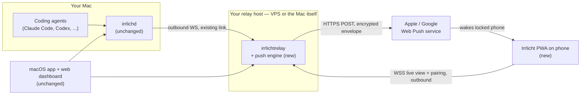
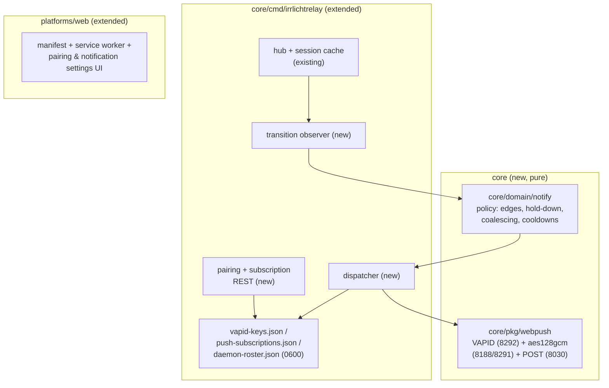
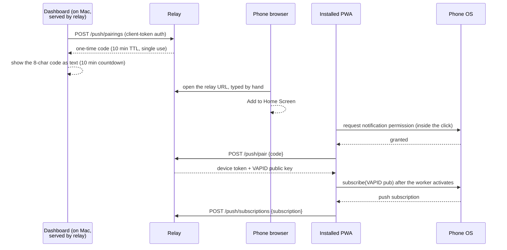
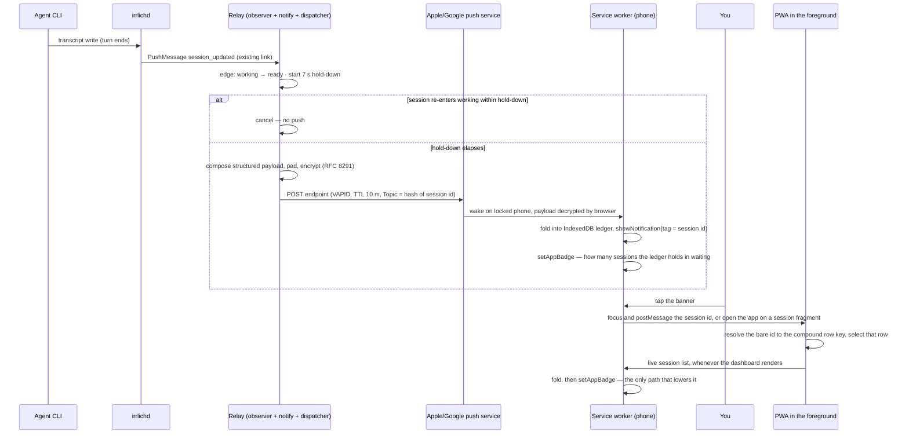
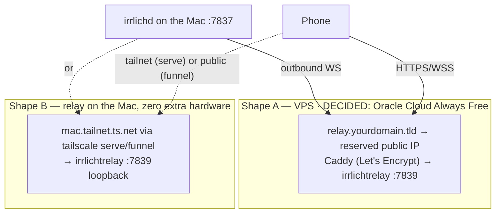

# Mobile Notifications — Architecture (arc42)

**Status:** **built, unproven.** Slices 1–8 are implemented on `feat/1346-beacon` (~15.8k lines across 100 files); every gate is green. **Nothing has yet delivered a notification to a real phone** — that is slice D ([`beacon-device-test.md`](./beacon-device-test.md)), and until it runs, the quality requirements in §10 are designed-for rather than demonstrated. One known gap is tracked in §11 rather than hidden: the test-notification button (§8.3). R6 was the other until slice 8 (§8.5, ADR-9).
**Scope:** feature-level arc42 for phone notifications (discussion [#1346](https://github.com/ingo-eichhorst/Irrlicht/discussions/1346)); system-wide architecture lives in `site/docs/architecture.html` and `docs/relay-protocol.md`. Operator runbook: [`examples/relay/DEPLOY.md`](../examples/relay/DEPLOY.md). User guide: [`site/docs/beacon.html`](../site/docs/beacon.html).
**Format note:** minimal arc42 profile — every section present, none padded

> **This document describes code that exists.** It began as a proposal, and while it was being implemented three of its confident-sounding sentences turned out to be false — a self-heal that did not cover the case it claimed, a UI button nobody built, a release artifact no release carried. Each was found by writing something *else* against the code and noticing the disagreement, never by re-reading this file. Treat an unsourced assertion here as a claim awaiting its next contradiction, and prefer the `file:line` citations where they appear.

---

## 1. Introduction and Goals

A phone notification when an agent finishes or needs input — the same signal the menu bar gives, when the user is not at the desk. Not a second cockpit: a lock-screen banner plus a last-known-state list. Off unless a phone is explicitly paired.

The phone-facing app is named **Irrlicht Beacon** (the name the user sees: manifest, home-screen icon, docs). "Beacon" is scoped to that app only — the Go packages keep mechanism names (`notify`, `webpush`), because `core/pkg/hookbeacon` already uses the word for an unrelated mechanism (the `irrlichd hook-post` delivery beacon) and two internal "beacon" packages would collide in every conversation about either.

### 1.1 Requirements overview

| # | Requirement |
|---|---|
| R1 | A locked, backgrounded phone shows a banner on `* → waiting` and `working → ready` transitions — **built, not yet observed on a device (slice D)** |
| R2 | Pairing happens once per phone; daily use needs zero setup gestures |
| R3 | Ten flapping sessions must not mean ten buzzes (dedupe/coalescing, see §8.4) |
| R4 | A dead delivery path is visible, never silent (§8.3) — **met except for one case**: a lost `vapid-keys.json` leaves both the browser subscription and the relay record intact, so nothing looks wrong and nothing self-heals (risk 10) |
| R5 | The Mac and the phone may both roam networks freely; nothing rebinds |
| R6 | Tapping a notification opens the app on that session's last-known state — nothing more. **Built** (§8.5): the tap carries the session id, the app resolves it to the row the dashboard actually keys, and a session it cannot find is *said out loud* rather than tapped into silence. Like R1, not yet observed on a device (slice D) |

### 1.2 Quality goals (ranked)

| Priority | Goal | Meaning here |
|---|---|---|
| 1 | **Privacy** | Nothing readable leaves the user's own infrastructure (Mac + their relay). Apple/Google carry ciphertext plus routing metadata — timing, and the headers §8.2 now enumerates, which distinguish event *kinds*. Content, never. |
| 2 | **Trustworthy delivery** | Absence of a notification and inability to deliver are distinguishable states (house rule: a mechanism that cannot run fails loudly). |
| 3 | **Minimal footprint** | Zero daemon changes, zero new wire-protocol frames, no project-hosted services, no app-store presence. |

### 1.3 Stakeholders

| Who | Concern |
|---|---|
| Irrlicht users running a relay | The feature; setup cost; trust in the privacy promise |
| Users without a relay | Explicitly *not served* in P1 (ADR-5) — must be told, not surprised |
| Maintainers | New surface is confined to relay + web tree + two pure packages |
| Discussion #1346 participants | The promise made there is reworded here (§8.2); the change is theirs to challenge |

---

## 2. Constraints

| # | Constraint | Consequence |
|---|---|---|
| C1 | Neither iOS nor Android delivers events to a backgrounded app without APNs/FCM | Apple/Google are unavoidably in the wake-up path; the design minimizes what they see |
| C2 | APNs keys are bound to an App Store bundle and cannot ship inside a self-hosted binary | No native iOS app without a project-operated gateway → Web Push instead (ADR-2) |
| C3 | iOS Web Push requires a home-screen-installed web app (iOS 16.4+, WebKit; EU included — the 17.4-beta removal was reversed) | PWA install step is mandatory on iOS; iOS 26 opens home-screen sites as web apps by default |
| C4 | Web Push subscriptions and PWA installs are bound to their HTTPS origin | The relay needs one stable, TLS-served hostname, chosen once (§7) |
| C5 | Relay wire protocol v0 changes must be additive | Met with zero frame changes: everything new is relay-local REST + outbound HTTPS (ADR-4) |
| C6 | Repo conventions: hexagonal layering, consent gating (#570), `platforms/web` is vanilla ES modules with no build step | New logic lands as pure `core` packages + relay wiring + plain JS files |
| C7 | Web Push payload encryption (RFC 8291) is mandatory and terminates on the device | The E2E-to-phone property is free; the push service cannot read content by construction |

---

## 3. Context and Scope

### 3.1 Context

Every arrow into the relay is dialed **outbound** by a roaming endpoint (R5): the Mac's forwarder reconnects on network change (existing jittered backoff + `daemon_snapshot` reconciliation), the phone reconnects when opened, and pushes reach the phone through Apple/Google wherever it is. The relay's hostname is the only fixed point; the Mac's address appears nowhere.

### 3.2 In scope (P1) / out of scope

**In:** relay-side push engine, PWA shell over `platforms/web`, one-time pairing, policy defaults of §8.4, daemon-offline watchdog push, delivery health surfacing.

**Out (deliberately):** ntfy/webhook sinks (deferred, ADR-5) · native iOS/Android apps (ADR-2) · remote control from the phone (non-goal in #1346; the relay's `control` channel exists but stays untouched) · project-hosted relay · presence-aware muting ("I'm at the Mac, don't buzz") — P2+, needs a presence signal that does not exist yet · quiet hours (delegated to OS Focus modes).

---

## 4. Solution Strategy

| Decision | One-line rationale | ADR |
|---|---|---|
| Push engine lives in the **relay**, daemon untouched | The relay already receives every `PushMessage` under an explicitly configured flow and caches prev/next state per session | ADR-1 |
| **PWA + Web Push**, no native apps | Only mobile path with zero project infrastructure and no distributable secrets | ADR-2 |
| Pairing completes **inside the installed app** with a one-time code | iOS partitions Safari-tab storage from installed-app storage | ADR-3 |
| **Zero wire-protocol changes** | Subscription registry, pairing, VAPID are relay-local; daemon frames unchanged | ADR-4 |
| Transition semantics live in one **pure package** (`core/domain/notify`) | The one piece that must exist server-side; property-testable; reusable if a daemon-side sink is ever demanded | ADR-5 |
| Relay composes payloads (readable to the relay) | The relay already holds full session state in its cache; the trust boundary is the user's own infra | ADR-6 |

---

## 5. Building Block View

### 5.1 Level 1 — what is new, and where

| Block | Responsibility | Notes |
|---|---|---|
| `core/domain/notify` | Decide *whether/when/how-coalesced* to notify, given a stream of transition events | Defines its own input event struct; imports nothing outward (domain rule). Relay maps `outbound.PushMessage` → `notify.Event`. No interface/port — the port is born only when a second consumer exists. |
| `core/pkg/webpush` | Encrypt payload to a subscription, sign VAPID JWT, POST with `TTL`/`Topic`/`Urgency` headers | `pkg/` leaf-layer rules apply (no adapters/application imports). Hand-written on the stdlib — nothing vendored, no new module dependency, which is what keeps it extractable. |
| Relay: observer | Detect per-session state edges off the cache updates it already performs; seed silently on first sight/snapshot | Feeds `notify` engine; also feeds `daemon_status` disconnects (watchdog) |
| Relay: dispatcher | Fan decided notifications out to every subscription in the same **workspace**; prune on `410`; record last-delivery status | Workspace scoping mirrors existing isolation |
| Relay: pairing/REST | `GET /api/v1/push/info` (unauthenticated — §5.2's feature detection depends on it) · `POST /api/v1/push/pairings` (authed; mints one-time code) · `POST /api/v1/push/pair` (code → device token + VAPID pub) · `POST/DELETE/GET /api/v1/push/subscriptions` (device-token-authed; the GET is §8.3's health panel) | Device tokens are ordinary `TokenRecord`s — `token list`/`revoke` and 4401 semantics apply unchanged |
| `platforms/web` PWA | Manifest, service worker (push → ledger fold → `showNotification` → badge; `notificationclick` → deep link; `message` → live fold + ledger reads), pairing flow (which also configures the live view, ADR-9), health panel, unpair. **No** notification-settings UI: policy is server-side (§8.4). **No** test button (slice 9) | No build step; plain files. Ships via `build-release.sh`'s single `WEB_FILES` list, kept complete by a tripwire that derives the required set (§8.7). The worker is a classic script and imports nothing, so the four message names it exchanges with `beacon.js` are two copies — pinned together by `sw-contract.test.js` |

**Source location.** All Go code stays in the existing `core` module — no new module. `notify` (under `domain/`) and `webpush` (under `pkg/`) fall under `core/architecture_test.go`'s layering rules automatically. The relay's push **state** lands in a `core/cmd/irrlichtrelay/push` subpackage (VAPID identity, pairing codes, subscription registry, roster, health); the observer, dispatcher and HTTP surface stayed in `package main` beside the hub they wire into. Both are composition-root code, free to import anything, and kept deliberately outside the daemon's hexagon: `core/adapters/outbound/relay` is the *daemon-side* forwarder and stays untouched. PWA assets join `platforms/web` — no third web tree (the #1225 dependency-drift lesson), and no build step to introduce.

**Separate-repo option (kept open, not taken).** Beacon might one day live in its own repo. Development starts here because the repo's gates (architecture test, preflight, replay) are what hold the new code to the house rules — but every boundary is drawn so extraction stays a move, not a rewrite: `notify` and `webpush` import **stdlib only** (no `irrlicht/core` types cross into them), the Beacon PWA files are additive to `platforms/web` behind feature detection, and the relay already serves its UI from disk (`IRRLICHT_UI_DIR` / `resolveUIDir`), so a standalone repo could ship relay + Beacon assets without touching this one. The one thing extraction would cost is the shared web tree's dashboard — which is exactly why the §5.2 contract keeps Beacon's files separable rather than woven in.

### 5.2 The additivity contract — what explicitly does not change

`irrlichd` (all of it) · the macOS app · the relay wire protocol · the consent catalog · every default. **No existing surface starts relaying to an external server:** daemon, dashboard and macOS app connect to a relay only when the user configures one — exactly as today; with no relay configured there is zero relay traffic and the feature is simply absent.

The one shared surface is `platforms/web` (served by the localhost daemon *and* by relays), so additivity there is a contract, not an intention:

| Rule | Guarantee |
|---|---|
| The service worker has **no `fetch` handler** (push + notification-click only) | It can never interpose on asset loading or cache the dashboard stale; local serving stays byte-identical |
| The service worker is registered **lazily**, from the pairing flow and the §8.3 self-heal — never at page load | Plain dashboard usage never installs it. The self-heal is a second call site, but it runs only for an already-paired phone (it is gated on the stored device token), so the guarantee holds |
| The pairing/push UI is **feature-detected** (renders only where the origin answers the push-info endpoint) | The daemon-served dashboard shows no Beacon UI and installs no service worker; an old relay hides it too. **One exception, stated rather than glossed:** `index.html` links the manifest and two `theme-color` metas unconditionally, so the plain dashboard is installable under the Beacon name. Inert — an install without pairing subscribes to nothing — but it is not literally "nothing new" |
| No lockstep (ADR-4) | Old daemon ↔ push-capable relay and unchanged daemon ↔ old relay both work |

---

## 6. Runtime View

### 6.1 One-time pairing (per phone)

The code crosses the Safari-tab → installed-app storage boundary **by hand** — nothing carries it in a
URL (ADR-8) — and pairing *completes* in the installed app (ADR-3).

Two orderings here are load-bearing and were both settled by the implementation rather than by this
diagram. Permission is asked **first**, inside the click's transient user activation: a network
round-trip plus a worker registration can outlive it, and on iOS an expired activation means the
prompt never appears at all. It is also the cheap thing to fail — a refusal costs nothing, because
the single-use code is not yet spent. And `subscribe()` waits for the worker to reach *activated*;
the Push API rejects it while the registration's active worker is null.

There is no closing "send a test notification" step: that button is §8.3's, and it does not exist
(slice 9). Proving delivery today means driving a real transition.

### 6.2 Background delivery (daily path)

`* → waiting` follows the same path with no hold-down and TTL 1 h.

**What the PWA is when open.** Twice now this paragraph has been wrong, in opposite directions, and
both errors are worth keeping visible. The first draft said the PWA becomes an ordinary WS client
with its banners suppressed while visible. The correction said it configures no source at all and a
live view is a separate, manual act. Since slice 8 that is wrong too: **pairing configures the live
view** (ADR-9) — `enableRelaySource`, `relayUrl` = the serving origin, `relayToken` = the device
token, written through the dashboard's own Settings → Sources mechanism and removed again on unpair.
Not a nicety: it is the only signal that can lower a badge (§8.5), because §8.4 never pushes on
`* → working`.

Two halves of the older text survive unchanged. The dashboard's default "local" source still dials
the serving origin *without* a token, which a push-capable relay (always auth-on, §8.1) closes with
`CloseRevoked` — pairing configures the relay source beside it rather than fixing that. And the
visible-tab suppression is still the *dashboard's* own client-side banner rule; the service worker
calls `showNotification` unconditionally, as `userVisibleOnly` requires, so an open PWA still gets the
banner.

### 6.3 Roam and reconcile

Mac switches networks → forwarder reconnects → `daemon_snapshot` replaces the relay's cache. The observer **seeds** state from snapshots without emitting edges *except* where a session's state genuinely differs from the last known one — that single diff notifies (better late than silent), storms don't (R3).

### 6.4 Daemon offline (watchdog)

Relay sees the daemon link drop → 60 s grace (roaming reconnects are seconds) → one push "Mac 'laptop' disconnected" (Topic-replaced by later status). This is the one notification the daemon can never send about itself, and the answer to #1346's "a missing notification looks exactly like a quiet agent". The roster of known daemons is persisted (§8.6) so a relay restart cannot silently forget a daemon that is offline at the time.

---

## 7. Deployment View

**Decided:** Shape A on **Oracle Cloud** (Always Free). Shape B stays documented as the
zero-hardware alternative, not as a second thing to maintain.

| Aspect | Shape A: VPS | Shape B: Tailscale on the Mac |
|---|---|---|
| Stable origin (C4) | Your domain | `*.ts.net` name — identical across every physical network the Mac joins |
| Phone prerequisites | None | Tailscale app on tailnet (`serve`) or none (`funnel`) |
| Survives Mac asleep | Relay yes (only watchdog push remains meaningful) | No — but with the daemon down there are no events anyway |
| Push egress | Relay → Apple/Google outbound HTTPS | Same, from the Mac |

Dev loop: **the daemon is not a substitute for the relay here.** It serves the same web tree, but registers no `/api/v1/push/*` route, so feature detection finds nothing and the Beacon section never renders — by design (§5.2), and worth knowing before trying to test pairing against `127.0.0.1:7837`. Use `tools/beacon-rig.sh up`, which stands up a real relay on loopback; loopback is a secure context, so the worker and subscription flow work without TLS.

**Renaming the relay origin re-pairs every phone** (C4). Pick the name once.

**What choosing Oracle Cloud costs, and how the architecture answers it.** Two of its properties
are load-bearing enough to belong here rather than only in the operator guide
(`examples/relay/DEPLOY.md`, which carries the commands):

| Property | Consequence | Why P1 survives it |
|---|---|---|
| Free compute is **ARM** (Ampere A1), with an x86 micro fallback when A1 capacity is short | The relay must ship for **both** `linux/arm64` and `linux/amd64` | It cross-compiles clean and static — no cgo, one pure-Go dependency (verified by building both). Slice 6 publishes both tarballs |
| OCI **reclaims idle instances** — under 20% CPU *and* network *and* (A1) memory across 7 days | A relay is that profile by construction, and the failure is silent: the VM stops, notifications cease | Not preventable from inside the design, so it is made **cheap to recover from**: a reserved public IP plus external DNS keeps the origin stable across a rebuild, and §8.6's four files restore the VAPID identity and subscriptions. **No phone re-pairs** — origin and VAPID key are exactly what a subscription binds to |

The second row is the one to notice: the §8.6 persistence inventory was written as a backup
story, and it turns out to be the disaster-recovery story for this host. The property that
makes it work is that the relay holds *no session content* — restoring it is four small files
and a DNS record that never changed, not a database.

### 7.1 Distribution

The operator story exists: `examples/relay/` carries a Dockerfile, docker-compose, a systemd unit, and `DEPLOY.md` with the two auth/TLS postures and the reverse-proxy pattern — Shape A is documented today. What does **not** exist is shipped bits: `DEPLOY.md` itself states "built from source — there is no published release yet", and `irrlichtrelay` appears nowhere in `tools/build-release.sh`, `site/install.sh`, or the Homebrew tap (verified). P1 closes exactly that gap:

1. `build-release.sh` cross-compiles `irrlichtrelay` into the **existing** darwin/linux tarballs — their `web/` payload is already what the relay serves, via the same `resolveUIDir` walk as the daemon (`cmd/irrlichtrelay/main.go:443`).
2. Both web copy-list call sites (`build-release.sh:65` darwin, `:87` linux) grow the PWA files, under the §8.7 tripwire.
3. `examples/relay` gains the push addendum: auth now mandatory (§8.1), the §8.6 backup file list, and a launchd plist beside `irrlichtrelay.service` for Shape B.

Deferred: publishing a container image (releases run locally with no CI secrets; the committed Dockerfile builds from any checkout). Version skew between relay binary and PWA assets is a non-issue — one tarball carries both — and the installed PWA self-updates on next open via the standard service-worker byte-check lifecycle.

---

## 8. Cross-cutting Concepts

### 8.1 Consent, identity, and isolation

No new daemon consent entry: the daemon does nothing new. The flow rides three existing/explicit opt-ins — (1) relay forwarding is user-configured (URL + token in Settings → Sources), (2) pairing is a deliberate act with a possession-proving code, (3) the OS notification permission is granted on-device. Revocation: `irrlichtrelay token revoke <device>` kills WS access (4401) *and* drops that device's subscription.

**Why tokens at all** — "users only see their own sessions on their devices" *is* the token mechanism. The relay's isolation unit is the **workspace**, server-derived from the token hash at every handshake and never read from the wire (unspoofable; `docs/relay-protocol.md`). Cache, fan-out and reads are already partitioned by it; subscriptions and push dispatch join the same partition. A push-capable relay is by definition internet-reachable, and each of its doors is an abuse without an identity:

| Door | Credential proving workspace | Without it |
|---|---|---|
| Daemon link (`hello`) | daemon token (existing) | anyone injects fake sessions into your phone's view |
| Live view (WS + REST reads) | client/device token (existing mechanism) | anyone reads every user's session labels and states |
| Subscription registration + self-heal | **device token**, minted at pairing | anyone routes your state changes to their phone |
| Pairing-code minting | any authed client token | codes could not inherit a workspace |
| Code redemption (`POST /push/pair`) | **the code itself** — no bearer | the one door whose credential is the payload; single-use, 10 min, uniform 401, rate-limited (§6.1) |
| Feature detection (`GET /push/info`) | **none, deliberately** | it must be able to say *why* push is off on an anonymous relay, and the VAPID public key it returns is public by construction. The cost is real and worth naming: any internet caller learns this origin is an Irrlicht relay with push enabled |

**A device token is a full client token.** It is an ordinary `TokenRecord` in the workspace, so
every client route accepts it — the WS live view, the REST session mirrors, and `POST
/push/pairings`, meaning a paired phone can mint further pairing codes. That is not what §3.2's
"remote control from the phone is out of scope" implies, and it is a consequence of reusing the
token mechanism rather than a decision anyone took. It is contained by the workspace boundary and by
`token revoke`, and narrowing it would mean a token *kind* the relay does not currently have.

**Since slice 8 this breadth is load-bearing rather than incidental** (ADR-9): pairing configures the
phone's own live view with the device token, and that works only because the WS route accepts it. So
narrowing is now *owed work with a shape*, not merely a recorded property — a narrower kind has to
keep the live view and the REST session mirrors open while closing `POST /push/pairings`, which is
the one route nothing needs (risk 15). Recorded here rather than left to be discovered by whoever
tries the narrowing and finds every phone's live view dead.

Division of labor: the **device token** is the phone's durable identity (an ordinary `TokenRecord` — list/revoke for free); the **push subscription** is only a delivery *address* the OS may reissue at any time (which is why it cannot replace the token, and why self-heal works: identity survives, address is re-registered); the **pairing code** is the one-time bridge that carries the workspace into the device token. After setup, no token is ever seen or typed again.

**Rule: push requires auth.** The protocol doc already declares a reachable no-auth relay unsafe; push makes reachability mandatory. The relay therefore **refuses to enable push endpoints under `--auth off`**, with an error naming the fix — anonymous mode and push are mutually exclusive, failing loudly rather than serving an open relay (even on a tailnet, where the network gates access: one security model, not two). Per-device filtering *within* a workspace (this phone gets only project X) is a later subscription-level knob, not an identity concern.

### 8.2 Privacy model (the reworded #1346 promise)

> Nothing readable leaves your infrastructure. Only ciphertext transits Apple/Google, only if you pair a phone, and only until the phone picks it up.

| Party | Sees |
|---|---|
| Your Mac | Everything (unchanged) |
| Your relay | Full session state — **already true today** for any relay user; it composes payloads (ADR-6) |
| Apple/Google | Endpoint identity, **timing**, ciphertext padded to a fixed 2 KiB — **and four plaintext headers we long described as absent**: `TTL` (3600 for `waiting`, 600 for `ready` and daemon), `Urgency` (`high` vs `normal`, splitting the same way), the `Topic` collapse key, and the VAPID `k=` public key. The first two mean the push service can distinguish *which kind* of event fired, not merely that one did; `Topic` is a stable per-session pseudonym across its lifetime; `k=` groups every phone paired to one relay, and the `sub` claim (ADR-7) names the software. Content stays unreadable; the metadata is richer than "timing" implied (`core/pkg/webpush/sender.go:117-126`) | 
| Phone | Structured payload; notification text is composed **on-device** by the service worker |

Named leak, accepted as in #1346: timing is a work-rhythm signal; batching would hide it and ruin the feature. Payloads are structured data (ids, labels, states), never prose — composition stays on-device.

### 8.3 Failure visibility

House rule: absence of a finding and inability to look must never produce the same output.

| Failure | Surfaced by |
|---|---|
| Push service returns `410/404` | Subscription pruned; the PWA health panel then reads "Paired, but push is not registered — reopen this app to re-subscribe" on next open (`beacon.js`), and the self-heal re-registers it |
| Subscription silently invalidated by iOS | Self-heals: PWA re-subscribes on next open with its stored device token |
| Doubt | A "send test notification" button in PWA settings — **not built** (slice 9). Until it exists, proving delivery means driving a real transition |
| A tap that resolves to no session | The app opens and *says so*, naming the session's last-known state from the ledger and the time it was last known (§8.5, R6) — never a tap that appears to do nothing |
| The live view pairing configured is off, or aimed at another relay | A second line in the health panel, because the badge then only counts up and that would otherwise read as a broken badge rather than a configuration (`liveViewNoteText` in `beacon.js`) |
| Daemon link down | Watchdog push (§6.4) |
| Delivery attempt outcome | Last-status per subscription, visible in the PWA and relay logs |

### 8.4 Policy defaults (the #1346 dedupe answer — lives in `core/domain/notify`, one place)

| Rule | Default |
|---|---|
| `* → waiting` | Push immediately — latency is the feature |
| `working → ready` | Push after 7 s hold-down; cancelled if the session leaves `ready` |
| `* → working` | Never |
| First sighting / snapshot seed | Silent (no push), except a genuine state *diff* on reconcile (§6.3) |
| Subagent sessions (`ParentSessionID` set) | Never — parent covers them (matches both existing client implementations) |
| `session_deleted` | No push; cancels pending hold-downs |
| Collapse | One notification per session. The device-side `tag` **is** the session id; the `Topic` header is `base64url(sha256(id))[:32]`, because RFC 8030 §5.4 caps a Topic at 32 base64url chars and a session UUID is 36. Same collapse semantics, deterministic, but the header never carries the id — which is also why it is a stable pseudonym rather than a leak of the id itself (§8.2) |
| Cooldown | 60 s per (session, edge) — the backchannel engine's default |
| Burst | > 3 pushes within 20 s → single summary "N agents need attention" (itself Topic-replaced) |
| TTL | `waiting` 1 h · `ready` 10 m · watchdog 10 m — stale `ready` is noise, `waiting` stays true |
| Presession → real-session rekey | The engine rekeys cooldown/hold-down state (the #1002 class) — **but nothing emits `EventRekey`**: the relay's mapper produces only session-update and session-delete (`push_observer.go` `sessionEvent`), so a promotion arrives as a delete plus a silent first sighting and the cooldown is dropped. Policy that is correct in the package and unreachable end-to-end; the relay has no promotion signal to map, since the wire protocol carries none (ADR-4) |

### 8.5 State on the phone

The PWA holds a last-known-state ledger (IndexedDB `beacon-ledger`, one object store, keyed by the
relay's **bare** session id): folded from push payloads while backgrounded and from the dashboard's
own live view while open, read back on a notification tap, and reduced to a home-screen badge. It is
never authoritative — the daemon is. Disconnected, it shows "as of 14:32".

**The badge counts `waiting`, and nothing else.** §8.4 pushes a banner for `working → ready` too, but
the two states make different claims: `waiting` is "an agent is blocked on you", which you clear by
answering, while `ready` is "work you could pick up", which a finished session keeps asserting until
you start another turn. A badge counting `ready` would sit non-zero for every session that ever
finished. `navigator.setAppBadge` is feature-detected per call — it is absent on every desktop
Firefox and on Safari outside an installed app — and its absence, a throw, and a rejected promise all
cost nothing: no badge is a better outcome than a broken notification chain, and the chain is the
feature.

**Why the live fold exists, and why it is part of pairing.** A badge derived from push alone can only
climb. §8.4 never pushes on `* → working`, and iOS forbids a silent push (`userVisibleOnly` forces a
visible notification per push), so a backgrounded phone learns that sessions *need* attention and
never that one stopped. The correcting signal is the dashboard's own WS stream — which is why pairing
now configures the phone's live view (ADR-9) and why the open app posts its visible session list into
the same ledger. The live set **replaces** the ledger rather than merging into it: a row the live set
does not name is dropped, because a session that ended has to stop counting exactly like one that
left `waiting`. The empty set is therefore a real snapshot and is published like any other — a phone
opened after everything ended is precisely the case the badge has to survive.

That case turns on **when** a publish is triggered, not on what it carries, and the first
implementation got it wrong in a way its own tests could not see: the publish rode on `render()`
alone, and nothing renders when a socket connects. A phone with no sessions therefore had no frame to
render and published nothing, leaving the badge exactly where the push fold left it. It now publishes
on the **connect edge** as well, and forgets its last-published signature on **disconnect** — because
the worker's ledger does not stand still while the page is away (the push fold keeps writing it), so
"unchanged since I last published" says nothing about what the ledger now holds.
`irrlicht.beaconedges.test.js` drives both edges with the sessions fetch deliberately never resolving,
which is what removes `render()` from the picture.

**What a tap resolves to (R6).** The payload carries the relay's bare session id, while the dashboard
re-keys relay-sourced sessions to a compound `<daemon>\0<id>` (#537) before writing
`data-session-id`. A link keyed on the bare id would select nothing, silently, for exactly the
sessions notifications are about — which is why this was a slice and not a line. The worker sends the
bare id (postMessage to a focused window, URL fragment to a cold one) and the dashboard resolves it
through `displaySessionId`, `compoundSessionId`'s documented inverse, rather than through a second
derivation that could drift. A row hidden inside a collapsed group is expanded rather than reported
missing. A session that genuinely is not there produces a notice naming its last-known state and the
time it was last known — never a tap that appears to do nothing. Two daemons sharing one bare id are
reported as ambiguous, and one is selected: a notification names no daemon, so this is the one
question the payload cannot answer.

Three distinctions are load-bearing here, and each is the §8.3 house rule in local form. **A read
that failed is not an empty ledger:** `all()` answers `[]` for "nothing there" and `null` for "could
not look", and a null leaves the badge exactly where it is rather than clearing it — clearing would
state "nothing needs you", which is a claim a storage failure does not support. **A dashboard with no
connected source publishes nothing:** its list is not a smaller truth, it is no truth at all, and
publishing it would delete the ledger kept for exactly that moment. **A message the worker does not
understand is still answered:** an older worker meeting a newer app is precisely when a caller
awaiting a reply that never arrives would hang, so every message carrying a reply port gets one.

### 8.6 Persistence and restart behavior

The relay is stateless-by-design in v0 (sessions in RAM, rebuilt from `daemon_snapshot` on every daemon reconnect); the only file it writes today is `tokens.json`, hashed at rest. The push engine keeps that shape: flat JSON files, 0600, atomic temp+rename, no database. **Session content is never at rest on the relay host — before this feature and after it.**

| Data | Where | Survives restart | Notes |
|---|---|---|---|
| Token records (existing) | `tokens.json` | yes | SHA-256 hashes only; hot-reloaded on change |
| VAPID keypair | `vapid-keys.json` | yes | Subscriptions are bound to it, so **losing it means re-pairing every phone** — the §8.3 self-heal does *not* cover this. `selfHeal` re-subscribes only when the browser has no subscription or the relay has no record of the phone (`beacon.js:418`); after a key loss both still exist, so the phone keeps a subscription bound to a key that is gone and nothing detects it. Back this file up |
| Subscription registry | `push-subscriptions.json` | yes | Endpoint + device keys per phone, linked to its TokenRecord; rewritten only on pair/revoke/`410`-prune, never per push |
| Daemon roster | `daemon-roster.json` | yes | workspace + id + label + last-seen (the workspace is part of the identity: daemon ids are unique per tenant, not globally) — so the watchdog does not forget an offline daemon across a relay restart (§6.4). Bounded: entries unseen for 30 days are swept, so "cannot forget" is really "does not forget for a month" |
| Session cache | RAM | no | Repopulated by daemon reconnects within seconds |
| Policy state (cooldowns, hold-downs, burst windows) | RAM | no | **A restart is amnesia, not recovery.** The engine's session map is RAM-only and nothing seeds it, so after a restart every session is an unknown id — a first sighting, which is silent by design. A `ready` that landed during the restart is therefore *not* delivered; the next genuine transition is. §6.3's diff rule covers a daemon reconnect, not a relay restart |
| Pairing codes | RAM | no | 10 min TTL, single use; a restart mid-pairing just means regenerating the code |
| Delivery health (last attempt per subscription) | RAM | no | Shown as "unknown since restart" — honest, per §8.3 |
| Notification payloads | **nowhere** | — | No outbox, no durable queue, by design: a stale notification is an anti-feature. Apple/Google *are* the queue; TTL (§8.4) is its bound |

**Backup / host migration:** copy four small files (`tokens.json`, `vapid-keys.json`, `push-subscriptions.json`, `daemon-roster.json`) and keep the hostname — every phone survives the move untouched. The origin-rename caveat (§7) is unchanged and orthogonal.

**Disk-compromise threat note:** an attacker with the relay's data dir gets no session content and no usable bearer tokens (hashes) — what they do get is `vapid-keys.json` + `push-subscriptions.json`, which together allow **sending arbitrary, readable notifications to paired phones** until the user re-pairs (which rotates everything). Named so it is weighed, not discovered.

### 8.7 Testing

What exists: `notify` has table tests over every §8.4 row plus a fixed-seed property test (2000 flap
storms, an eight-invariant oracle, and an env-gated 24k sweep); `webpush` is pinned by the RFC 8291
Appendix A known-answer test, a round-trip property test through a test-side decryptor, and a fake
push service grading headers and JWT; the relay carries the tripwires §5.2 needs — `sw.js` registers
no `fetch` handler, exactly one shipped module registers the worker, and the release copy list is
*derived* from `index.html` plus the import graph rather than hand-kept. `tools/beacon-rig.sh check`
runs ten assertions against a live relay. Every guard landed with a deliberate mutation seen red.

Slice 8 added 76 jsdom test cases across six files, and none of them is a green that was never red:
every one was run against the *previous* `sw.js`, `beacon.js` and `irrlicht.js` first — 28 red on the
worker side, 32 on the page side — which is the honest form of red-first for a slice that adds
behaviour rather than fixing a defect. It found two real ones on the way. `liveViewNoteText` took an
`origin` parameter that half its own verdict ignored in favour of `location.origin`, invisible in
production because the two are always the same string and visible the moment a pure function was
called with a different one. And the live fold's "do not republish an unchanged set" guard held
"nothing published yet" and "published the empty set" as the same value, so the *first* snapshot of
an empty dashboard was skipped — which is exactly the phone opened after every session ended, the
case the badge most has to survive. That one was reproduced red before it was fixed, by driving the
socket open before the initial `/api/v1/sessions` fetch resolves, the ordering a warm relay
connection actually produces.

**The lesson this section exists for, because it nearly shipped a dead feature.** Adversarial review
of the observer found **seven of eight** fresh mutations staying green. The tests drove the
component's synchronous core (`handle`, `tick`) directly and never executed the production
plumbing — so `setPushHook` could be made a no-op (the whole feature dead), `nextWake` could report
nothing pending (**the ready hold-down and the §6.4 watchdog never firing**), and the run loop's
`handle` could become `drive` (the roster never persisting) with a fully green build. Every headline
behaviour in this document reached a phone only through code no test executed.

The fix is one end-to-end test that builds the real collaborator, registers the hook production
registers, starts the real goroutine and lets a **real timer** fire
(`push_production_path_test.go` — it calls `handle`, `drive` and `tick` nowhere), proven by severing
each seam and watching it redden. Two traps are worth carrying to the next component:

- **A zero value that is also a valid value hides a broken guard.** A revoked token resolves to
  workspace `""`, which *is* the default single-tenant workspace, so tests using named tenants
  cannot tell "failed to resolve" from "resolved to default". The guard is only testable by issuing
  against a named workspace and driving the transition in the default one.
- **A guard can be vacuous in its own right.** The tarball-layout arm asserted `$staging/bin`
  appeared somewhere in the function — which `mkdir -p "$staging/bin"` one line above satisfies
  while the binary is staged flat beside it. Found by mutating the guard, not by reading it.

---

## 9. Architecture Decisions

**ADR-1 — Push engine in the relay, not a daemon sink framework.**
*Context:* round 1 proposed a daemon-side `NotifyService` + sink port (ntfy/webhook/webpush). Review challenge: one consumer, three layers.
*Decision:* the relay — which already receives the full stream under configured consent and holds prev/next state — detects, decides, delivers. Daemon diff: zero.
*Consequence:* P1 requires a relay (see ADR-5). The sink port is deliberately unbuilt until a second consumer exists.

**ADR-2 — PWA + Web Push, not native apps.**
*Context:* native iOS background push requires APNs keys that cannot ship in self-hosted binaries → project-run gateway (Path B's cost). Native Android could use UnifiedPush but splits effort.
*Decision:* installable PWA served by the relay; per-relay VAPID keys; EU status verified (Apple retained Home Screen web apps; the 2024 removal died in beta).
*Consequence:* iOS install friction (home screen step); WebKit-only; transport stays pluggable in case Apple regresses (§11).

**ADR-3 — Pairing completes inside the installed app via one-time code.**
*Context:* iOS partitions Safari-tab storage from installed-app storage; a token saved pre-install can vanish post-install; long-lived tokens in URLs leak into history.
*Decision:* short-lived (10 min), single-use, possession-proving code, exchanged for a device token *by the installed app*. The code is typed — see ADR-8.
*Consequence:* the code is typed once, by hand (ADR-8 settled the QR question against vendoring an encoder); codes are rate-limited relay-side, and a wrong one is indistinguishable from an expired one.

**ADR-4 — Zero wire-protocol changes.**
*Context:* protocol v0 is deliberately thin; daemons must not need lockstep upgrades.
*Decision:* subscriptions, pairing, VAPID identity are relay-local REST + files; the observer reads the cache updates the relay already performs.
*Consequence:* old daemons work unchanged against a push-capable relay; version skew is a non-issue.

**ADR-5 — ntfy/webhook sinks deferred; P1 serves relay operators only.**
*Context:* #1346's Path A ("costs nothing, hosts nothing") targeted the zero-infra crowd; this design inverts that order because the relay made B-lite cheap.
*Decision:* defer third-party sinks. Keep `notify` pure so a future daemon-side sink imports the same policy rather than growing a fourth transition-logic copy (Swift, JS, relay… would-be daemon).
*Consequence:* users without a relay get nothing in P1 — this inversion must be stated openly when the direction is posted to #1346.

**ADR-6 — The relay composes payloads (readable to the relay).**
*Context:* a daemon-encrypts/relay-delivers split would keep the relay content-blind for pushes — but the relay already caches full session state, so blindness there protects nothing real, while the split costs new upstream frames and breaks one-subscription-per-workspace fan-out.
*Decision:* relay composes structured payloads and encrypts to each device (mandatory per RFC 8291); trust boundary = user's own infrastructure (§8.2).
*Consequence:* the #1346 promise is reworded from "machine" to "infrastructure" — flagged for discussion sign-off.

**ADR-7 — An unset VAPID subject defaults rather than refusing to start.**
*Context:* RFC 8292 §2.1 requires a `sub` claim and admits only `mailto:` or `https:`. Apple Web Push and Mozilla autopush **reject** a JWT without it, so the relay shipping one was a total-failure bug on the only platform where the PWA path is mandatory (found in review; §8.7). The fix needed a policy for the operator who configures nothing.
*Decision:* `--vapid-subject` (or `IRRLICHT_RELAY_VAPID_SUBJECT`) unset resolves to the project URL — a real `https:` URI that self-describes what is pushing. A value that is *set* but is neither `mailto:` nor `https:` is fatal at startup, and validated before push is known to be enabled.
*Consequence:* refusing to boot over a missing contact address is a worse failure than identifying the software instead of the operator; but a wrong value surfaces as a 4xx per push on somebody's phone, where nobody is looking, so that one dies loudly and early. An operator who wants to be reachable sets it.

**ADR-8 — Paste-only pairing; no QR encoder.**
*Context:* §6.1 originally offered "QR or paste", which meant vendoring a QR encoder into a no-build tree (risk 7).
*Decision:* type the code. It is eight characters from an ambiguity-free alphabet, entered once per phone in the phone's own keyboard.
*Consequence:* a dependency avoided for a one-time act. QR remains addable later behind the same REST call if pairing friction turns out to matter.

**ADR-9 — Pairing also configures the phone's live view.**
*Context:* the badge R6 implies cannot decay from push alone. §8.4 never pushes on `* → working`, and iOS's `userVisibleOnly` forbids a silent push, so a backgrounded phone only ever learns that sessions *need* attention; a count derived from push alone climbs and never falls. The alternative on the table was a ledger-only slice 8 — deep link and badge, no live fold — which would have shipped a badge that is wrong within minutes of being right.
*Decision:* a successful pair writes the dashboard's own Sources settings (`enableRelaySource`, `relayUrl` = the serving origin, `relayToken` = the device token) through `irrlicht.js`'s existing settings path — the same object, `persistSettings()` and `rebuildSources()` the Settings panel uses, never localStorage keys written by hand — and unpairing removes them symmetrically. A live view already aimed at a *different* relay is left exactly as the user set it, and the health panel names where it points and what that costs.
*Consequence:* §8.1's "a device token is a full client token" stops being an incidental property and becomes load-bearing: the live view is accepted because the device token is an ordinary `TokenRecord` every client route takes. Narrowing device tokens to their own kind is therefore owed work with a known shape (risk 15), not a footnote. Second consequence: the ledger's key space belongs to the paired relay, so the dashboard publishes only while its live view watches *that* relay — a live view aimed elsewhere would fold foreign sessions in and drop the paired relay's rows as absent. Third: the phone now holds a source that a `token revoke` kills; a `4401` close parks it in `unauthorized` with no retry (`connectSource` in `irrlicht.js`), so a revoked phone does not reconnect-loop, and unpair takes the source down rather than leaving one that can never connect.

---

## 10. Quality Requirements

**How to read the last column.** *Demonstrated* means something ran and was observed. *Asserted*
means a test pins it, which is weaker than it sounds — the whole point of §8.7's lesson is that a
green test can pin nothing. *Designed-for* means the code intends it and nobody has checked.

| Q | Scenario | Target | Status |
|---|---|---|---|
| Q1 | Agent enters `waiting` while phone is locked | Banner within ~3 s (detector → WS forward → policy → push service ≤ ~1 s + APNs/FCM delivery) | **designed-for** — needs slice D; the ~1 s relay-side half is plausible but unmeasured, and the APNs half is not ours |
| Q2 | Ten sessions flap `working ↔ ready` for a minute | ≤ 3 individual pushes then summaries only, per 20 s window (the threshold is 3, not 0 — a lone `ready` should still buzz normally) | **asserted** — property test invariant I5 bounds session-kind pushes per window. The original "zero per-session spam" wording was wrong about its own design |
| Q3 | Phone's subscription dies silently | Detected at next relay push (`410` → pruned) and shown in the PWA within one app-open; never a permanent quiet gap | **asserted** for the `410` prune (relay tests + rig); the PWA's display of it is asserted in jsdom only |
| Q4 | Mac hops networks mid-session | No user action; forwarder reconnects; no notification storm on reconcile (§6.3) | **asserted** — the engine is diff-driven, so a snapshot replay is silent by construction |
| Q5 | Grep the daemon diff for this feature | 0 lines | **demonstrated** — `git diff main...HEAD -- core/cmd/irrlichd core/domain/session core/application core/adapters` is empty, as is the relay wire protocol |
| Q6 | Push service compromise / subpoena | Yields endpoints, timing, TTL/Urgency/Topic metadata (§8.2), and 2 KiB ciphertext blobs — no session content | **asserted** for the size property (exact 2150-byte equality across payload sizes) and for content-blindness; the metadata list is what §8.2 had to be corrected to |
| Q7 | Local-only rig (daemon + dashboard + macOS app, no relay configured) after the feature ships | Behavior identical to before; zero connection attempts to any relay; no service worker installed (§5.2) | **asserted** — §5.2's tripwires, plus a jsdom arm driving a non-push origin. The "zero connection attempts" half deserves an eye during slice D |

---

## 11. Risks and Technical Debt

| # | Risk / debt | Mitigation / status |
|---|---|---|
| 1 | iOS web push reliability quirks (subscriptions dying after long inactivity; delivery deprioritized) | Self-heal on open + health surfacing (§8.3); accepted residual |
| 2 | Apple platform risk — home-screen web apps were yanked once (2024 EU beta) before reversal | Transport is a phone-side detail behind the same relay REST; UnifiedPush/native can slot in without touching daemon or policy |
| 3 | Relay origin rename re-pairs every phone | Documented loudly (§7); no P1 mitigation |
| 4 | Policy lives only in the relay; desktop/web keep their own client-side copies | Accepted for P1; convergence path = both clients eventually consuming server-decided notifications is *not* planned |
| 5 | Relay was stateless-by-design (v0); push adds persisted files | Full inventory + restart matrix in §8.6; sessions stay in-memory, payloads are never stored |
| 6 | New static files must reach installed relays | **Was worse than predicted, now guarded.** All three copy sites shipped 3 files while `irrlicht.js` imports ten siblings — so a tarball-served *and* a curl-installed dashboard both 404'd their own module graph, before Beacon existed. One `WEB_FILES` list now feeds every site, the tripwire derives what belongs in it, and it covers the Dockerfile and installer too (slice 6) |
| 7 | `platforms/web` gains a vendored QR encoder (no-build tree) | **Closed: no QR.** Paste-only shipped — typing eight ambiguity-free characters beat auditing vendored code for a one-time act |
| 8 | Timing metadata to Apple/Google | Named and accepted, as in #1346 |
| 9 | **Nothing has run on a device.** Every defect so far was found by reading, and two of them — a VAPID JWT with no `sub`, `subscribe()` before the worker activates — fail only on contact with a real push service and passed every mock | Slice D, ordered ahead of release. `tools/beacon-rig.sh check` automates the phone-free half; the rest needs a phone. **Until it runs, §10 is designed-for, not demonstrated** |
| 10 | **Losing `vapid-keys.json` costs a full re-pair of every phone**, and nothing detects it — `selfHeal` fires only when the browser has no subscription or the relay has no record (`beacon.js:418`); after a key loss both still exist | Named in §8.6 and the runbook's backup list. No code mitigation; a relay whose data dir is not backed up is one file loss from silent, permanent non-delivery |
| 11 | §8.3's test-notification button does not exist | Slice 9. Marked in place rather than quietly dropped — this table is the record of what the doc promises and the code does not yet do. R6 shared this row until slice 8 (§8.5, ADR-9) |
| 12 | **Same-`Topic` push ordering is unserialized** — two pushes sharing a Topic race through the dispatch semaphore, so a daemon that flaps inside a slow POST can leave the *stale* banner winning the collapse permanently | Documented at the call site (`push_observer.go`); the exposed pair is the daemon up/down Topic, where the wrong survivor says "disconnected" about a live daemon. No fix in P1 |
| 13 | **A relay restart is amnesia for policy state** (§8.6): every session becomes an unknown id, and a first sighting is silent — so a `ready` that landed during the restart is never delivered | Accepted: the alternative is persisting per-session policy state, which trades a missed edge for a stale one |
| 14 | **`EventRekey` is never emitted**, so the presession→real-session cooldown carryover (§8.4) is dead policy | Needs a promotion signal the wire protocol does not carry; wiring one would touch ADR-4 |
| 15 | **Narrowing device tokens is now owed, not optional** — ADR-9 made §8.1's "a device token is a full client token" load-bearing, so a paired phone can still mint pairing codes for its workspace | A narrower token kind has to keep the WS live view and the REST session mirrors open while closing `POST /push/pairings`; that shape is recorded in §8.1 so the narrowing does not silently kill every phone's live view. Contained meanwhile by the workspace boundary and `token revoke`, exactly as before |

---

## 12. Glossary

| Term | Meaning |
|---|---|
| **Irrlicht Beacon** | Product name of the phone-facing PWA (§1). Distinct from `core/pkg/hookbeacon`, the unrelated `irrlichd hook-post` delivery mechanism |
| **Relay** | `irrlichtrelay` — user-hosted fan-out server; daemons dial out to it (`docs/relay-protocol.md`) |
| **Web Push / VAPID** | Browser push standard; per-server ES256 keypair replaces vendor accounts (RFC 8030/8292) |
| **RFC 8291** | Mandatory end-to-end payload encryption to the device's subscription keys |
| **PWA** | Installable web app; on iOS the only vehicle for third-party web push |
| **Service worker** | Phone-side script woken by a push while the app is closed; composes the banner on-device |
| **Topic / tag** | Push-service-side replacement key / device-side notification collapse key — both set to the session id |
| **Hold-down** | Delay before a `ready` push, cancelled if the state flaps back |
| **Device token** | Ordinary relay `TokenRecord` issued at pairing; revocable via existing CLI |
| **Workspace** | Relay's tenant isolation unit; subscriptions and fan-out are scoped to it |
| **Watchdog push** | Relay-originated "daemon disconnected" notification (§6.4) |

---

## Appendix A — P1 slices (each independently PR-able)

| Slice | Content | State |
|---|---|---|
| 1 | `core/domain/notify` — policy engine, table + property tests | **done** `2be21acd` |
| 2 | `core/pkg/webpush` — encrypt/sign/POST, fake-push-service tests | **done** `e7bad8de` |
| 3 | Relay: VAPID identity, pairing endpoints, subscription registry + revocation coupling, push-requires-auth refusal | **done** `c13d8035` |
| 4 | Relay: transition observer + dispatcher + watchdog incl. persisted daemon roster | **done** `527ea4b6` |
| 5 | `platforms/web`: manifest, service worker, pairing + settings UI, paste-only code, release copy list + tripwires | **done** `ea674027` |
| — | *Remediation*: device-breaking defects and the coverage vacuity that hid them (§8.7) | **done** `d2643b36` |
| 6 | Distribution: `irrlichtrelay` tarballs for `linux/arm64` + `linux/amd64`; two broken copy sites fixed | **done** `25281eb8` |
| 7 | Docs: relay-protocol REST reference, operator runbook, site setup guide | **done** `1a2361f9`, `0dd395fa` |
| **D** | **Device test — pair a real phone and observe a notification** ([`beacon-device-test.md`](./beacon-device-test.md)). Its phone-free half is automated (`tools/beacon-rig.sh check`, 10 live assertions, passing); the half that needs a device has not run | **outstanding — the gate on calling this done** |
| 8 | Ledger read path: live-view fold, `setAppBadge`, notification deep link — what makes **R6** true (§8.5), plus the pairing change ADR-9 records | **done** |
| 9 | "Send test notification" button (§8.3), and a deterministic session-state driver for the device test's burst case | not started |

Slice D was inserted mid-flight, ahead of 6, on the reasoning that packaging a flow nobody has
seen work is premature — then 6 and 7 ran first anyway because D needs a human with a phone and
the fleets did not. That inversion is the honest state of things, not a plan: **the ordering
argument still stands and D is still the next thing that matters.**

---

*Template: [arc42](https://arc42.org) by Gernot Starke and Peter Hruschka (CC BY-SA).*
