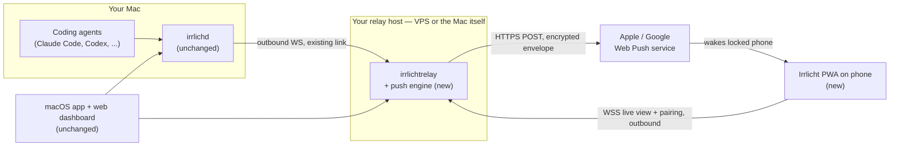
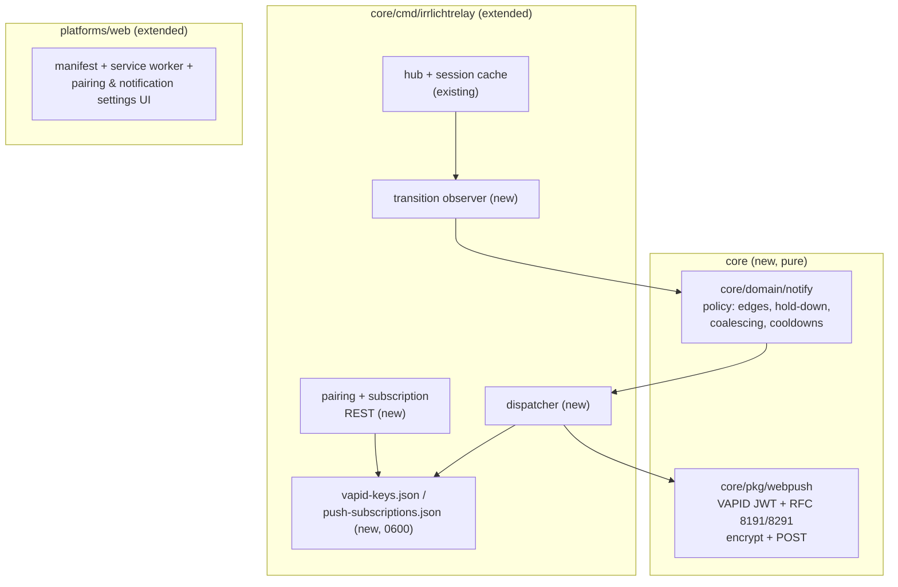
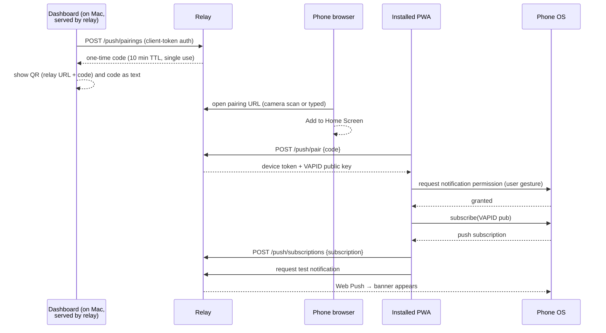
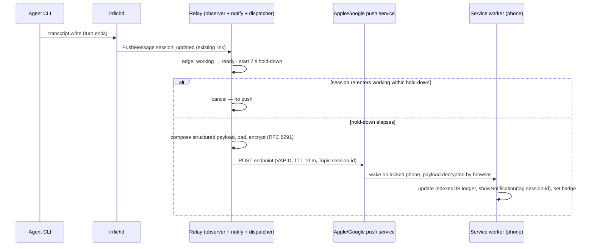
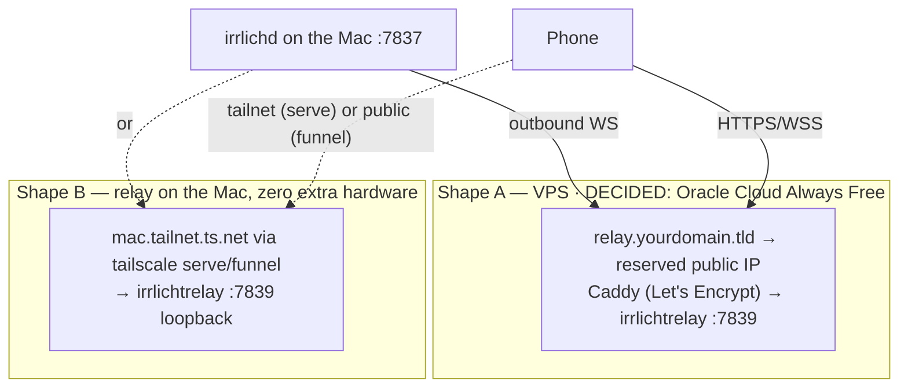

# Mobile Notifications — Architecture (arc42)

**Status:** proposed — this document exists to be reviewed
**Scope:** feature-level arc42 for phone notifications (discussion [#1346](https://github.com/ingo-eichhorst/Irrlicht/discussions/1346)); system-wide architecture lives in `site/docs/architecture.html` and `docs/relay-protocol.md`
**Format note:** minimal arc42 profile — every section present, none padded

---

## 1. Introduction and Goals

A phone notification when an agent finishes or needs input — the same signal the menu bar gives, when the user is not at the desk. Not a second cockpit: a lock-screen banner plus a last-known-state list. Off unless a phone is explicitly paired.

The phone-facing app is named **Irrlicht Beacon** (the name the user sees: manifest, home-screen icon, docs). "Beacon" is scoped to that app only — the Go packages keep mechanism names (`notify`, `webpush`), because `core/pkg/hookbeacon` already uses the word for an unrelated mechanism (the `irrlichd hook-post` delivery beacon) and two internal "beacon" packages would collide in every conversation about either.

### 1.1 Requirements overview

| # | Requirement |
|---|---|
| R1 | A locked, backgrounded phone shows a banner on `* → waiting` and `working → ready` transitions |
| R2 | Pairing happens once per phone; daily use needs zero setup gestures |
| R3 | Ten flapping sessions must not mean ten buzzes (dedupe/coalescing, see §8.4) |
| R4 | A dead delivery path is visible, never silent (§8.3) |
| R5 | The Mac and the phone may both roam networks freely; nothing rebinds |
| R6 | Tapping a notification opens the app on that session's last-known state — nothing more |

### 1.2 Quality goals (ranked)

| Priority | Goal | Meaning here |
|---|---|---|
| 1 | **Privacy** | Nothing readable leaves the user's own infrastructure (Mac + their relay). Apple/Google carry ciphertext and timing only. |
| 2 | **Trustworthy delivery** | Absence of a notification and inability to deliver are distinguishable states (house rule: a mechanism that cannot run fails loudly). |
| 3 | **Minimal footprint** | Zero daemon changes, zero new wire-protocol frames, no project-hosted services, no app-store presence. |

### 1.3 Stakeholders

| Who | Concern |
|---|---|
| Irrlicht users running a relay | The feature; setup cost; trust in the privacy promise |
| Users without a relay | Explicitly *not served* in P1 (ADR-5) — must be told, not surprised |
| Maintainers | New surface is confined to relay + web tree + two pure packages |
| Discussion #1346 participants | The promise made there is reworded here (§8.2); the change is theirs to challenge |

---

## 2. Constraints

| # | Constraint | Consequence |
|---|---|---|
| C1 | Neither iOS nor Android delivers events to a backgrounded app without APNs/FCM | Apple/Google are unavoidably in the wake-up path; the design minimizes what they see |
| C2 | APNs keys are bound to an App Store bundle and cannot ship inside a self-hosted binary | No native iOS app without a project-operated gateway → Web Push instead (ADR-2) |
| C3 | iOS Web Push requires a home-screen-installed web app (iOS 16.4+, WebKit; EU included — the 17.4-beta removal was reversed) | PWA install step is mandatory on iOS; iOS 26 opens home-screen sites as web apps by default |
| C4 | Web Push subscriptions and PWA installs are bound to their HTTPS origin | The relay needs one stable, TLS-served hostname, chosen once (§7) |
| C5 | Relay wire protocol v0 changes must be additive | Met with zero frame changes: everything new is relay-local REST + outbound HTTPS (ADR-4) |
| C6 | Repo conventions: hexagonal layering, consent gating (#570), `platforms/web` is vanilla ES modules with no build step | New logic lands as pure `core` packages + relay wiring + plain JS files |
| C7 | Web Push payload encryption (RFC 8291) is mandatory and terminates on the device | The E2E-to-phone property is free; the push service cannot read content by construction |

---

## 3. Context and Scope

### 3.1 Context

Every arrow into the relay is dialed **outbound** by a roaming endpoint (R5): the Mac's forwarder reconnects on network change (existing jittered backoff + `daemon_snapshot` reconciliation), the phone reconnects when opened, and pushes reach the phone through Apple/Google wherever it is. The relay's hostname is the only fixed point; the Mac's address appears nowhere.

### 3.2 In scope (P1) / out of scope

**In:** relay-side push engine, PWA shell over `platforms/web`, one-time pairing, policy defaults of §8.4, daemon-offline watchdog push, delivery health surfacing.

**Out (deliberately):** ntfy/webhook sinks (deferred, ADR-5) · native iOS/Android apps (ADR-2) · remote control from the phone (non-goal in #1346; the relay's `control` channel exists but stays untouched) · project-hosted relay · presence-aware muting ("I'm at the Mac, don't buzz") — P2+, needs a presence signal that does not exist yet · quiet hours (delegated to OS Focus modes).

---

## 4. Solution Strategy

| Decision | One-line rationale | ADR |
|---|---|---|
| Push engine lives in the **relay**, daemon untouched | The relay already receives every `PushMessage` under an explicitly configured flow and caches prev/next state per session | ADR-1 |
| **PWA + Web Push**, no native apps | Only mobile path with zero project infrastructure and no distributable secrets | ADR-2 |
| Pairing completes **inside the installed app** with a one-time code | iOS partitions Safari-tab storage from installed-app storage | ADR-3 |
| **Zero wire-protocol changes** | Subscription registry, pairing, VAPID are relay-local; daemon frames unchanged | ADR-4 |
| Transition semantics live in one **pure package** (`core/domain/notify`) | The one piece that must exist server-side; property-testable; reusable if a daemon-side sink is ever demanded | ADR-5 |
| Relay composes payloads (readable to the relay) | The relay already holds full session state in its cache; the trust boundary is the user's own infra | ADR-6 |

---

## 5. Building Block View

### 5.1 Level 1 — what is new, and where

| Block | Responsibility | Notes |
|---|---|---|
| `core/domain/notify` | Decide *whether/when/how-coalesced* to notify, given a stream of transition events | Defines its own input event struct; imports nothing outward (domain rule). Relay maps `outbound.PushMessage` → `notify.Event`. No interface/port — the port is born only when a second consumer exists. |
| `core/pkg/webpush` | Encrypt payload to a subscription, sign VAPID JWT, POST with `TTL`/`Topic`/`Urgency` headers | `pkg/` leaf-layer rules apply (no adapters/application imports). Wraps or vendors a small RFC 8291 implementation. |
| Relay: observer | Detect per-session state edges off the cache updates it already performs; seed silently on first sight/snapshot | Feeds `notify` engine; also feeds `daemon_status` disconnects (watchdog) |
| Relay: dispatcher | Fan decided notifications out to every subscription in the same **workspace**; prune on `410`; record last-delivery status | Workspace scoping mirrors existing isolation |
| Relay: pairing/REST | `POST /api/v1/push/pairings` (authed; mints one-time code) · `POST /api/v1/push/pair` (code → device token + VAPID pub) · `POST/DELETE /api/v1/push/subscriptions` (device-token-authed) | Device tokens are ordinary `TokenRecord`s — `token list`/`revoke` and 4401 semantics apply unchanged |
| `platforms/web` PWA | Manifest, service worker (receive push → update IndexedDB ledger → `showNotification` → `setAppBadge`), pairing flow, notification settings, health panel, test button | No build step; plain files. Release copy list in `tools/build-release.sh` must grow (§11) |

**Source location.** All Go code stays in the existing `core` module — no new module. `notify` (under `domain/`) and `webpush` (under `pkg/`) fall under `core/architecture_test.go`'s layering rules automatically. The relay wiring lands as a **`core/cmd/irrlichtrelay/push` subpackage** — composition-root code, free to import anything, and kept deliberately outside the daemon's hexagon: `core/adapters/outbound/relay` is the *daemon-side* forwarder and stays untouched. PWA assets join `platforms/web` — no third web tree (the #1225 dependency-drift lesson), and no build step to introduce.

**Separate-repo option (kept open, not taken).** Beacon might one day live in its own repo. Development starts here because the repo's gates (architecture test, preflight, replay) are what hold the new code to the house rules — but every boundary is drawn so extraction stays a move, not a rewrite: `notify` and `webpush` import **stdlib only** (no `irrlicht/core` types cross into them), the Beacon PWA files are additive to `platforms/web` behind feature detection, and the relay already serves its UI from disk (`IRRLICHT_UI_DIR` / `resolveUIDir`), so a standalone repo could ship relay + Beacon assets without touching this one. The one thing extraction would cost is the shared web tree's dashboard — which is exactly why the §5.2 contract keeps Beacon's files separable rather than woven in.

### 5.2 The additivity contract — what explicitly does not change

`irrlichd` (all of it) · the macOS app · the relay wire protocol · the consent catalog · every default. **No existing surface starts relaying to an external server:** daemon, dashboard and macOS app connect to a relay only when the user configures one — exactly as today; with no relay configured there is zero relay traffic and the feature is simply absent.

The one shared surface is `platforms/web` (served by the localhost daemon *and* by relays), so additivity there is a contract, not an intention:

| Rule | Guarantee |
|---|---|
| The service worker has **no `fetch` handler** (push + notification-click only) | It can never interpose on asset loading or cache the dashboard stale; local serving stays byte-identical |
| The service worker is registered **lazily**, from the pairing flow only | Plain dashboard usage never installs it |
| The pairing/push UI is **feature-detected** (renders only where the origin answers the push-info endpoint) | The daemon-served dashboard shows nothing new; an old relay hides it too |
| No lockstep (ADR-4) | Old daemon ↔ push-capable relay and unchanged daemon ↔ old relay both work |

---

## 6. Runtime View

### 6.1 One-time pairing (per phone)

The code crosses the Safari-tab → installed-app storage boundary by hand or by surviving in the URL; either way pairing *completes* in the installed app (ADR-3).

### 6.2 Background delivery (daily path)

`* → waiting` follows the same path with no hold-down and TTL 1 h. When the PWA is open and connected, it is an ordinary WS client (live view; its own banners suppressed while visible — same rule the dashboard uses today).

### 6.3 Roam and reconcile

Mac switches networks → forwarder reconnects → `daemon_snapshot` replaces the relay's cache. The observer **seeds** state from snapshots without emitting edges *except* where a session's state genuinely differs from the last known one — that single diff notifies (better late than silent), storms don't (R3).

### 6.4 Daemon offline (watchdog)

Relay sees the daemon link drop → 60 s grace (roaming reconnects are seconds) → one push "Mac 'laptop' disconnected" (Topic-replaced by later status). This is the one notification the daemon can never send about itself, and the answer to #1346's "a missing notification looks exactly like a quiet agent". The roster of known daemons is persisted (§8.6) so a relay restart cannot silently forget a daemon that is offline at the time.

---

## 7. Deployment View

**Decided:** Shape A on **Oracle Cloud** (Always Free). Shape B stays documented as the
zero-hardware alternative, not as a second thing to maintain.

| Aspect | Shape A: VPS | Shape B: Tailscale on the Mac |
|---|---|---|
| Stable origin (C4) | Your domain | `*.ts.net` name — identical across every physical network the Mac joins |
| Phone prerequisites | None | Tailscale app on tailnet (`serve`) or none (`funnel`) |
| Survives Mac asleep | Relay yes (only watchdog push remains meaningful) | No — but with the daemon down there are no events anyway |
| Push egress | Relay → Apple/Google outbound HTTPS | Same, from the Mac |

Dev loop: the daemon serves the same web tree on `127.0.0.1` — a secure context — so service worker and subscription flow are locally testable without TLS.

**Renaming the relay origin re-pairs every phone** (C4). Pick the name once.

**What choosing Oracle Cloud costs, and how the architecture answers it.** Two of its properties
are load-bearing enough to belong here rather than only in the operator guide
(`examples/relay/DEPLOY.md`, which carries the commands):

| Property | Consequence | Why P1 survives it |
|---|---|---|
| Free compute is **ARM** (Ampere A1), with an x86 micro fallback when A1 capacity is short | The relay must ship for **both** `linux/arm64` and `linux/amd64` | It cross-compiles clean and static — no cgo, one pure-Go dependency (verified by building both). Slice 6 publishes both tarballs |
| OCI **reclaims idle instances** — under 20% CPU *and* network *and* (A1) memory across 7 days | A relay is that profile by construction, and the failure is silent: the VM stops, notifications cease | Not preventable from inside the design, so it is made **cheap to recover from**: a reserved public IP plus external DNS keeps the origin stable across a rebuild, and §8.6's four files restore the VAPID identity and subscriptions. **No phone re-pairs** — origin and VAPID key are exactly what a subscription binds to |

The second row is the one to notice: the §8.6 persistence inventory was written as a backup
story, and it turns out to be the disaster-recovery story for this host. The property that
makes it work is that the relay holds *no session content* — restoring it is four small files
and a DNS record that never changed, not a database.

### 7.1 Distribution

The operator story exists: `examples/relay/` carries a Dockerfile, docker-compose, a systemd unit, and `DEPLOY.md` with the two auth/TLS postures and the reverse-proxy pattern — Shape A is documented today. What does **not** exist is shipped bits: `DEPLOY.md` itself states "built from source — there is no published release yet", and `irrlichtrelay` appears nowhere in `tools/build-release.sh`, `site/install.sh`, or the Homebrew tap (verified). P1 closes exactly that gap:

1. `build-release.sh` cross-compiles `irrlichtrelay` into the **existing** darwin/linux tarballs — their `web/` payload is already what the relay serves, via the same `resolveUIDir` walk as the daemon (`cmd/irrlichtrelay/main.go:443`).
2. Both web copy-list call sites (`build-release.sh:65` darwin, `:87` linux) grow the PWA files, under the §8.7 tripwire.
3. `examples/relay` gains the push addendum: auth now mandatory (§8.1), the §8.6 backup file list, and a launchd plist beside `irrlichtrelay.service` for Shape B.

Deferred: publishing a container image (releases run locally with no CI secrets; the committed Dockerfile builds from any checkout). Version skew between relay binary and PWA assets is a non-issue — one tarball carries both — and the installed PWA self-updates on next open via the standard service-worker byte-check lifecycle.

---

## 8. Cross-cutting Concepts

### 8.1 Consent, identity, and isolation

No new daemon consent entry: the daemon does nothing new. The flow rides three existing/explicit opt-ins — (1) relay forwarding is user-configured (URL + token in Settings → Sources), (2) pairing is a deliberate act with a possession-proving code, (3) the OS notification permission is granted on-device. Revocation: `irrlichtrelay token revoke <device>` kills WS access (4401) *and* drops that device's subscription.

**Why tokens at all** — "users only see their own sessions on their devices" *is* the token mechanism. The relay's isolation unit is the **workspace**, server-derived from the token hash at every handshake and never read from the wire (unspoofable; `docs/relay-protocol.md`). Cache, fan-out and reads are already partitioned by it; subscriptions and push dispatch join the same partition. A push-capable relay is by definition internet-reachable, and each of its doors is an abuse without an identity:

| Door | Credential proving workspace | Without it |
|---|---|---|
| Daemon link (`hello`) | daemon token (existing) | anyone injects fake sessions into your phone's view |
| Live view (WS + REST reads) | client/device token (existing mechanism) | anyone reads every user's session labels and states |
| Subscription registration + self-heal | **device token**, minted at pairing | anyone routes your state changes to their phone |
| Pairing-code minting | any authed client token | codes could not inherit a workspace |

Division of labor: the **device token** is the phone's durable identity (an ordinary `TokenRecord` — list/revoke for free); the **push subscription** is only a delivery *address* the OS may reissue at any time (which is why it cannot replace the token, and why self-heal works: identity survives, address is re-registered); the **pairing code** is the one-time bridge that carries the workspace into the device token. After setup, no token is ever seen or typed again.

**Rule: push requires auth.** The protocol doc already declares a reachable no-auth relay unsafe; push makes reachability mandatory. The relay therefore **refuses to enable push endpoints under `--auth off`**, with an error naming the fix — anonymous mode and push are mutually exclusive, failing loudly rather than serving an open relay (even on a tailnet, where the network gates access: one security model, not two). Per-device filtering *within* a workspace (this phone gets only project X) is a later subscription-level knob, not an identity concern.

### 8.2 Privacy model (the reworded #1346 promise)

> Nothing readable leaves your infrastructure. Only ciphertext transits Apple/Google, only if you pair a phone, and only until the phone picks it up.

| Party | Sees |
|---|---|
| Your Mac | Everything (unchanged) |
| Your relay | Full session state — **already true today** for any relay user; it composes payloads (ADR-6) |
| Apple/Google | Endpoint identity, **timing**, ciphertext padded to a fixed 2 KiB | 
| Phone | Structured payload; notification text is composed **on-device** by the service worker |

Named leak, accepted as in #1346: timing is a work-rhythm signal; batching would hide it and ruin the feature. Payloads are structured data (ids, labels, states), never prose — composition stays on-device.

### 8.3 Failure visibility

House rule: absence of a finding and inability to look must never produce the same output.

| Failure | Surfaced by |
|---|---|
| Push service returns `410/404` | Subscription pruned + PWA health panel shows "push unreachable since …" on next open |
| Subscription silently invalidated by iOS | Self-heals: PWA re-subscribes on next open with its stored device token |
| Doubt | "Send test notification" button in PWA settings |
| Daemon link down | Watchdog push (§6.4) |
| Delivery attempt outcome | Last-status per subscription, visible in the PWA and relay logs |

### 8.4 Policy defaults (the #1346 dedupe answer — lives in `core/domain/notify`, one place)

| Rule | Default |
|---|---|
| `* → waiting` | Push immediately — latency is the feature |
| `working → ready` | Push after 7 s hold-down; cancelled if the session leaves `ready` |
| `* → working` | Never |
| First sighting / snapshot seed | Silent (no push), except a genuine state *diff* on reconcile (§6.3) |
| Subagent sessions (`ParentSessionID` set) | Never — parent covers them (matches both existing client implementations) |
| `session_deleted` | No push; cancels pending hold-downs |
| Collapse | One notification per session: Web Push `Topic` + notification `tag` = session id; newer replaces |
| Cooldown | 60 s per (session, edge) — the backchannel engine's default |
| Burst | > 3 pushes within 20 s → single summary "N agents need attention" (itself Topic-replaced) |
| TTL | `waiting` 1 h · `ready` 10 m · watchdog 10 m — stale `ready` is noise, `waiting` stays true |
| Presession → real-session rekey | Rekeys cooldown/hold-down state (the #1002 class) |

### 8.5 State on the phone

The PWA holds a last-known-state ledger (IndexedDB): folded from WS snapshots while open, from push payloads while backgrounded. It is never authoritative — the daemon is. Disconnected, it shows "as of 14:32".

### 8.6 Persistence and restart behavior

The relay is stateless-by-design in v0 (sessions in RAM, rebuilt from `daemon_snapshot` on every daemon reconnect); the only file it writes today is `tokens.json`, hashed at rest. The push engine keeps that shape: flat JSON files, 0600, atomic temp+rename, no database. **Session content is never at rest on the relay host — before this feature and after it.**

| Data | Where | Survives restart | Notes |
|---|---|---|---|
| Token records (existing) | `tokens.json` | yes | SHA-256 hashes only; hot-reloaded on change |
| VAPID keypair | `vapid-keys.json` | yes | Subscriptions are bound to it. If lost, no phone is pushable until its PWA is next opened and self-heals by re-subscribing with the new key |
| Subscription registry | `push-subscriptions.json` | yes | Endpoint + device keys per phone, linked to its TokenRecord; rewritten only on pair/revoke/`410`-prune, never per push |
| Daemon roster | `daemon-roster.json` | yes | id, label, last-seen — so the watchdog cannot silently forget an offline daemon across a relay restart (§6.4) |
| Session cache | RAM | no | Repopulated by daemon reconnects within seconds |
| Policy state (cooldowns, hold-downs, burst windows) | RAM | no | §6.3's reconcile-diff rule doubles as restart recovery: a `ready` that landed during the restart still fires as a genuine diff |
| Pairing codes | RAM | no | 10 min TTL, single use; a restart mid-pairing just means regenerating the code |
| Delivery health (last attempt per subscription) | RAM | no | Shown as "unknown since restart" — honest, per §8.3 |
| Notification payloads | **nowhere** | — | No outbox, no durable queue, by design: a stale notification is an anti-feature. Apple/Google *are* the queue; TTL (§8.4) is its bound |

**Backup / host migration:** copy four small files (`tokens.json`, `vapid-keys.json`, `push-subscriptions.json`, `daemon-roster.json`) and keep the hostname — every phone survives the move untouched. The origin-rename caveat (§7) is unchanged and orthogonal.

**Disk-compromise threat note:** an attacker with the relay's data dir gets no session content and no usable bearer tokens (hashes) — what they do get is `vapid-keys.json` + `push-subscriptions.json`, which together allow **sending arbitrary, readable notifications to paired phones** until the user re-pairs (which rotates everything). Named so it is weighed, not discovered.

### 8.7 Testing

Per repo rules, stated here so the slices inherit them: `notify` gets table *and property* tests (random flap storms; fixed seed; failure prints the event sequence); every new guard lands with its committed mutation seen red; the webpush sender is tested against a fake push service asserting encryption, padding, `TTL`/`Topic` headers; the release copy-list gains a tripwire so a missing SW file fails loudly instead of shipping a silently push-less PWA; and the §5.2 contract gets its own tripwire — a static check that `sw.js` registers no `fetch` handler and that the dashboard entry path performs no eager service-worker registration (a guard, landed with its mutation seen red).

---

## 9. Architecture Decisions

**ADR-1 — Push engine in the relay, not a daemon sink framework.**
*Context:* round 1 proposed a daemon-side `NotifyService` + sink port (ntfy/webhook/webpush). Review challenge: one consumer, three layers.
*Decision:* the relay — which already receives the full stream under configured consent and holds prev/next state — detects, decides, delivers. Daemon diff: zero.
*Consequence:* P1 requires a relay (see ADR-5). The sink port is deliberately unbuilt until a second consumer exists.

**ADR-2 — PWA + Web Push, not native apps.**
*Context:* native iOS background push requires APNs keys that cannot ship in self-hosted binaries → project-run gateway (Path B's cost). Native Android could use UnifiedPush but splits effort.
*Decision:* installable PWA served by the relay; per-relay VAPID keys; EU status verified (Apple retained Home Screen web apps; the 2024 removal died in beta).
*Consequence:* iOS install friction (home screen step); WebKit-only; transport stays pluggable in case Apple regresses (§11).

**ADR-3 — Pairing completes inside the installed app via one-time code.**
*Context:* iOS partitions Safari-tab storage from installed-app storage; a token saved pre-install can vanish post-install; long-lived tokens in URLs leak into history.
*Decision:* short-lived (10 min), single-use, possession-proving code, exchanged for a device token *by the installed app*. QR carries URL + code; typing the code is the universal fallback.
*Consequence:* one manual entry when the URL fragment doesn't survive install; codes are rate-limited relay-side.

**ADR-4 — Zero wire-protocol changes.**
*Context:* protocol v0 is deliberately thin; daemons must not need lockstep upgrades.
*Decision:* subscriptions, pairing, VAPID identity are relay-local REST + files; the observer reads the cache updates the relay already performs.
*Consequence:* old daemons work unchanged against a push-capable relay; version skew is a non-issue.

**ADR-5 — ntfy/webhook sinks deferred; P1 serves relay operators only.**
*Context:* #1346's Path A ("costs nothing, hosts nothing") targeted the zero-infra crowd; this design inverts that order because the relay made B-lite cheap.
*Decision:* defer third-party sinks. Keep `notify` pure so a future daemon-side sink imports the same policy rather than growing a fourth transition-logic copy (Swift, JS, relay… would-be daemon).
*Consequence:* users without a relay get nothing in P1 — this inversion must be stated openly when the direction is posted to #1346.

**ADR-6 — The relay composes payloads (readable to the relay).**
*Context:* a daemon-encrypts/relay-delivers split would keep the relay content-blind for pushes — but the relay already caches full session state, so blindness there protects nothing real, while the split costs new upstream frames and breaks one-subscription-per-workspace fan-out.
*Decision:* relay composes structured payloads and encrypts to each device (mandatory per RFC 8291); trust boundary = user's own infrastructure (§8.2).
*Consequence:* the #1346 promise is reworded from "machine" to "infrastructure" — flagged for discussion sign-off.

---

## 10. Quality Requirements

| Q | Scenario | Target |
|---|---|---|
| Q1 | Agent enters `waiting` while phone is locked | Banner within ~3 s (detector → WS forward → policy → push service ≤ ~1 s + APNs/FCM delivery) |
| Q2 | Ten sessions flap `working ↔ ready` for a minute | ≤ 1 summary notification per 20 s window; zero per-session spam (§8.4) |
| Q3 | Phone's subscription dies silently | Detected at next relay push (`410` → pruned) and shown in the PWA within one app-open; never a permanent quiet gap |
| Q4 | Mac hops networks mid-session | No user action; forwarder reconnects; no notification storm on reconcile (§6.3) |
| Q5 | Grep the daemon diff for this feature | 0 lines |
| Q6 | Push service compromise / subpoena | Yields endpoints, timing, 2 KiB ciphertext blobs — no session content |
| Q7 | Local-only rig (daemon + dashboard + macOS app, no relay configured) after the feature ships | Behavior identical to before; zero connection attempts to any relay; no service worker installed (§5.2) |

---

## 11. Risks and Technical Debt

| # | Risk / debt | Mitigation / status |
|---|---|---|
| 1 | iOS web push reliability quirks (subscriptions dying after long inactivity; delivery deprioritized) | Self-heal on open + health surfacing (§8.3); accepted residual |
| 2 | Apple platform risk — home-screen web apps were yanked once (2024 EU beta) before reversal | Transport is a phone-side detail behind the same relay REST; UnifiedPush/native can slot in without touching daemon or policy |
| 3 | Relay origin rename re-pairs every phone | Documented loudly (§7); no P1 mitigation |
| 4 | Policy lives only in the relay; desktop/web keep their own client-side copies | Accepted for P1; convergence path = both clients eventually consuming server-decided notifications is *not* planned |
| 5 | Relay was stateless-by-design (v0); push adds persisted files | Full inventory + restart matrix in §8.6; sessions stay in-memory, payloads are never stored |
| 6 | New static files must reach installed relays | Release copy-list tripwire (§8.7) — a guard, landed with its mutation |
| 7 | `platforms/web` gains a vendored QR encoder (no-build tree) | Small single-file encoder, or ship paste-only first — decided at slice 5 |
| 8 | Timing metadata to Apple/Google | Named and accepted, as in #1346 |

---

## 12. Glossary

| Term | Meaning |
|---|---|
| **Irrlicht Beacon** | Product name of the phone-facing PWA (§1). Distinct from `core/pkg/hookbeacon`, the unrelated `irrlichd hook-post` delivery mechanism |
| **Relay** | `irrlichtrelay` — user-hosted fan-out server; daemons dial out to it (`docs/relay-protocol.md`) |
| **Web Push / VAPID** | Browser push standard; per-server ES256 keypair replaces vendor accounts (RFC 8030/8292) |
| **RFC 8291** | Mandatory end-to-end payload encryption to the device's subscription keys |
| **PWA** | Installable web app; on iOS the only vehicle for third-party web push |
| **Service worker** | Phone-side script woken by a push while the app is closed; composes the banner on-device |
| **Topic / tag** | Push-service-side replacement key / device-side notification collapse key — both set to the session id |
| **Hold-down** | Delay before a `ready` push, cancelled if the state flaps back |
| **Device token** | Ordinary relay `TokenRecord` issued at pairing; revocable via existing CLI |
| **Workspace** | Relay's tenant isolation unit; subscriptions and fan-out are scoped to it |
| **Watchdog push** | Relay-originated "daemon disconnected" notification (§6.4) |

---

## Appendix A — P1 slices (each independently PR-able)

| Slice | Content | Depends on |
|---|---|---|
| 1 | `core/domain/notify` — policy engine, table + property tests | — |
| 2 | `core/pkg/webpush` — encrypt/sign/POST, fake-push-service tests | — |
| 3 | Relay: VAPID identity, pairing endpoints, subscription registry + revocation coupling, push-requires-auth refusal (a guard — lands with its mutation seen red) | 2 |
| 4 | Relay: transition observer + dispatcher + watchdog incl. persisted daemon roster | 1, 3 |
| 5 | `platforms/web`: manifest (app name: Irrlicht Beacon), service worker, pairing + settings UI, QR-or-paste, both release copy lists + tripwire | 3 |
| **D** | **Device test — pair a real phone against a real relay and observe a notification** ([`docs/beacon-device-test.md`](./beacon-device-test.md)). Runs *before* 6: every defect so far was found by reading, and two of them fail only on contact with a real push service, so packaging a flow nobody has seen work is premature | 1–5 |
| 6 | Distribution: `irrlichtrelay` into the darwin/linux release tarballs (**both `arm64` and `amd64` — the Oracle target's free tier is ARM**); `examples/relay` push addendum (auth rule, backup list, launchd plist) | D |
| 7 | Docs: relay-protocol.md addendum (REST endpoints), site setup guide (both deployment shapes) | 3–6 |

---

*Template: [arc42](https://arc42.org) by Gernot Starke and Peter Hruschka (CC BY-SA).*
