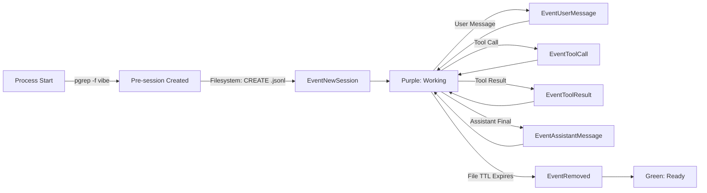

# Mistral Vibe Adapter for Irrlicht — Feature Handover Document

> **⚠️ Original AI-generated analysis — kept for understanding/debugging, NOT a
> spec.** This is the initial handover that seeded the work. The actual adapter
> was built and verified against a real `~/.vibe` transcript, and two claims here
> are WRONG: (1) tool calls use the OpenAI **nested** `tool_calls[].function.name`
> shape, not the flat `tool_calls[].name` shown below; (2) `vibe` is a Python
> console-script, so it needs a `CommandPattern` process match, not `ExactName`.
> For the verified adapter shape, the full assess/unlock/record results, and the
> filed issues, see **`mistral-vibe-onboarding-report.md`** and the adapter source
> under `core/adapters/inbound/agents/vibe/`.

**Status:** Feature Request  
**Repository:** [ingo-eichhorst/Irrlicht](https://github.com/ingo-eichhorst/Irrlicht)  
**Issue:** `feat: Add Mistral Vibe adapter`  
**Date:** 2026-07-06  
**Author:** Mistral Vibe Analysis  

---

## 📋 Executive Summary

This document provides a complete analysis and implementation plan for adding Mistral Vibe support to Irrlicht. Mistral Vibe is currently **not supported** by Irrlicht — no adapter exists, so Irrlicht cannot detect, monitor, or display Mistral Vibe sessions.

**Effort Estimate:** ~2-4 hours (mostly Go boilerplate + testing)  
**Complexity:** Low — follows existing adapter patterns exactly  
**Risk:** Low — no changes to core, only new adapter package  

---

## 🔍 Analysis

### Mistral Vibe Overview

| Property | Value |
|----------|-------|
| **Product** | Mistral Vibe |
| **Vendor** | Mistral AI |
| **Website** | [vibe.mistral.ai](https://vibe.mistral.ai/) |
| **Type** | Open-source coding agent |
| **Status** | Actively maintained |

### Technical Discovery

#### Process
- **Binary:** `vibe` (installed via `pip install mistral-vibe`)
- **Command:** `/path/to/vibe` or `python3 /path/to/vibe`
- **CLI Args:** Often runs with flags like `--yolo`, `--model`, etc.
- **Process Match Pattern:** `pgrep -f vibe`

#### Session Storage
- **Base Directory:** `~/.vibe/`
- **Session Root:** `~/.vibe/logs/session/`
- **Transcript Path:** `~/.vibe/logs/session/<session-id>/messages.jsonl`
- **Session ID:** UUID v4 (e.g., `session_20260706_101952_48e134e3`)
- **Format:** JSONL (JSON Lines) — one JSON object per line

#### Transcript File Format

Each line is a complete JSON object. Key fields:

```json
{
  "role": "user" | "assistant" | "tool",
  "content": "...",
  "message_id": "uuid-v4-string",
  "injected": false,
  "reasoning_content": "...",           // assistant only, optional
  "reasoning_message_id": "...",       // assistant only, optional
  "tool_calls": [                      // assistant only, when invoking tools
    {
      "id": "...",
      "name": "bash",
      "arguments": {...}
    }
  ],
  "tool_call_id": "...",               // tool only
  "name": "bash"                       // tool only
}
```

**Field Presence Matrix:**

| Role | content | message_id | reasoning_content | tool_calls | tool_call_id | name |
|------|---------|------------|-------------------|-----------|--------------|------|
| user | ✅ | ✅ | ❌ | ❌ | ❌ | ❌ |
| assistant | ✅/❌ | ✅ | ✅/❌ | ✅/❌ | ❌ | ❌ |
| tool | ✅ | ✅ | ❌ | ❌ | ✅ | ✅ |

---

## 🎯 Implementation Plan

The implementation follows the **exact pattern** of existing Irrlicht adapters (Claude Code, Pi, Kiro CLI, etc.). No core changes are required — this is a **pure addition** of a new adapter package.

### Directory Structure

```
irrlicht/
├── core/
│   ├── cmd/
│   │   └── irrlichd/
│   │       └── main.go          # ← Add import + registration
│   └── adapters/
│       └── inbound/
│           └── agents/
│               ├── claudecode/
│               ├── codex/
│               ├── pi/
│               ├── kirocli/
│               ├── geminicli/
│               ├── antigravity/
│               └── vibe/          # ← NEW: Mistral Vibe adapter
│                   ├── agent.go
│                   ├── parser.go
│                   └── icons.go
```

---

### 1. Agent Declaration

**File:** `core/adapters/inbound/agents/vibe/agent.go`

```go
// Package vibe implements the Mistral Vibe adapter for Irrlicht.
package vibe

import (
	"regexp"

	"core/domain/agent"
	"core/domain/agent/processlifecycle"
	"core/pkg/tailer"
)

// Transcript directory relative to $HOME
const transcriptDir = ".vibe/logs/session"

// Agent returns the Mistral Vibe adapter configuration.
func Agent() agent.Agent {
	return agent.Agent{
		Identity: agent.Identity{
			Name:         "vibe",
			DisplayName:  "Mistral Vibe",
			IconSVGLight: mistralIconLight,
			IconSVGDark:  mistralIconDark,
		},
		Process: agent.Process{
			// Match any process with 'vibe' in the command line
			// Covers: `vibe`, `python3 /path/to/vibe`, etc.
			Match: &agent.CommandPattern{
				Regex: regexp.MustCompile(`(?i)(vibe|\.vibe/)`),
			},
			// Use shared PID discovery via lsof
			PIDForSession: processlifecycle.PIDForSessionFromLsof,
		},
		Source: &agent.FilesUnderRoot{
			// Watch ~/.vibe/logs/session/ for .jsonl files
			Dir: transcriptDir,
			Parser: agent.JSONLineParser{
				NewParser: func() tailer.LineParser {
					return &VibeParser{}
				},
			},
		},
		// No backchannel support (Mistral Vibe doesn't support input injection)
		Control:     agent.Control{},
		Permissions: nil,
	}
}
```

---

### 2. Transcript Parser

**File:** `core/adapters/inbound/agents/vibe/parser.go`

```go
package vibe

import (
	"core/pkg/tailer"
)

// VibeParser parses Mistral Vibe's JSONL transcript format
// and converts it into Irrlicht's normalized event model.
type VibeParser struct{}

// ParseLine processes a single JSONL line from a Mistral Vibe transcript.
// Returns nil to silently skip unparseable lines.
func (p *VibeParser) ParseLine(raw map[string]interface{}) *tailer.ParsedEvent {
	// Extract role — required field
	role, ok := raw["role"].(string)
	if !ok {
		return nil
	}

	// Extract message ID for deduplication
	messageID, _ := raw["message_id"].(string)

	// Helper to extract string field safely
	getString := func(key string) string {
		if v, ok := raw[key].(string); ok {
			return v
		}
		return ""
	}

	switch role {
	case "user":
		// User message: content is the prompt/input
		return &tailer.ParsedEvent{
			Type:    tailer.EventUserMessage,
			Content: getString("content"),
			ID:      messageID,
		}

	case "assistant":
		// Check if assistant is invoking tools
		if toolCalls, exists := raw["tool_calls"]; exists {
			if toolCallsList, ok := toolCalls.([]interface{}); ok && len(toolCallsList) > 0 {
				// Assistant is in the middle of tool execution — working state
				return &tailer.ParsedEvent{
					Type:        tailer.EventToolCall,
					ID:          messageID,
					ToolCalls:   toolCallsList,
					IsStreaming: true,
				}
			}
		}
		// Regular assistant response (possibly final)
		return &tailer.ParsedEvent{
			Type:    tailer.EventAssistantMessage,
			Content: getString("content"),
			ID:      messageID,
		}

	case "tool":
		// Tool result message
		return &tailer.ParsedEvent{
			Type:     tailer.EventToolResult,
			ToolName: getString("name"),
			Content:  getString("content"),
			ID:       messageID,
		}
	}

	return nil
}
```

---

### 3. SVG Icons

**File:** `core/adapters/inbound/agents/vibe/icons.go`

```go
package vibe

// mistralIconLight is the 14x14 SVG icon for light mode.
// Mistral's brand color is typically a gradient, but we use
// a simple triangle as a placeholder — replace with official icon.
const mistralIconLight = `<svg viewBox="0 0 14 14" xmlns="http://www.w3.org/2000/svg">
  <path fill="#000000" d="M7 0L14 7L7 14L0 7Z"/>
</svg>`

// mistralIconDark is the 14x14 SVG icon for dark mode.
const mistralIconDark = `<svg viewBox="0 0 14 14" xmlns="http://www.w3.org/2000/svg">
  <path fill="#FFFFFF" d="M7 0L14 7L7 14L0 7Z"/>
</svg>`
```

> **💡 Note:** Replace the placeholder triangle SVG with Mistral AI's official icon when available. The SVG should be 14×14 pixels and use `#000000` fill for light mode and `#FFFFFF` fill for dark mode.

---

### 4. Registration

**File:** `core/cmd/irrlichd/main.go`  
**Action:** Add import and register the adapter

```go
// Add to imports
import "core/adapters/inbound/agents/vibe"

// In the agent initialization (typically in wiring.go or main.go)
// Add vibe.Agent() to the allAgents slice
allAgents = append(allAgents, vibe.Agent())
```

---

## 🔄 Event Flow & State Machine

### Session Lifecycle



### Event Mapping Table

| Mistral Vibe Event | Irrlicht Event | Light Color | Notes |
|-------------------|----------------|-------------|-------|
| Process starts | `proc-<pid>` pre-session | N/A | Via process scanner |
| `.jsonl` created | `EventNewSession` | Purple | Session detected |
| User message | `EventActivity` + `EventUserMessage` | Purple | User input |
| Assistant with `tool_calls` | `EventToolCall` | Purple | Working state |
| Tool execution | `EventToolResult` | Purple | Tool output |
| Assistant final message | `EventAssistantMessage` | Purple → Green | Turn complete |
| File stale (>5 min) | `EventRemoved` | Green | Session cleanup |

---

## 🧪 Testing Plan

### Prerequisites
- Mistral Vibe installed (`pip install mistral-vibe`)
- Irrlicht built with the new adapter
- Test session: `vibe --yolo`

### Test Cases

| # | Test | Expected Result |
|---|------|-----------------|
| 1 | Start Mistral Vibe session | New purple light appears in menu bar |
| 2 | Send user message | Light stays purple, activity detected |
| 3 | Mistral calls a tool (bash, grep, etc.) | Light stays purple, tool call tracked |
| 4 | Tool returns result | Light stays purple, tool result logged |
| 5 | Mistral sends final assistant message | Light turns green after short delay |
| 6 | End session (Ctrl+C) | Light turns green |
| 7 | Multiple concurrent sessions | Each session tracked independently |
| 8 | Subagent spawn | Parent-child relationship visible |

### Verification Commands

```bash
# Build Irrlicht with the new adapter
cd irrlicht
go build -o irrlichd ./core/cmd/irrlichd

# Run the daemon
./irrlichd

# Start a Mistral Vibe session in another terminal
vibe --yolo

# Query sessions via CLI
irrlicht-ls

# Expected output:
# SESSION  ID                                      STATE    AGENT        CWD
# 1        session_20260706_130000_a1b2c3d4         working  vibe         /Users/.../project

# Check logs for errors
cat ~/Library/Logs/Irrlicht/daemon.log
```

---

## 📦 Checklist for Implementation

- [ ] Create directory: `core/adapters/inbound/agents/vibe/`
- [ ] Add `agent.go` with `Agent()` function
- [ ] Add `parser.go` with `VibeParser` struct
- [ ] Add `icons.go` with SVG icons
- [ ] Add import in `main.go` or `wiring.go`
- [ ] Register adapter in `allAgents` slice
- [ ] Build and run Irrlicht daemon
- [ ] Start Mistral Vibe session
- [ ] Verify session appears in menu bar
- [ ] Test all event types (user, assistant, tool)
- [ ] Verify state transitions (working → ready)
- [ ] Clean up stale sessions

---

## 📚 References

### Irrlicht Documentation
- [Adapter Documentation](https://irrlicht.io/docs/adapters.html) — Canonical reference for writing adapters
- [Session Detection](https://irrlicht.io/docs/session-detection.html) — How Irrlicht discovers sessions
- [State Machine](https://irrlicht.io/docs/state-machine.html) — Working/waiting/ready states
- [API Reference](https://irrlicht.io/docs/api-reference.html) — Event types and data structures

### Similar Adapters (Reference Implementations)
- [`claude-code`](https://github.com/ingo-eichhorst/Irrlicht/tree/main/core/adapters/inbound/agents/claudecode) — JSONL format, similar structure
- [`pi`](https://github.com/ingo-eichhorst/Irrlicht/tree/main/core/adapters/inbound/agents/pi) — Nested session directories
- [`kiro-cli`](https://github.com/ingo-eichhorst/Irrlicht/tree/main/core/adapters/inbound/agents/kirocli) — Simple JSONL with sidecar metadata

### Mistral Vibe Resources
- [Official Website](https://vibe.mistral.ai/)
- [GitHub Repository](https://github.com/mistralai/mistral-vibe)
- [Installation](https://docs.mistral.ai/vibe/getting-started/installation)

---

## 💬 Frequently Anticipated Questions

### Q: Why doesn't Irrlicht detect Mistral Vibe today?
A: Irrlicht only monitors agents for which it has an **adapter**. Each adapter tells Irrlicht: what to watch (filesystem paths), how to parse (transcript format), and how to find the process. Without a Mistral Vibe adapter, Irrlicht doesn't know where to look or what to look for.

### Q: Can we use an existing adapter as a template?
A: Yes! The **Claude Code adapter** is the closest match:
- Both use JSONL format
- Both store sessions in nested directories under `~/.<agent-name>/`
- Both have similar field structures (role, content, message_id)

### Q: What about the Mistral Vibe TUI?
A: The adapter works regardless of whether Mistral Vibe runs in TUI mode or headless mode. It only cares about the `messages.jsonl` file on disk.

### Q: Does this support Mistral Vibe's subagents?
A: Mistral Vibe's subagent model is different from Claude Code's. Mistral Vibe doesn't currently spawn file-based subagents (each subagent is in-process). The adapter as written handles the main session. If Mistral Vibe adds file-based subagents in the future, we can extend the adapter to detect `subagents/` directories (similar to how Claude Code's adapter handles `subagents/`).

### Q: What about token counting and cost?
A: The basic adapter above doesn't include token extraction. To add it, implement the `PendingContributor` interface in the parser to expose in-progress turn cost. Token counts are in the Mistral Vibe transcript but may require parsing the `reasoning_content` or other fields.

### Q: How do we get the official Mistral icon?
A: Mistral AI's brand guidelines should have official SVG assets. Until then, the placeholder triangle is acceptable. The icon is 14×14 SVG with `#000000` fill for light mode and `#FFFFFF` fill for dark mode.

---

## 🏁 Summary

**Status:** Ready for implementation  
**Blockers:** None  
**Next Step:** Open issue in `ingo-eichhorst/Irrlicht` with this document, or implement directly via PR  

This feature adds Mistral Vibe support to Irrlicht with minimal code (~200 lines) following established patterns. No changes to core Irrlicht functionality are required — it's a pure addition that integrates cleanly with the existing architecture.

---

*Document generated: 2026-07-06*  
*Analysis based on: Mistral Vibe session files, Irrlicht v0.5.5, Irrlicht adapter documentation*
