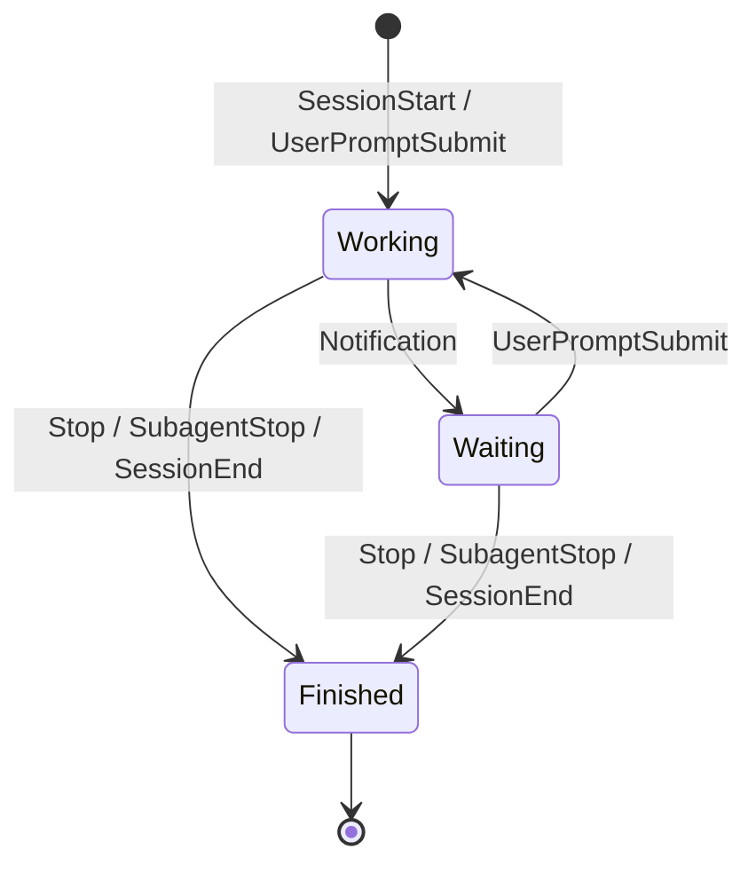

# ClaudeBoard – Requirements Specification (v0.1)

> *A local-first, zero‑friction menu‑bar monitor for Claude Code sessions.*

---

## 1. Purpose & Vision

ClaudeBoard is a macOS **menu‑bar** application that renders a compact, real‑time "battery" of all **Claude Code** sessions running on a developer’s machine and exposes actionable per‑session details on click. It must install in **one step**, configure itself, and require **no manual edits** to Claude Code.

**Core value:** Reduce cognitive load while working with multiple Claude Code sessions; make invisible background work legible at a glance, and actionable within one click.

---

## 2. Scope

**In‑scope**

* Observing local Claude Code sessions via **official Hooks** and **transcripts** (JSONL files) in the user profile.
* Menu‑bar presentation of session **state** (working / waiting / finished) and **metrics** (msgs/min, context usage %, elapsed, optional cost estimate).
* One‑click actions (open/tail transcript, open project in Terminal/VS Code).
* One‑click install, auto‑start at login, clean uninstall with config restore.

**Out‑of‑scope (v1)**

* Cloud services, remote session aggregation, team dashboards.
* Editing Claude settings beyond hook registration.
* Full cost accounting with vendor billing APIs.
* Windows/Linux builds.

---

## 3. Stakeholders & Personas

* **Primary:** Individual developer/architect running multiple concurrent Claude Code sessions.
* **Secondary:** Team leads, trainers, demo presenters needing a visible session overview.

---

## 4. Definitions & Abbreviations

* **Session:** A distinct execution context tracked by Claude Code (has `session_id`).
* **Hook:** Claude Code’s event callback mechanism delivering lifecycle events on **stdin** to a command.
* **Transcript:** Local JSONL log of a session’s interactions/events.
* **State machine:** Mapping from hook events to UI states: `working`, `waiting`, `finished`.

---

## 5. Goals & Non‑Goals

**Goals**

1. Show **N sessions** in the menu bar simultaneously as compact glyphs.
2. Present **state** with < 2 s latency from the originating hook.
3. Provide **per‑session details** and **actions** in a dropdown menu.
4. Install in **one step**; no Homebrew/Node/SwiftBar requirements.
5. Respect **local‑first privacy** (no outbound network by default).

**Non‑Goals**

* Interpreting or modifying user prompts/code.
* Vendor lock‑in or proprietary cloud dependencies.

---

## 6. User Stories

1. **As a developer**, I want to see at a glance how many sessions are active and whether each is working, waiting, or finished, so I can prioritize attention.
2. **As a developer**, I want to click a session and view live throughput (msgs/min) and context usage %, so I can detect stalls or context saturation.
3. **As a power user**, I want one‑click actions to open/tail the transcript and jump to the project folder, so I can debug fast.
4. **As a trainer/presenter**, I want the app to “just work” after installation, so I can focus on the demo, not setup.
5. **As a security‑conscious user**, I want the app to stay local by default and be transparent about what it reads/writes.

---

## 7. Functional Requirements

### 7.1 Installation & Configuration

* **FR‑I01**: Provide a signed, notarized **.pkg** installer that installs:

  * `ClaudeBoard.app` to `/Applications`.
  * `claudeboard-hook` (CLI) to `/usr/local/bin` (or a similarly accessible path).
  * App support directories under `~/Library/Application Support/ClaudeBoard/`.
* **FR‑I02**: Post‑install script merges a **hook configuration** into `~/.claude/settings.json` (idempotent, JSON‑aware merge, with timestamped backup).
* **FR‑I03**: Install a **LaunchAgent** to auto‑start ClaudeBoard at login.
* **FR‑I04**: Provide a **one‑step uninstaller** that restores the backed‑up settings and removes all installed artefacts (with user confirmation).

### 7.2 Hook Receiver (Event Ingestion)

* **FR‑H01**: `claudeboard-hook` must read **stdin JSON** from Claude Code hook events.
* **FR‑H02**: Supported events and mapping:

  * `SessionStart` → initialize record; default `working`.
  * `UserPromptSubmit` → `working`.
  * `Notification` → `waiting`.
  * `Stop` / `SubagentStop` / `SessionEnd` → `finished`.
* **FR‑H03**: For each event, upsert `~/Library/Application Support/ClaudeBoard/instances/<session_id>.json` with atomic write (temp file + rename).
* **FR‑H04**: Persist fields when present: `session_id`, `transcript_path`, `cwd`, model identifier/display name, timestamps (`first_seen`, `updated_at`).
* **FR‑H05**: Ignore events >512 KB; validate/sanitize paths; log minimal diagnostics to `…/logs/events.log`.

### 7.3 Menu‑Bar UI

* **FR‑U01**: Display a **single line ‘battery’** consisting of one glyph per **active** session:

  * ● working, ◔ waiting, ✓ finished.
* **FR‑U02**: Clicking the status opens a **dropdown** listing sessions with:

  * `shortId · state · model` (header row per session).
  * **msgs/min**, **tokens\_in**, **context\_used\_%**, **elapsed\_s**.
* **FR‑U03**: Provide **actions** per session:

  * Open transcript (default editor).
  * Tail transcript (launch Terminal with `tail -n 200 -f`).
  * Open `cwd` in Terminal.
  * Open `cwd` in VS Code (if `code` is available).
* **FR‑U04**: Expire **finished** sessions from the header after a configurable TTL (default 15 min), but keep them visible in dropdown (collapsed section) until app restart.

### 7.4 Metrics Pipeline

* **FR‑M01**: Compute **messages per minute** over a 60 s sliding window by tailing the last \~64 KB of the transcript JSONL.
* **FR‑M02**: Extract **tokens\_in** and, if available, determine **context\_used\_%** by dividing by a **model capacity** table (configurable JSON).
* **FR‑M03**: If precise token counts are missing, estimate tokens via char‑count × model‑specific slope; render **%** only for known model capacities.
* **FR‑M04**: Track **elapsed time** as `now − first_seen`.
* **FR‑M05 (optional)**: Show **cost estimate** using a local price table (editable), when input/output tokens are available or estimable.

### 7.5 Fallback Telemetry (pre‑hook sessions)

* **FR‑F01**: On startup and every N seconds, scan `~/.claude*/projects/**/*.jsonl` to infer sessions not yet emitting hooks.
* **FR‑F02**: Infer state heuristically:

  * `working` if file grew in last 5 s.
  * `waiting` if no growth ≥60 s and last event suggests user input/permission.
  * `finished` if no growth beyond TTL.
* **FR‑F03**: Mark such sessions as **low‑confidence** until a hook event arrives.

### 7.6 Preferences & Persistence

* **FR‑P01**: Preferences window for: refresh interval, expiry TTL, glyph style (ASCII vs SF Symbols), showing cost estimates, theme (auto/light/dark).
* **FR‑P02**: Persist preferences via `UserDefaults` under an app domain; export/import preferences to JSON.
* **FR‑P03**: Maintain an editable **model capacity** JSON and **pricing** JSON in app support.

### 7.7 Updates & Diagnostics

* **FR‑D01**: Provide a basic diagnostics panel showing: last 10 hook events, paths, and current config.
* **FR‑D02**: Support in‑app update checks (Sparkle or equivalent) with release notes (optional for v1).

---

## 8. Non‑Functional Requirements (NFRs)

### 8.1 Performance

* **NFR‑PERF‑01**: Hook→UI latency ≤ **2 seconds** (p95) for local events.
* **NFR‑PERF‑02**: CPU overhead ≤ **5%** p95 while tracking up to **12 concurrent** sessions.
* **NFR‑PERF‑03**: Memory footprint ≤ **100 MB** RSS p95 during typical usage.

### 8.2 Reliability & Robustness

* **NFR‑REL‑01**: Atomic writes for all JSON files; never produce truncated/partial files.
* **NFR‑REL‑02**: Debounce duplicate `Notification` storms; no UI jitter.
* **NFR‑REL‑03**: Graceful handling of missing/malformed transcripts—display partial metrics without crashing.

### 8.3 Security & Privacy

* **NFR‑SEC‑01**: **No network egress** by default. Any future telemetry/export must be **opt‑in**.
* **NFR‑SEC‑02**: Operate under **user permissions** only; no escalations.
* **NFR‑SEC‑03**: Restrict file access to user profile paths (`~/.claude*`, transcript paths provided by hooks) and app support directories.
* **NFR‑SEC‑04**: Sign and notarize both app and CLI; enable hardened runtime.

### 8.4 Compatibility

* **NFR‑COMP‑01**: macOS **13+ (Ventura)** on Apple Silicon and Intel.
* **NFR‑COMP‑02**: Support current Claude Code stable releases; tolerate minor schema drift in transcripts.

### 8.5 Usability & Accessibility

* **NFR‑UX‑01**: Single‑glance status comprehension with no reading needed.
* **NFR‑UX‑02**: Keyboard navigable dropdown; large enough hit targets; VoiceOver labels for glyphs (“Working/Waiting/Finished”).

### 8.6 Maintainability & Testability

* **NFR‑MAINT‑01**: Core components modularized: Hook Receiver, Metrics Engine, UI Adapter.
* **NFR‑MAINT‑02**: Unit tests for parsers (transcripts), estimators, and state transitions.
* **NFR‑MAINT‑03**: Synthetic replay suite for multi‑session scenarios.

### 8.7 Operability

* **NFR‑OPS‑01**: Logs are human‑readable and rotated; diagnostics bundle export.
* **NFR‑OPS‑02**: Uninstall restores the prior `~/.claude/settings.json` exactly (or removes only the app’s hook entries if no backup).

---

## 9. External Interfaces

* **Claude Code Hooks** → stdin JSON to `claudeboard-hook`.
* **Filesystem** → transcripts (JSONL), config files, app support folder.
* **Shell actions** → open/tail transcript; open `cwd` in Terminal/VS Code (optional dependency on `code`).

---

## 10. Data Model

### 10.1 Instance Document (`instances/<session_id>.json`)

```json
{
  "version": 1,
  "session_id": "abc123",
  "state": "working|waiting|finished",
  "model": "claude-3.7-sonnet",
  "cwd": "/path/to/project",
  "transcript_path": "/abs/path/transcript.jsonl",
  "first_seen": 1725560000,
  "updated_at": 1725560123,
  "confidence": "high|low", // low for heuristic-only sessions
  "metrics": {
    "msgs_per_min": 1.4,
    "tokens_in": 92431,
    "context_capacity": 200000,
    "context_used_pct": 46.2,
    "elapsed_s": 840,
    "cost_usd": 0.12
  }
}
```

### 10.2 Preference Files (App Support)

* `model-capacities.json` → `{ "claude-3.7-sonnet": 200000, … }`
* `price-table.json` → `{ "claude-3.7-sonnet": { "input_per_1k": 0.0X, "output_per_1k": 0.0Y } }`

---

## 11. State Machine



---

## 12. Error Handling

* Missing transcript path → show state only; metrics as “—”.
* Transcript rotation or truncation → reset sliding window; keep state from hooks.
* JSON parse error in hook input → drop event; log warning.
* Path outside user domain → reject and log.

---

## 13. Constraints & Assumptions

* Hooks are configured in `~/.claude/settings.json`; merging is allowed and backward‑compatible.
* Hook configuration changes apply to **new** sessions (snapshot at start). Fallback telemetry bridges existing sessions.
* App is **not sandboxed** (MAS) to avoid permission prompts and preserve zero‑step UX.

---

## 14. Telemetry & Privacy (Opt‑in Only)

* Future option to export anonymous counters (session counts, avg msgs/min) via OTLP; **default OFF**.
* If enabled, redact file paths and project names.

---

## 15. Acceptance Criteria (per milestone)

* **M1 (UI + files):** Creating/removing JSONs reflects in menubar ≤2 s; dropdown lists correct IDs/states.
* **M2 (Hooks wired):** New Claude sessions appear with correct state transitions; uninstall restores settings.
* **M3 (Metrics v1):** msgs/min & context % displayed and update smoothly under replay.
* **M4 (Ops & actions):** All actions work; no UI freeze; finished expiry works.
* **M5 (Fallback):** Pre‑hook sessions appear with low‑confidence status that converges to high once hooks fire.

---

## 16. Risks & Mitigations

* **Hook schema drift** → Defensive parsing; feature flags; quick prefs to disable problematic fields.
* **Transcript format variance** → Tolerant JSONL tailer; heuristic estimator fallbacks.
* **User distrust of config edits** → Backups, transparent diff view in diagnostics, easy restore.
* **Enterprise managed settings** → Detect and switch to project‑local stubs or read‑only mode with notice.

---

## 17. Test Strategy

* Unit tests: hook parser, transcript tailer, token estimator, state machine.
* Integration: synthetic replay of multi‑session timelines (2, 4, 8 sessions).
* Performance soak: 2 h continuous updates, verify CPU/RAM thresholds.
* Installer/uninstaller: idempotent runs; diff of settings before/after.

---

## 18. Release & Distribution

* Developer ID signing + notarization.
* Deliver as `.pkg`; optional Sparkle for delta updates.
* Semantic versioning `MAJOR.MINOR.PATCH`.

---

## 19. Open Questions

1. Should cost estimates be enabled by default if token counts are reliably available?
2. Should we offer a minimal **statusline** mode (text‑only) for presenters?
3. Do we need per‑model override for context capacity at runtime via UI?

---

## 20. Appendix

* Sample hook payloads (redacted) and sample transcripts (fixtures) to be included in the repo `fixtures/` directory.
* Human‑readable changelog maintained in `CHANGELOG.md`.
